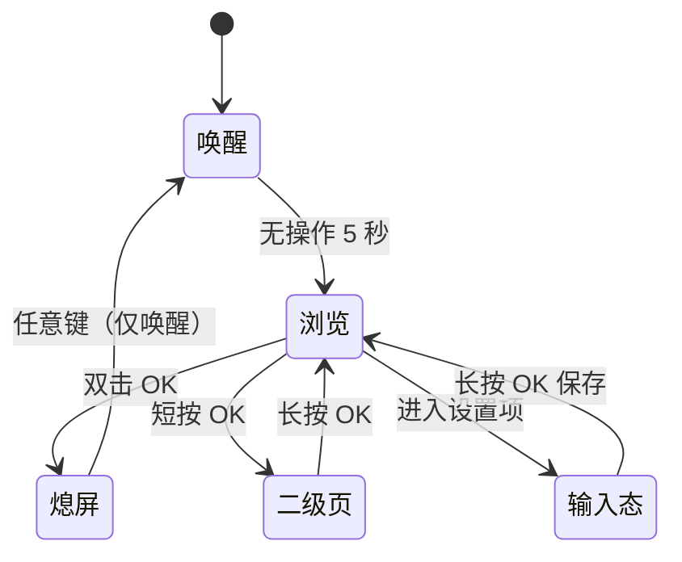
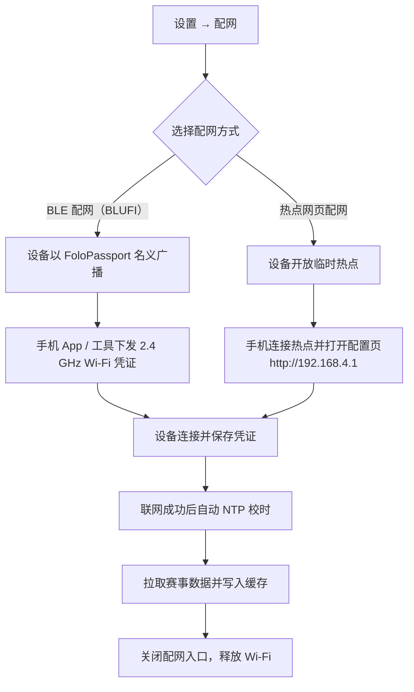

# AI Passport 随身工具箱 产品需求文档

玩法名称：通行证随身工具箱（Play code：`passport-toolbox`）
运行平台：FoloToy AI Passport（ESP32-C3 可穿戴 AI 硬件）
文档日期：2026-09-24
文档状态：初稿，待评审

---

## 1. 需求背景与来源

FoloToy AI Passport 是一款开放的可穿戴 AI 硬件，官方仓库把它定位成"开发基线"而不是成品：仓库同时给出硬件能力契约、稳定的 BSP 接口、资源边界、参考实现和验收方法，社区则通过"玩法"把各自写好的固件应用分发给其他玩家，安装方式是用 Type-C 连接设备后从网页直接烧录。设备一次只能装一个玩法，安装会覆盖当前设备上的应用。

仓库给出的硬件事实构成了本产品的物理边界：ESP32-C3 主控、240×320 竖屏 ST7789P3、UP/DOWN/OK 三键（共用 GPIO0 的 ADC 电阻分压）、ES8311 音频编解码、CW2017 电量计、2.4 GHz Wi-Fi STA、NimBLE 蓝牙（不支持蓝牙经典）、8 MB Flash、无 PSRAM，以及两秒浅睡眠与五秒深睡眠两种低功耗模式。[调研支撑]

社区当前已有的玩法覆盖了相当广的场景，但呈现出两个明显特征。[调研支撑]

第一个特征是离线能力普遍偏弱。价值最集中的几类玩法都强依赖联网：赛博工牌的小智语音对话与城市电台、BigDay 的实时天气、语音输入、PPT/TikTok 蓝牙遥控、课表与成绩的导入同步，断网后核心体验即失效。真正离线可用的玩法只有人生进度、番茄钟、2FA 验证器、健康打卡等少数几个，而它们的功能面都很窄。

第二个特征是功能碎片化。玩家想同时拥有日历、打卡、工牌、2FA，就得在多个玩法之间反复烧录，每次烧录都覆盖上一份数据。社区里已经出现了"多合一平台"和"班味"这类把多个功能塞进同一固件的尝试，说明玩家对整合有真实需求，但它们的整合更多是功能并列，没有围绕"离线优先"做统一的架构约束。

这两点指向同一个机会：做一款以离线为默认状态的箱式玩法，把社区被验证过的高赞点子收敛成一套自洽、互相联动的日常工具箱，联网只作为增强，并补上设备用户群体真正关心的一类在线内容——英雄联盟赛事数据。[假设]

把英雄联盟赛事数据放进来的依据来自用户画像与社区信号。设备的核心使用人群是年轻学生与上班族，与英雄联盟观赛人群高度重叠；社区里已经出现"通行证雷达"这种需要多台设备联动的社交向玩法，说明硬件被当作一种轻量、常亮的随身信息载体。用一块常亮的 240×320 小屏在桌边看"今天有没有我关注的队伍比赛、现在比分多少"，是设备形态能承接的真实场景。[假设]

不解决会怎样：设备会继续停留在"装一个玩法玩两天就吃灰"的状态，离线时几乎无用，联网玩法又彼此割裂，玩家需要不断重新烧录来切换用途。[假设]

---

## 2. 产品目标

产品要成为设备上"装上就不用再换"的那一个玩法。围绕这一点，目标分成三组。

离线目标。核心页面在完全无网络时 100% 可进入、可操作，除"赛事中心"和"校时"外的所有功能不依赖任何网络请求；首次开机在从未联网的情况下，用户手动设定时间后即可正常使用日历、番茄钟、打卡等全部离线能力。离线可用性以"断网状态下除赛事中心外页面可进入率 = 100%"作为验收口径。[假设，待确认]

覆盖目标。一次安装覆盖时间与日历、专注与效率、健康与习惯、身份与工具四类日常场景，共 20 项以上功能点，让设备在不通勤、不观赛的日子里也有打开的理由。

联网增强目标。联网时提供英雄联盟赛事数据，信息按三级分层展示，默认页只呈现赛程与比分，单场比赛详情作为二级下钻；赛事数据在断网时降级为本地缓存并明确标注新鲜度，不做静默失败。

性能目标。冷启动到主界面不超过 1.5 秒；任意按键的界面反馈不超过 200 毫秒；进入赛事中心到首屏数据呈现不超过 3 秒（网络正常时）。以上为设计目标，基线值 [待确认]。

工程目标。全部实现遵守仓库的硬件能力契约：所有引脚与地址只从 BSP 定义读取，应用层不复制硬件常量；显示使用局部刷新以适应单 DMA 缓冲；按键回调不阻塞；不因新增功能创建第二个 ADC1 单元或第二条同端口 I2C 总线。

---

## 3. 目标用户与核心场景

### 3.1 用户角色

设备使用者。本产品的直接操作者，通过三键与屏幕交互。可以是电竞观赛党、学生或上班族，三类人群在设备上使用的是同一套离线工具箱，差别主要体现在赛事中心的关注战队配置上。

手机配置端。使用者在配网、上传工牌头像、导入课表时用到的手机或电脑浏览器。它不是一个独立账号体系，只是设备在配网期间临时开放的配置入口，配置完成后设备不再依赖它。

玩法开发者。基于本仓库 BSP 与 demo 分支继续扩展本玩法的开发者。产品需要把纯逻辑与界面分离、把硬件访问收敛在 BSP，使后续扩展不必重写交互。

社区平台。负责玩法的分发、版本更新与审核，本产品的安装、更新、版本回退都依赖它的既有链路。

### 3.2 用户画像

电竞观赛党（主要人群）。18–30 岁的学生或年轻上班族，每周固定看 LPL，赛季期间会看 MSI 与世界赛；关注 2–3 支战队；习惯在电脑前或桌边放一块小屏作为"第二屏"。设备对他们来说是常亮的信息角，最在意的是"我关注的队伍今天什么时候打、现在打到哪了"。

学生党。在校本科生或研究生，日程被课表切碎，需要番茄钟和提醒来推进作业；教室、图书馆场景网络不稳定，离线可用是硬需求。

打工人。作息固定，需要打卡类轻量仪式感、工牌展示、以及 2FA 这类安全工具；设备放在工位，联网机会少，离线能力直接决定是否长期使用。

硬件折腾者。会自己烧录、关心 BSP 与低功耗表现，会主动尝试深睡眠、自检页等偏工程的功能。

### 3.3 核心场景与优先级

| 优先级 | 场景 | 前置条件 | 期望结果 |
|--------|------|----------|----------|
| P0 | 无网开机后查看时间与日历 | 设备已开机，时间已设定 | 主界面与万年历正常显示，无需联网 |
| P0 | 有网时查看今日英雄联盟赛程与实时比分 | 已完成 Wi-Fi 配网 | 赛事中心列出赛程，进行中的比赛显示实时比分 |
| P0 | 用番茄钟专注并断电后保留记录 | 无 | 番茄钟可暂停恢复，重启后配置与记录不丢 |
| P1 | 习惯打卡并查看连续天数 | 无 | 打卡状态掉电不丢，连续天数正确累计 |
| P1 | 展示电子工牌与他人交换二维码 | 无 | 多张工牌可切换，二维码离线可显示 |
| P1 | 离线生成 2FA 一次性密码 | 设备时间已校准 | 生成符合 RFC 6238 的 6 位动态码 |
| P1 | 断网后仍能查看最近一次赛程 | 曾经联网拉取过数据 | 显示缓存赛程并标注"数据可能已过期" |
| P2 | 配网与校时 | 有可用的 2.4 GHz Wi-Fi | 通过手机完成配网，联网后自动校时 |
| P2 | 硬件自检 | 无 | 逐项检查显示、按键、音频、电池、存储 |

---

## 4. 同类玩法研究

下表对社区已有的 12 个玩法做提炼。这些玩法既是需求来源，也构成了本产品在社区内的直接参照。[调研支撑]

| 玩法 | 作者 | 核心点子 | 离线能力 | 联网依赖 | 本产品可借鉴之处 |
|------|------|----------|----------|----------|------------------|
| 人生进度 | AoiA | 把今天/本周/本月/今年/一生化成点亮的格子，青绿色表示已走过、珊瑚色表示此刻 | 完全离线 | 无 | 时间可视化的交互模型：OK 切换尺度、UP/DOWN 调精度 |
| 猫猫专注日历 | Sherone | 万年历 + 农历节气宜忌 + 番茄钟 + 猫咪陪伴 + 常亮壁纸时钟 | 基本离线 | 仅用于校时 | 万年历与番茄钟合并的信息架构；猫咪状态的陪伴感设计 |
| BigDay | Bigphilosophy | 天气预报 + 黄历 + 每日卦象 + 历史今日 + 每日答案 | 部分离线（卦象、历史今日可离线） | 天气需联网 | 黄历与每日内容类玩法的内容结构；离线/在线内容分区的做法 |
| UEG 数字生命健康卡 | zach | 复刻《流浪地球》数字身份卡 + 健康打卡（三餐/喝水/运动） | 完全离线 | 无 | 打卡项设计；IP 主题化外壳能显著提升使用意愿 |
| 二步验证器 | 过期的萌新 | 硬件 TOTP（RFC 6238）+ BLE 写入 + WLAN 客户端获取 | 核心离线 | 仅用于导入配置 | 离线安全工具的可行性验证；恢复码备份是必须提醒的风险点 |
| 课表与成绩助手 | JQ | 今日/本周/考试/成绩四视图 + 设备端算 GPA + 硬件自检页 | 数据离线可用 | 仅用于校时 | 四视图切换模式；设备端本地计算而非云端；自检页的清单化设计 |
| 班味 | OpenTele | 打工人工作日伴侣：今日收入、下班/周末/发薪倒计时、班味指数、状态卡、迷你游戏、本地 2FA、番茄钟 | 完全离线 | 无（蓝牙为可选增强） | "离线为主、联网/蓝牙为增强"的产品结构与本产品最接近；状态卡与自定义心情的玩法 |
| 赛博工牌 · 随身 AI 助手 | 何夕2077 | 5 张身份工牌 + 小智语音对话 + 8 条提醒 + 木鱼/电台/摇卦小程序 | 工牌与提醒离线 | 语音、电台需联网 | 多工牌切换；提醒的定点与按星期重复模型；热点网页配网的完整交互 |
| AI Passport 多合一平台 | 周旋 | 电子工牌 + 语音输入 + PPT 遥控，多功能并行互不干扰 | 工牌离线 | 语音输入与 PPT 需配对 | 多模块并存的导航设计；长按返回的按键约定 |
| 通行证雷达 | FOLOTOY | 多台设备互相搜索并显示相对方位 | 离线（设备间） | 无 | 硬件可被当作社交/信息载体的信号 |
| TikTok 遥控器 | Yeats_Liao | 蓝牙配对后遥控刷视频、点赞 | 否 | 蓝牙配对 | 单一功能玩法在断网场景下的局限 |
| PPT 演讲遥控器 | Yeats_Liao | 蓝牙 HID 演示遥控 + 演讲计时 | 否 | 蓝牙配对 | 计时器与主功能结合的呈现方式 |

### 研究结论

离线与在线的分布并不均衡。12 个玩法里有 4 个完全离线、3 个以离线为核心、5 个强依赖联网。真正让玩家长期留在设备上的，恰好集中在离线阵营（人生进度、班味、2FA、健康卡），而联网玩法的评价里频繁出现"要联网才能用""支持中文就更好了"这类与离线、本地化相关的诉求。这支持了本产品"离线优先"的定位。

已存在的整合尝试没有统一约束。多合一平台与班味都做了功能聚合，但聚合方式是把功能并列，没有回答"断网时哪些能力必须仍然成立"这个问题。本产品要求离线可用在任何情况下都成立，并以此反推模块取舍与数据存储，这是与它们的主要区别。

中文字库是共性的工程难点。人生进度的评论里出现"要是支持中文就更好了"，指向的其实是 8 MB Flash、无 PSRAM 条件下点阵中文字库的取舍。本产品需要正面处理这个问题，否则"工具箱"的中文界面无法落地。

差异化定位。面向英雄联盟观赛人群，把赛事信息做成设备上"一眼可见、断网可回看"的常驻角标，同时用离线工具箱保证设备在没有比赛的日子里依然有用。赛事数据在社区现有玩法中尚未出现，是明确的内容空位。

---

## 5. 功能需求

### 5.1 产品信息架构

主界面是一个模块导航页，向上进入各功能模块。所有模块共用统一的按键约定与状态栏。

```mermaid
graph TD
    HOME["主界面 / 模块导航<br/>状态栏：时间 · 电量 · 网络 · 赛事角标"]

    HOME --> T["1 时间与日历"]
    HOME --> F["2 专注与效率"]
    HOME --> H["3 健康与习惯"]
    HOME --> I["4 身份与工具"]
    HOME --> E["5 英雄联盟赛事中心"]
    HOME --> S["6 系统设置"]

    T --> T1["万年历（公历 / 农历 / 节气 / 宜忌）"]
    T --> T2["时间进度（今日 / 本周 / 本月 / 今年 / 人生）"]
    T --> T3["秒表 · 计时器 · 世界时钟"]

    F --> F1["番茄钟"]
    F --> F2["本地提醒"]
    F --> F3["课表与日程"]

    H --> H1["习惯打卡"]
    H --> H2["连续天数与统计"]

    I --> I1["电子工牌（多卡切换）"]
    I --> I2["2FA 动态口令"]
    I --> I3["摇卦 / 每日一签"]
    I --> I4["硬件自检"]

    E --> E1["今日与本周赛程"]
    E --> E2["实时比分"]
    E --> E3["赛区积分榜"]
    E --> E4["战队与选手"]
    E --> E5["单场对局详情（二级）"]

    S --> S1["配网（BLE + 热点网页）"]
    S --> S2["时间与校时"]
    S --> S3["息屏与省电"]
    S --> S4["主题与显示"]
    S --> S5["关注战队"]
    S --> S6["存储管理"]
```



### 5.2 全局按键约定

三个实体按键是本产品唯一的输入方式，必须在所有页面保持一致，避免用户重新学习。

| 操作 | 主界面 | 二级页面 | 输入类页面（设置数值/文字） |
|------|--------|----------|------------------------------|
| 短按 UP / DOWN | 上下移动模块选择 | 列表上下移动，或切换子视图 | 数值加减 / 选项切换 |
| 短按 OK | 进入选中模块 | 确认当前项或进入下一级 | 确认并跳到下一项 |
| 长按 UP | 快捷进入关注战队赛程 | 由各页面定义（如切换主题、打开子模式） | 大步增加 |
| 长按 DOWN | 快捷进入番茄钟 | 由各页面定义 | 大步减少 |
| 长按 OK | 进入系统设置 | 返回上一级 | 保存并返回 |
| 双击 OK | 熄屏 | 熄屏 | 熄屏 |
| 任意键（熄屏时） | 唤醒 | 唤醒 | 唤醒 |

熄屏期间计时、番茄钟、提醒调度与时钟继续运行；熄屏后第一次按键只负责唤醒，不触发该键的常规动作，这一约定与赛博工牌的说明保持一致。



### 5.3 功能总览

| # | 模块 | 功能说明 |
|---|------|----------|
| 1 | 主界面状态栏 | 常驻显示当前时间（联网校时后显示时分，未校时显示"--:--"）、电池百分比（低于 20% 变红）、网络状态（未配网/已连接）、赛事角标。赛事角标仅在存在"进行中的关注比赛"或"30 分钟内开赛的关注比赛"时出现。 |
| 2 | 主界面模块导航 | 纵向列出六个模块入口，UP/DOWN 移动、OK 进入。默认焦点停留在上次使用的模块，减少重复操作。 |
| 3 | 万年历 | 显示公历日期与星期，长按 UP 切换到中国日历视图，叠加农历日期、节气与宜忌；UP/DOWN 翻月或翻日。数据全部本地计算，不依赖网络。 |
| 4 | 时间进度 | 以点亮格子的方式展示今日、本周、本月、今年、人生五个尺度的时间流逝，OK 依次切换尺度，UP/DOWN 调整格子精度，每个尺度提供总览、均衡、精细三档。生日与预期寿命在首次使用时设置，默认 80 岁。 |
| 5 | 秒表与计时器 | 秒表支持开始/暂停/清零与分段记录；计时器支持自定义时长与到时提示音。两者与番茄钟共用计时基础设施，使用单调时钟避免息屏后计时漂移。 |
| 6 | 番茄钟 | 可设置专注时长与休息时长，开始后进入专注界面；支持暂停与恢复；完成后进入休息倒计时并给出提示音。专注记录写入掉电不丢失的存储，供健康与习惯模块统计。 |
| 7 | 本地提醒 | 支持新增最多 8 条提醒，每条可指定钟点、日期或按星期重复。提醒依赖设备本地时间，未校时前创建提醒时给出提示。关机期间不响，开机校时后恢复调度。 |
| 8 | 课表与日程 | 展示今日与本周课程或日程；支持在手机配置页按结构化格式导入，导入数据只保存在设备本地。首页可显示"下一节课"提示。 |
| 9 | 习惯打卡 | 支持喝水、三餐、运动及自定义项，每项每日一次打卡，打卡状态掉电不丢。当日完成情况以进度环或计数呈现。 |
| 10 | 连续天数与统计 | 汇总习惯连续打卡天数、番茄钟累计次数与专注时长，以周视图呈现。数据全部本地计算。 |
| 11 | 电子工牌 | 支持 5 张身份卡切换，每张可配置头像、昵称、多行文本（可设字号与是否加粗）、二维码与主题；留空的行不显示。二维码离线生成并可全屏展示供他人扫描。 |
| 12 | 2FA 动态口令 | 基于 RFC 6238 生成 TOTP 一次性密码，密钥可手动输入或由手机配置页写入，全部保存在设备本地。显示剩余有效秒数，密钥与恢复码可导出到手机配置页。 |
| 13 | 摇卦与每日一签 | 离线生成卦象与每日内容，展示卦名与卦辞；同一天内容稳定不重复。 |
| 14 | 硬件自检 | 逐项检查显示、按键、音频、电池与存储，每项给出通过或失败结论，用于安装后快速确认设备状态。 |
| 15 | 赛事赛程 | 列出今日与本周英雄联盟赛程，包含赛区、赛事名称、战队、开赛时间与比赛状态（未开始/进行中/已结束）。默认按第 6 章的优先级排序。 |
| 16 | 实时比分 | 进行中的比赛显示实时比分与当前局数；比分按刷新策略更新，退出赛事中心后停止刷新。 |
| 17 | 赛区积分榜 | 按赛区展示战队排名、胜负数与积分；支持 UP/DOWN 在赛区之间切换。 |
| 18 | 战队与选手 | 展示战队基本信息与选手名单；支持将战队设为关注，关注状态保存在本地并驱动赛程排序与状态栏角标。 |
| 19 | 单场对局详情 | 从赛程或比分列表进入单场比赛详情，展示阵容与禁用、经济曲线、选手数据等二级信息。该页为下钻页，不作为默认入口。 |
| 20 | 关注与赛事提示 | 用户可关注最多若干支战队；关注战队的比赛在主界面状态栏与赛事中心内优先呈现。关注关系离线保存。 |
| 21 | 配网 | 提供两条配网路径：BLE 配网（BLUFI）与设备热点网页配网。热点网页配网时设备开放临时热点，手机连接后打开配置页填写 2.4 GHz Wi-Fi 信息与个人配置。 |
| 22 | 时间与校时 | 联网时通过 NTP 自动校时并记录校时来源与时间；未联网时允许手动设置时间。校时状态在设置页与时钟相关页面可见。 |
| 23 | 息屏与省电 | 自动息屏时长可选常亮、15 秒、30 秒、1 分钟、2 分钟、5 分钟；按键唤醒并重新计时。空闲时进入浅睡眠，长时间待机可进入深睡眠。 |
| 24 | 主题与显示 | 提供明暗两套主题，用户选择后保存；不涉及具体视觉参数。 |
| 25 | 存储管理 | 展示本地数据的占用情况，支持清除工牌数据、清除打卡与专注记录、清除赛事缓存三类操作，清除前二次确认。 |

### 5.4 模块详情与原型

#### 5.4.1 主界面与状态栏（功能 1、2）

```
┌──────────────────────────────┐
│ 14:32          ██ 76%   ▲ LIVE │  ← A 状态栏（时间 / 电量 / 赛事角标）
├──────────────────────────────┤
│  ▸ 时间与日历                  │  ← B 模块列表，当前焦点带指示
│    专注与效率                  │
│    健康与习惯                  │
│    身份与工具                  │
│    英雄联盟赛事中心            │
│    系统设置                    │
├──────────────────────────────┤
│ 关注：EDG · 下次 19:00         │  ← C 关注提示（有关注战队时显示）
└──────────────────────────────┘
```

- 业务逻辑：开机后进入主界面并恢复上次焦点模块。状态栏每 30 秒刷新一次时间与电量；赛事角标依据本地缓存的赛事数据计算，无数据时不显示。
- 交互逻辑：UP/DOWN 移动焦点并即时更新列表高亮；OK 进入选中模块；长按 UP 直接跳到关注战队赛程；长按 DOWN 直接进入番茄钟；长按 OK 进入系统设置；双击 OK 熄屏。
- 规则约束：模块列表固定为六项，不可由用户增删。焦点位置保存在本地，重启后恢复。
- 边界与异常：未配网时网络状态显示"未配网"，赛事角标不显示；电量读取失败时显示"--%"，不阻断其他功能。

#### 5.4.2 时间与日历（功能 3、4、5）

```
┌──────────────────────────────┐
│ 万年历          2026 年 9 月   │
│  一  二  三  四  五  六  日    │
│  1   2   3   4   5   6   7    │
│  8  [9] 10  11  12  13  14    │
│  ...                          │
│ 九月初九 · 寒露 · 宜 出行 会友  │  ← 农历 / 节气 / 宜忌
│ 长按↑ 切换中国日历   ↑↓ 翻月   │
└──────────────────────────────┘
```

- 业务逻辑：万年历基于本地日期计算公历、农历、节气与宜忌，全部在设备端完成。时间进度按选定尺度与精度计算已过格子数并高亮当前格子。
- 交互逻辑：万年历中 UP/DOWN 翻月，长按 UP 切换到中国日历视图（叠加农历与宜忌），OK 进入时间进度；时间进度中 OK 依次切换今日/本周/本月/今年/人生，UP/DOWN 在总览/均衡/精细三档间切换精度。
- 规则约束：人生尺度从生日当天零点起到预期寿命生日零点止，默认 80 岁；当前年龄按今天是否已过生日动态计算。时间进度各尺度的三档精度与社区已验证的取值一致：今日为 24 小时 / 96 个 15 分钟 / 288 个 5 分钟；本周为 7 天 / 56 个 3 小时 / 168 小时；本月为当月天数 / 每天 4 格 / 每天 8 格；今年为 12 月 / 53 周 / 365 或 366 天；人生为 80 年 / 320 季度 / 960 月。
- 边界与异常：时间未设定时不展示时间进度，引导先设定时间；跨零点或跨月时进度自动重算，无需用户操作。

#### 5.4.3 专注与效率（功能 6、7、8）

```
┌──────────────────────────────┐
│ 番茄钟                 专注中  │
│                              │
│        25:00                 │  ← 剩余时间，大号
│   [■■■■■■□□□□□□]  第 2 轮    │
│                              │
│  OK 暂停 / 继续   长按OK 退出  │
└──────────────────────────────┘
```

- 业务逻辑：番茄钟读取用户配置的专注与休息时长，开始后倒计时；一个专注段结束后自动进入休息段并提示；完成的专注段写入本地记录供统计。提醒按本地时间调度，重启后依据校时结果恢复。
- 交互逻辑：OK 在开始/暂停/继续之间切换；长按 OK 退出并保留当前进度；计时结束时触发提示音并自动进入下一段。
- 规则约束：专注与休息时长可配置，默认 25 分钟与 5 分钟；提醒数量上限 8 条；提醒按星期重复时以设备本地时区为准。
- 边界与异常：设备关机期间提醒不触发，开机校时后按最新时间重新计算下一次触发点；未校时前创建提醒时提示用户先校准时间；番茄钟运行中双击 OK 熄屏不中断计时。

#### 5.4.4 健康与习惯（功能 9、10）

```
┌──────────────────────────────┐
│ 今日打卡          2026-09-24  │
│  喝水    ●●●○○   3 / 5 杯     │
│  早餐    ✓ 已完成             │
│  运动    ○ 未打卡             │
│  连续打卡：12 天              │
└──────────────────────────────┘
```

- 业务逻辑：每个习惯项当日只记一次（计数类项按目标次数累计），状态写入本地存储；连续天数按自然日连续计算，跨日自动刷新当日状态并保留历史。
- 交互逻辑：UP/DOWN 选择习惯项，OK 打卡或取消当日打卡；长按 OK 返回主界面。
- 规则约束：习惯项包含内置的喝水、三餐、运动，并支持新增自定义项；每日零点重置当日状态，历史记录保留用于统计。
- 边界与异常：设备时间被手动大幅修改时，连续天数以设备当前日期为准并提示可能失真；存储写入失败时保留内存状态并提示未保存。

#### 5.4.5 身份与工具（功能 11、12、13、14）

```
┌──────────────────────────────┐
│ 电子工牌              1 / 5   │
│   ┌────────┐  姓名：林一      │
│   │ 头像   │  身份：学生      │
│   └────────┘  学院：计算机     │
│   [ 二维码 ]  长按OK 返回      │
│  ↑↓ 切换工牌  长按↑ 亮码全屏   │
└──────────────────────────────┘
```

- 业务逻辑：工牌数据（头像、文本、二维码）保存在本地，最多 5 张；2FA 密钥保存在本地并基于设备时间生成动态口令；摇卦与每日一签由本地算法生成，同一天结果稳定；自检逐项运行硬件检查并给出结论。
- 交互逻辑：工牌页 UP/DOWN 切换身份卡，长按 UP 全屏展示二维码，长按 OK 返回；2FA 页显示动态码与剩余秒数，长按 UP 导出恢复码到手机配置页；自检页 UP/DOWN 选择检查项，OK 单项运行，长按 UP 全部运行。
- 规则约束：2FA 动态口令遵循 RFC 6238，默认 30 秒步长、6 位数字；首次添加 2FA 时必须提示用户备份恢复码，且恢复码导出需在手机配置页完成；工牌文本行可设字号与是否加粗，留空的行不显示。
- 边界与异常：2FA 依赖准确时间，未校时前给出明显警告，避免生成错误口令导致登录失败；自检在音频检查时会短暂占用音频通道，需在检查结束后恢复；存储空间不足时禁止新增工牌并提示。

#### 5.4.6 英雄联盟赛事中心（功能 15–20）

赛事中心是本产品唯一的在线模块，也是联网时的核心价值。进入该模块时按需开启 Wi-Fi 并拉取数据，退出时释放 Wi-Fi 以省电。

```
┌──────────────────────────────┐
│ 赛事中心  [赛程] 积分榜  战队  │  ← 顶部三个子视图
│ ● 进行中  EDG 1 : 0 BLG  第2局 │  ← 优先级 1：LIVE
│ ○ 19:00   JDG  vs  TES   未开始│  ← 优先级 2：关注战队即将开赛
│ ○ 21:00   WBG  vs  LNG   未开始│  ← 优先级 3：今日剩余赛程
│ ✓ 17:00   RNG 0 : 2 FPX  已结束│  ← 优先级 4：今日已结束
│ 明日 17:00  WE vs OMG          │  ← 优先级 5：明日与本周
│ 更新于 14:30   长按↑ 刷新       │
└──────────────────────────────┘
```

- 业务逻辑：进入模块时请求赛程数据，按第 6 章的优先级排序后渲染；进行中的比赛按刷新策略定时更新比分；积分榜与战队视图在切换到对应子视图时按需请求。所有赛事数据在拉取成功后写入本地缓存。
- 交互逻辑：UP/DOWN 在赛程列表内移动，OK 进入单场详情；左右切换子视图通过长按 UP/DOWN 或顶部标签配合 OK 实现；长按 UP 手动刷新；长按 OK 返回主界面。将某战队设为关注的操作位于战队视图，OK 切换关注状态并即时更新赛程排序。
- 规则约束：赛事数据按赛区分组，默认展示用户关注战队所在赛区与主要赛区；单场详情页只能从赛程或比分列表下钻进入，不设独立入口；关注战队数量上限 [待确认]。
- 权限逻辑：本产品无多用户体系，设备持有者即唯一操作者，无需角色隔离。手机配置页仅在配网期间可访问设备数据。
- 边界与异常：无网络或请求失败时，展示最近一次缓存数据并在顶部标注"离线 · 更新于 X 时 X 分"，同时提供重试入口；从未成功拉取过数据时展示空状态并引导配网；请求超时按第 6 章的降级策略处理，不阻塞离线功能。

单场对局详情（二级下钻）：

```
┌──────────────────────────────┐
│ EDG  vs  BLG      第 2 局      │
│ [阵容]  经济曲线  选手数据     │  ← 二级信息分页
│  EDG 蓝色方                   │
│  上单 剑姬  打野 蔚  中单 阿卡丽 │
│  BLG 红色方                   │
│  上单 杰斯  打野 盲僧  中单 辛德拉│
│ 长按OK 返回   长按↑ 刷新        │
└──────────────────────────────┘
```

- 业务逻辑：详情页展示阵容与禁用、经济曲线、选手数据三类二级信息，数据在进入详情页时单独请求，请求失败时回退到赛程列表中已有的基础比分信息。
- 交互逻辑：长按 UP/DOWN 在三类二级信息之间切换；长按 OK 返回赛程列表。
- 边界与异常：详情数据不可用时，仅展示已缓存的比分与战队，并标注"详情暂不可用"。

#### 5.4.7 系统设置与配网（功能 21–25）

配网提供两条路径，用户可任选。BLE 配网适用于设备已开机、手机在身边但不想切换 Wi-Fi 的场景；热点网页配网适用于需要同时填写个人配置（工牌、课表、2FA 密钥）的场景。



- 业务逻辑：配网成功后设备保存凭证并自动校时，随后按需拉取赛事数据；配网入口在成功后关闭，避免长期暴露。Wi-Fi 与 BLE 协议栈仅在对应页面打开时初始化，退出时释放，符合仓库对 Wi-Fi 与 BLE 作为按需服务的约束。
- 交互逻辑：设置页 UP/DOWN 选择条目，OK 进入；配网过程中屏幕显示热点名称、密码或等待状态；长按 OK 在任意设置子页返回上一级。
- 规则约束：仅支持 2.4 GHz Wi-Fi；设备时间可通过联网校时或手动设置；自动息屏时长在给定选项中单选；主题在明暗之间单选；存储管理提供三类清除操作且清除前二次确认。
- 边界与异常：配网失败时保留已输入信息并允许重试，不进入死循环；凭证错误时给出明确提示；清除存储类操作需二次确认并在完成后刷新相关页面。

### 5.5 存储、离线与数据策略

本产品把"离线可用"当作架构前提。全部用户数据与赛事缓存都保存在设备的非易失存储中，设备在无网络、无手机的情况下是一个功能完整的工具。

| 数据类别 | 内容 | 离线可用 | 联网行为 |
|----------|------|----------|----------|
| 时间基准 | 上次校时时间、时区、手动设置的时间 | 是（依赖设备时钟，可能漂移） | NTP 校时后覆盖基准 |
| 个人配置 | 工牌数据、课表、提醒、习惯与打卡记录、番茄钟记录 | 是 | 不参与同步，仅在手机配置页读写 |
| 安全数据 | 2FA 密钥与恢复码 | 是 | 不联网 |
| 赛事缓存 | 最近一次成功拉取的赛程、比分、积分榜、战队信息 | 是（只读，标注新鲜度） | 拉取成功后覆盖并记录同步时间 |

赛事缓存的保留策略：赛程与积分榜保留最近一次成功结果；比分缓存仅保留最近一次结果用于离线回看。缓存不参与跨设备同步。

### 5.6 中文字库与显示约束

设备为 8 MB Flash、无 PSRAM，点阵中文字库会占用可观空间，这是社区玩法里"支持中文就更好了"这一反馈背后的真实约束。产品需要在需求层面明确取舍：界面固定文案与用户自定义文本（工牌、课表、提醒、赛事战队名）都需要中文显示能力，因此字库按覆盖常用汉字的最小子集裁剪，并优先保证固定界面文案完整、用户自定义文本允许缺字提示。具体裁剪范围与字库方案在技术设计阶段确定，本文档只约束"界面文案必须完整显示、用户文本缺字时给出提示而非乱码"这一验收要求。

---

## 6. 赛事数据的显示优先级与降级

赛事数据的展示规则是本产品在线体验的核心，需要同时回答"先看什么"和"没网怎么办"。

### 6.1 三级信息分层

| 层级 | 内容 | 入口 | 默认可见 |
|------|------|------|----------|
| 一级 | 赛程列表（含状态、比分、时间、战队）、赛区积分榜、战队与选手列表 | 赛事中心顶部子视图 | 是 |
| 二级 | 单场比赛的对局详情：阵容与禁用、经济曲线、选手数据 | 从赛程或比分列表下钻 | 否 |
| 三级 | 战队与选手的历史数据、赛事规则等扩展信息 | 暂不在本期范围 | 否 |

默认页只呈现一级信息，保证首屏加载快、信息一眼可读；二级信息按需下钻，避免在 240×320 屏幕上堆叠过多内容。

### 6.2 赛程列表显示优先级

同屏出现多场比赛时，按下表顺序排序，优先级高的排在上方。

| 顺序 | 类别 | 判定条件 | 展示强调 |
|------|------|----------|----------|
| 1 | 进行中的比赛 | 状态为进行中 | 状态标记与实时比分，最高强调 |
| 2 | 关注战队即将开赛 | 关注战队参与且距开赛不超过 30 分钟 | 高亮开赛时间与倒计时 |
| 3 | 今日其他未开始比赛 | 今日内、状态为未开始 | 常规展示 |
| 4 | 今日已结束比赛 | 今日内、状态为已结束 | 常规展示，弱化 |
| 5 | 明日与本周赛程 | 今日之后、本周之内 | 分组展示，可折叠 |

排序规则之外，主界面状态栏的赛事角标遵循同一优先级：存在第 1 类或第 2 类比赛时出现角标，角标文案区分"进行中"与"即将开赛"两种状态。

### 6.3 刷新与省电

进入赛事中心时开启 Wi-Fi 并拉取一次数据；存在进行中的比赛时按固定间隔刷新比分；退出赛事中心后停止刷新并释放 Wi-Fi。刷新间隔与超时时间在技术设计阶段确定，本文档约束"退出页面后不得继续占用 Wi-Fi"这一要求。

### 6.4 降级规则

| 场景 | 表现 |
|------|------|
| 从未成功拉取过数据 | 空状态，提示先完成配网 |
| 有缓存但本次请求失败 | 展示缓存数据，顶部标注"离线 · 更新于 X 时 X 分"，提供重试 |
| 缓存过旧（超过约定时效） | 展示缓存并额外提示"数据可能已过期" |
| 详情数据不可用 | 仅展示已有比分与战队，标注"详情暂不可用" |
| 请求超时 | 按失败处理，回退缓存，不阻塞页面其他操作 |

任何降级状态下，离线功能模块均不受影响。

---

## 7. 数据与埋点

指标用于回答三个问题：设备是否被持续使用、离线能力是否被真正用到、赛事数据是否值得投入。所有数值的基线值 [待确认]，需在灰度阶段采集。

| 类型 | 指标 | 观察目的 |
|------|------|----------|
| 北极星 | 周活跃设备数（每周至少一次有效交互） | 判断玩法是否长期留在设备上 |
| 过程 | 玩法安装量、首次配网完成率 | 判断安装与配网链路是否顺畅 |
| 过程 | 各离线模块的进入次数与人均使用次数 | 判断哪些离线功能真正被用 |
| 过程 | 番茄钟完成数、习惯打卡连续天数分布 | 判断专注与习惯功能的黏性 |
| 过程 | 关注战队设置率、赛事中心打开次数 | 判断赛事模块的吸引力 |
| 过程 | 赛事缓存命中率、离线查看赛事次数 | 判断离线回看是否被需要 |
| 质量 | 冷启动时长、按键响应时长、异常复位率 | 判断基础体验是否达标 |
| 质量 | 赛事数据请求成功率、首屏加载时长 | 判断数据源与刷新策略是否可靠 |
| 质量 | 存储写入失败率、2FA 未校时使用次数 | 判断数据可靠性与风险提示是否有效 |

| 事件 | 触发时机 | 关键属性 | 服务的决策 |
|------|----------|----------|------------|
| `app_boot` | 开机进入主界面 | 冷启动耗时、是否已配网、是否已校时 | 判断启动性能与首次使用链路 |
| `module_open` | 进入任一模块 | 模块名、来源页面 | 判断模块使用分布，决定后续投入 |
| `pomodoro_complete` | 番茄钟专注段完成 | 时长、当日累计次数 | 判断专注功能黏性 |
| `habit_checkin` | 完成一次打卡 | 习惯项、连续天数 | 判断习惯功能留存价值 |
| `esports_open` | 进入赛事中心 | 网络状态、是否命中缓存 | 判断赛事模块打开场景 |
| `esports_fetch` | 赛事数据请求结束 | 成功与否、耗时、数据新鲜度 | 判断数据源稳定性与刷新策略 |
| `esports_detail_open` | 进入单场对局详情 | 比赛状态 | 判断二级信息是否值得保留 |
| `esports_follow_set` | 设置或取消关注战队 | 操作类型 | 判断关注功能的真实使用 |
| `provision_result` | 配网结束 | 方式（BLE/热点）、成功与否、失败原因 | 判断配网链路瓶颈 |
| `storage_clear` | 执行清除操作 | 清除类别 | 判断存储管理的使用与风险 |

考虑到设备联网机会有限，埋点采用"本地累积、联网时批量上报"的方式，上报失败不阻塞用户操作。

---

## 8. 依赖、风险与里程碑

### 8.1 依赖

技术依赖。英雄联盟赛事数据源（Riot 官方赛事接口或合规的第三方聚合接口，具体选型 [待确认]）、NTP 校时服务、BLE 配网（BLUFI）能力、ESP-IDF 提供的 Wi-Fi、NVS、FreeRTOS 与低功耗能力，以及仓库 BSP 提供的显示、按键、音频、电池、共享 I2C 接口。

团队依赖。固件开发、界面与交互实现、测试、社区运营分别承担不同环节；中文字库裁剪需要界面与固件协同确定。

外部依赖。赛事数据接口的稳定性与使用授权、社区平台的安装与更新链路、设备的 2.4 GHz Wi-Fi 环境。

### 8.2 风险

| 风险 | 可能性 | 影响 | 应对 |
|------|--------|------|------|
| 赛事数据接口不稳定或无合规授权 | 中 | 高（在线核心价值受损） | 优先选择有明确授权与稳定 SLA 的数据源；接口层做降级与缓存；必要时先用赛程与比分的最小集合上线 |
| 中文字库超出 Flash 预算 | 中 | 高（界面文案不完整） | 按最小常用字集裁剪，固定文案优先；用户自定义文本缺字时给出提示而非乱码 |
| 无 PSRAM 下的内存压力 | 中 | 中（页面卡顿或复位） | 局部刷新、分页加载赛事数据、避免大区域重绘；在真机上做内存与稳定性实测 |
| 赛事中心联网拉低续航 | 中 | 中（影响长期使用） | 仅在赛事中心页联网、退出即释放；有进行中比赛时才定时刷新 |
| 设备时间不准导致 2FA 失败 | 中 | 高（账号安全） | 未校时前显著警告并阻止在风险场景使用；提示用户备份恢复码 |
| 单 DMA 缓冲下大范围刷新闪烁 | 中 | 低 | 使用局部刷新，界面改动只重绘受影响区域 |
| 玩家误以为"编译通过即硬件验证通过" | 中 | 中（验收误判） | 交付时分别报告构建结果与真机验证结果，未在真机验证的项目明确列出 |

### 8.3 里程碑

以下为建议节奏，具体排期 [假设，待确认]：需求评审与原型确认、界面与纯逻辑实现（可在主机上运行测试）、硬件能力接入与真机联调、赛事数据接入与降级验证、真机验收与灰度发布、正式发布。

验收与发布遵循仓库的约定：构建结果与真机结果分开记录，未在真机执行的项目逐项列出。

---

## 9. 验收标准

离线验收。断开网络、拔掉数据线后，除赛事中心与校时外的全部页面可正常进入并完成一次完整操作；首次开机在从未联网的情况下手动设定时间后，日历、番茄钟、打卡、工牌、2FA 均可使用；重启设备后工牌、打卡记录、番茄钟配置、关注战队与赛事缓存不丢失。

在线验收。完成配网后自动校时并在相关页面显示校时状态；赛事中心按第 6 章的优先级顺序展示赛程，进行中的比赛显示实时比分，关注战队比赛排在其他未开始比赛之前；单场对局详情可从赛程列表下钻进入并正常展示二级信息；退出赛事中心后设备释放 Wi-Fi，不再刷新。

降级验收。断开网络进入赛事中心时展示缓存数据并标注更新时间的场景成立；从未拉取过数据时展示空状态；详情数据不可用时仅展示已有比分并标注提示。

硬件验收。显示、按键、音频、电池、存储自检项在真机上逐项通过；三键在所有页面行为符合第 5.2 章的约定；熄屏后第一次按键仅唤醒；番茄钟运行中熄屏不中断计时。

数据验收。第 7 章列出的埋点事件可被正确采集并在联网时成功上报；异常复位率与存储写入失败率在约定阈值内 [阈值待确认]。

工程验收。应用层未复制硬件引脚与地址常量，全部从 BSP 定义读取；未创建第二个 ADC1 单元或第二条同端口 I2C 总线；按键回调未阻塞。

---

## 10. 本期不做

AI 语音对话与电台等需要持续联网且算力要求高的能力；蓝牙 HID 遥控（PPT、短视频等）能力；多设备联动的社交玩法；天气与黄历之外的第三方内容聚合；跨设备数据同步与账号体系；赛事数据的三级扩展信息。
