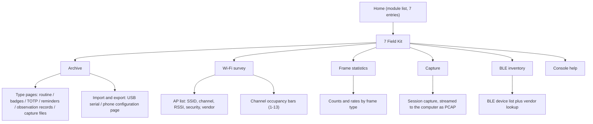
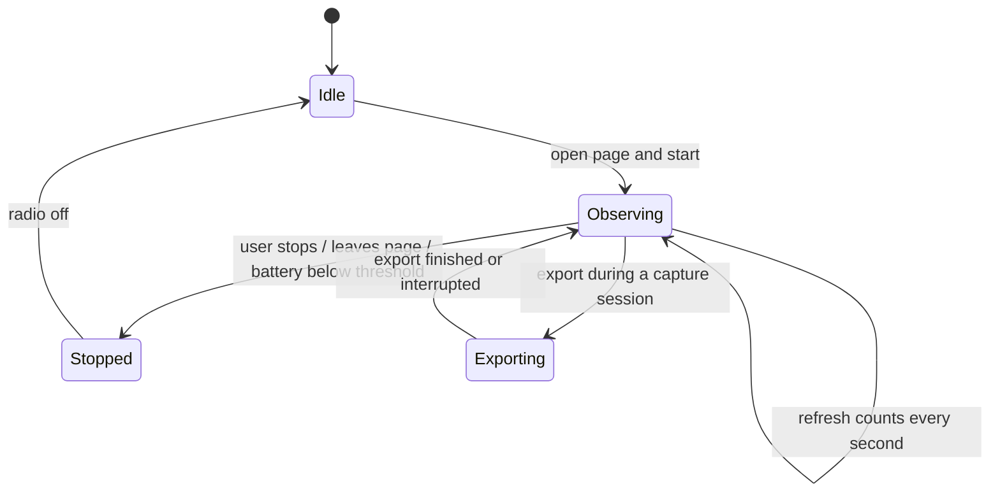
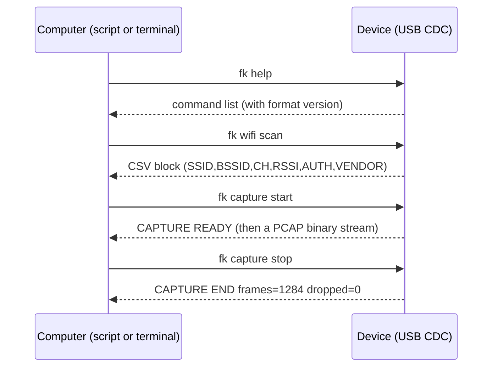

<p align="right">
  <a href="passport-field-kit-prd.zh_CN.md">简体中文</a> · <strong>English</strong>
</p>

# AI Passport Portable Toolbox · Field Kit Product Requirements Document

Play name: Field Kit (module group 7 of `passport-toolbox`)
Platform: FoloToy AI Passport (ESP32-C3, 8 MB Flash, no PSRAM, 240×320 portrait, three buttons)
Document date: 2026-09-28
Document status: First planning revision; defines requirements and boundaries only, not yet implemented
Related document: [Portable Toolbox Product Requirements Document](passport-toolbox-prd.md) (this module group extends it)

This document answers three questions: what else this hardware can support, which mature projects the additions come from, and why some capabilities are explicitly out of scope.

---

## 1. Background and Trigger

The toolbox's six existing modules solve personal, everyday problems: time, focus, routine, identity, esports, and system. They share one property — they concern only the user, and none of them observe the outside world. Yet the device carries 2.4 GHz Wi-Fi and Bluetooth radios, and the hardware self-test page already reads button voltages, battery, and bus state. The device can already sense; it just has not turned that into a product.

The reference points for doing so are clear. Flipper Zero proved that a pocket multi-tool form factor is acceptable to ordinary users, and ESP32Marauder proved that wireless observation and packet capture are engineering-feasible on an ESP32. Neither feature list transfers as-is, because their hardware differs greatly from this board, but their product structure, interaction organization, and data organization do transfer. [Research-backed]

Trigger: sustained community interest in both play styles, and wireless plus bus capabilities this device already has but has not productized. [Expert judgment]

---

## 2. Objectives and Scope

The goal is not to build a second Flipper. It is to add, without weakening the offline-first positioning, a set of tools that let the same device answer "what does the wireless environment around me look like" and let the results leave the device.

| # | Objective | Achievement criterion |
|---|-----------|----------------------|
| O1 | The device answers "what networks are around me and how crowded are the channels" without a computer | Observation pages work with no external device; a single scan lists nearby APs and channel occupancy |
| O2 | Results can be taken off the device | One observation session exports to a computer-readable file (CSV / PCAP); export failure names a reason |
| O3 | Records are no longer capped by fixed limits | How many records a user can keep no longer depends on compile-time constants; archive capacity [To be confirmed by measurement] |
| O4 | Existing experience is not degraded | Every new module works offline; button feedback on home, routine countdown, and Pomodoro stays ≤200 ms |
| O5 | Passive observation only | No active interference, injection, spoofing, credential capture, or bypass capability |

Scope: one new module group, Field Kit, covering an archive, a serial console, and wireless observation (features 26–35). No hardware changes; no native mobile application; no cloud.

---

## 3. Hardware Capability Review

This section is the core of the document. The boundaries the hardware cannot cross must be stated before any feature list is meaningful. [Research-backed]

### 3.1 Every pin is already in use

ESP32-C3 exposes 15 usable GPIOs (GPIO0–10 and GPIO18–21), and this board uses all of them:

| Pin | Use | Pin | Use |
|-----|-----|-----|-----|
| GPIO0 | Three-button ADC ladder | GPIO8 | LCD SCLK |
| GPIO1 | LCD CS | GPIO9 | LCD MOSI (also boot strap) |
| GPIO2 | I2S DOUT | GPIO10 | I2C SDA |
| GPIO3 | I2S WS | GPIO18 | USB D− |
| GPIO4 | I2S DIN | GPIO19 | USB D+ |
| GPIO5 | I2S BCLK | GPIO20 | LCD DC |
| GPIO6 | I2S MCLK | GPIO21 | LCD backlight |
| GPIO7 | I2C SCL | | |

Conclusion: this board cannot host an infrared transceiver, a Sub-GHz front end (CC1101 and similar), a 13.56 MHz or 125 kHz RFID front end, or a 1-Wire reader. Flipper Zero's six hardware play styles are not a build-or-skip decision on this board; there is no electrical path. Supporting them requires a board revision, and a revision should define pins and acceptance criteria in `components/bsp/include/bsp_pins.h` first.

### 3.2 USB is a fixed-function serial port

The C3's USB controller is USB-Serial-JTAG. Espressif states that it is a fixed-function device implemented entirely in hardware, cannot have its descriptors changed, and cannot be reconfigured for any other purpose; the official FAQ likewise states that the C3 acts only as a USB device providing serial and JTAG, with no USB-OTG. [Research-backed]

This directly rules out BadUSB (USB HID keyboard), U2F security keys, and USB mass storage (presenting a thumb drive). The only thing available on that link is a CDC serial data channel, which happens to be exactly what a serial console needs.

One existing fact belongs in the requirements: this repository's console already occupies that CDC (`CONFIG_ESP_CONSOLE_USB_SERIAL_JTAG=y`), so a serial console can only share the same channel with logs. Opening a second USB port is not an option.

### 3.3 What the hardware does support

| Capability | Hardware basis | Product fit |
|-----------|----------------|-------------|
| Passive 802.11 reception | The C3 supports promiscuous mode and dumps management, data, and control frames plus CRC-error frames, with per-type filters | Frame statistics and packet capture |
| AP scanning | The Wi-Fi driver scans actively and passively, returning SSID, BSSID, channel, RSSI, and security mode | Environment survey |
| BLE discovery | NimBLE central discovery yields address, name, RSSI, and address type | Device inventory |
| On-board file storage | The application occupies about 3.5 MB of the 8 MB Flash; the remainder can become a data partition | Archive |
| USB CDC data channel | Fixed-function serial, bidirectional | Console and PCAP streaming |
| Phone interaction | A SoftAP configuration page and BLE provisioning already exist | Can extend to file transfer |

Three hard constraints come with these:

- One radio. Capture and network access, or Wi-Fi and Bluetooth scanning, all contend for the same radio. They must be serialized in time, never run together.
- Promiscuous mode has a "great impact" on throughput in Espressif's words. Enable it only while the observation page is open, and disable it on exit.
- No PSRAM, about 400 KB of SRAM shared with Wi-Fi, Bluetooth, and LVGL. Capture must use a small fixed buffer and must not cache payloads.

### 3.4 Gap against the reference projects

| Capability | Flipper Zero | This device |
|-----------|--------------|-------------|
| Sub-GHz transceiver | CC1101, 300–928 MHz | None |
| 125 kHz / 13.56 MHz | Yes | None |
| Infrared | Yes | None |
| 1-Wire / iButton | Yes | None |
| USB HID (BadUSB / U2F) | Yes | None (fixed-function serial) |
| Storage | microSD | On-board Flash partition |
| Display | 128×64 monochrome, five buttons | 240×320 color, three buttons |
| Wireless observation | No (needs external hardware) | 2.4 GHz Wi-Fi promiscuous mode plus BLE discovery |
| GPS | No | No |

The gap runs both ways: Flipper has radio front ends but no wireless observation, and this device is the opposite. That settles the positioning — **not a copy of Flipper, but the part of its software organization that holds on this hardware.**

---

## 4. Reference Project Research

### 4.1 Flipper Zero: take the data and ecosystem patterns, not the hardware

| Borrowed idea | Flipper's approach | Landing on this device |
|---------------|--------------------|------------------------|
| Archive | Saved remotes, cards, keys, and payloads browsed by type in pages | An archive page with type pages for routine, badges, TOTP entries, reminders, observation records, and capture files |
| Serial CLI | Plug in USB and drive the device with text commands; qFlipper and third-party scripts build on it | A serial console with on-device text commands, scriptable from the computer |
| Stable file formats | Saved signals and payloads are files external tools can read, which is what let an ecosystem grow | Exports fixed to CSV / JSON / PCAP with a format version field |
| Visible active state | Broadcasting and emulation show status-bar icons so users never forget what the device is doing | Observation mode shows a persistent status-bar mark, with one-long-press stop from any page |
| Phone companion | The official app manages and shares data over BLE | Extend the existing configuration page into file transfer and result viewing |
| Not borrowed | Sub-GHz, RFID, NFC, infrared, iButton, BadUSB, U2F | No electrical path, or unsupported USB form; see section 3 |

### 4.2 ESP32Marauder: take passive analysis, not the attack surface

In Marauder's capability list, scanning, live frame statistics, PCAP logging, and BLE device identification are observation; deauthentication floods, beacon spam, probe floods, PMKID and handshake capture, captive portals, and BLE advertisement spam are interference or attack. [Research-backed]

This product takes only the former:

| Borrowed idea | Marauder's approach | Landing on this device |
|---------------|---------------------|------------------------|
| AP and client inventory | Scan and list APs and associated clients with OUI vendor lookup | Wi-Fi survey page: AP list, channel occupancy, and vendor lookup |
| Live frame statistics | An on-screen packet monitor counting frames by category | Frame statistics page: live counts and rate bars by management, data, control, and error type |
| PCAP logging | Written to SD for later analysis in Wireshark | Streamed over USB CDC to the computer instead, so nothing occupies on-board space and no third-party payload is stored |
| BLE device identification | A device list with identification of specific device types | BLE inventory page: list plus light vendor identification |
| CLI, menu, and web UI | All three coexist | Only two entry points, buttons and serial. No web command line: the configuration page is how ordinary users set the device up, and mixing a shell into it would hurt both usability and security |
| Not borrowed | Deauthentication, all flooding variants, handshake and PMKID capture, captive portals, BLE advertisement spam, GPS tagging | No interference or attack capability; rationale in section 7 |

Marauder's GPS tagging depends on a GPS module and an SD card; this device has neither. A plausible substitute would be tagging with the phone's location, but the browser geolocation API requires a secure context (HTTPS or localhost) and the configuration page is `http://192.168.4.1`, so location permission is unavailable. This release therefore does no map positioning; exported files keep timestamps, and the user adds location and mapping on the computer.

### 4.3 Conclusions

The transferable part of both projects is strikingly consistent: **how data is organized, how state stays visible, and how results leave the device.** None of that depends on the hardware, which is why it transfers.

Their signature capabilities rest on hardware — Flipper's radio front ends, Marauder's dual-core ESP32 with more memory. That part does not transfer, and forcing it would only produce half-finished features.

Passive observation and active attack differ by a few dozen lines of code, and by an entire product direction. This product chooses passive observation, and the reason is not technical feasibility but legality and the usage context of this device: worn on a person, aimed at students, usually sitting on a desk.

---

## 5. Target Users and Scenarios

| User | Characteristics | Frequency | Key need |
|------|-----------------|-----------|----------|
| Hardware tinkerer (primary) | Flashes firmware, reads logs, cares about the BSP and power; already uses the self-test and low-power pages [Research-backed] | Several times a week | Wants to understand the surrounding wireless environment; wants raw data it can export; willing to attach a serial cable |
| Student user (secondary) | Uses the toolbox's offline features, never connects a computer | Rarely enters this module group | Just wants to know whether the Wi-Fi where they are is crowded and which channel is better in a dorm |
| Teacher or club (weak) | Runs basic networking exercises with students | During demonstrations | Needs a safe demonstration device that can only observe passively |

Core scenarios, in priority order:

1. Reading a new environment: dorm, classroom, computer lab. Open the Wi-Fi survey page, look at AP count, channel crowding, and signal spread to decide what to connect to and whether to change channels.
2. Troubleshooting one's own network: where the router should sit, and whether the home AP is squeezed onto the same channel as the neighbors.
3. Taking data away: export one observation as CSV to see trends on the computer, or capture a PCAP and use Wireshark to see what one's own devices are doing.
4. Demonstration and teaching: explain what beacon, probe request, and deauthentication frames are, why some people misuse them, and why this device does not.

Preconditions: observation needs the radio on and clearly increases power draw; the device has no GPS and no SD card, so the way out is USB or the phone's hotspot page.

---

## 6. Functional Requirements

### 6.1 Information architecture

The home module list grows from 6 to 7 entries with the addition of Field Kit. Existing modules keep their internal structure and data untouched.



State flow of one observation session:



### 6.2 Entry points and button mapping

The global three-button contract applies (short press responds immediately, long press triggers at 500 ms, no double-click; see [toolbox PRD section 6.2](passport-toolbox-prd.md)):

| Page | UP / DOWN short | OK short | UP long | DOWN long | OK long |
|------|-----------------|----------|---------|-----------|---------|
| Field Kit menu | Select entry | Enter | Archive shortcut | Next module group | Back to home |
| Archive | Move selection | Open / export | Change type page | Toggle sort (name / time) | Back |
| Wi-Fi survey | Scroll list | Start / stop scan | Strong signals only | Toggle occupancy / list view | Back |
| Frame statistics | Adjust display | Start / stop | Change channel | Lock current channel | Back |
| Capture | Scroll the notice | Start / end session | Export to computer | Discard this session | Back |
| BLE inventory | Scroll list | Start / stop scan | Named devices only | Clear list | Back |

Consistent rules: leaving any observation page stops the radio immediately; capture does not survive screen-off, and resuming reports that the previous observation stopped because the screen turned off.

### 6.3 Feature overview

| # | Module | Description |
|---|--------|-------------|
| 26 | Archive | A single local file entry point that browses and manages user data by type. Replaces the current practice of storing records in fixed-size NVS structures, so record counts no longer depend on compile-time constants (today: at most 5 badges, at most 16 reminders). Each record is an individual file carrying type, creation time, size, and source; records can be renamed, deleted, and sorted by time or name. Deletion requires confirmation stating that the action cannot be undone. Capacity and record limits follow from the data partition size [To be confirmed by measurement]. |
| 27 | Archive import and export | Two paths. USB serial: the device emits text blocks (CSV / JSON) that the computer captures. Phone configuration page: add a file list with upload and download to the existing page. Exported files carry a format version and generation time so computer-side scripts can stay compatible. On import, validate the format version and field completeness first, then report how many records succeeded and failed, without rolling back everything and without silently dropping entries. |
| 28 | Serial console | Text commands over the existing USB CDC link: query status, list archive entries, read files, start and stop observation, export a capture, and set time and configuration. Commands share the channel with logs and must be distinguished by an explicit prefix, so a human reading logs does not confuse command output with them. Keep the command set small and stable, aimed at scripts rather than an interactive full-screen interface. Document that the USB device disappears from the host once the device enters deep sleep. |
| 29 | Wi-Fi survey | Passively scan and list nearby APs: SSID, BSSID, channel, RSSI, security mode, and vendor identified from a small on-board OUI table with no network lookup. Repeated scans keep only the newest entry per BSSID and count appearances. The occupancy view draws channels 1–13 as vertical bars whose height reflects AP count and whose shade reflects the strongest signal, so crowding is visible at a glance. Results stay in memory by default and clear on exit; keeping them requires saving an observation record explicitly. |
| 30 | Frame statistics | With promiscuous mode on, count frames live by type: management (broken down into beacon, probe request/response, and deauthentication), data, control, and CRC-error frames. Show per-second rate and totals plus a short rate bar. The channel can be locked or cycled in a fixed order. Counts only, never frame contents. Cycling and counting parameters live only inside the page and reset on exit. |
| 31 | Capture and export | Session-based capture: the user starts a session, the device encapsulates frames into PCAP and streams it over USB CDC to the computer, which writes the file. Nothing caches full payloads on board, avoiding memory pressure on a device without PSRAM. Starting requires an explicit confirmation page stating that surrounding devices' data frames, possibly including their address information, will be recorded, and that it must only be used on one's own network or in an authorized environment. Sessions have a default duration and size cap; reaching a cap stops the session and reports it. |
| 32 | BLE inventory | Passively discover BLE devices and list address, address type, name (if any), RSSI, and appearance count, with light identification for named or known-vendor devices. Deduplicate by address. The list can be cleared. Mutually exclusive with the Wi-Fi survey; switching reports that Bluetooth and Wi-Fi share one radio and that the previous observation was stopped. |
| 33 | Observation session records | Each observation (Wi-Fi scan, frame statistics, capture, BLE inventory) produces a session record on completion, containing type, start and end time, duration, channel, sample counts, and export status. Records land in the archive and can be exported as text. This record is the only way to review what a previous observation found. |
| 34 | Observation mode state | While observation runs, the status bar keeps an observation mark on every page and the hint bar shows how to stop it; a long press from any page stops observation. This prevents users from forgetting the device is still receiving frames and draining power. |
| 35 | Frame type learning page | Explains what beacon, probe request, and deauthentication frames do using the device's own counters, and why this device only observes passively. Aimed at student users and demonstration scenarios. |

### 6.4 Module details and prototypes

#### 6.4.1 Field Kit menu (single entry point for features 26–35)

```
┌──────────────────────────────┐
│ Field Kit                     │  ← status bar keeps time and battery
├──────────────────────────────┤
│  ▸ Archive           12 items │
│    Wi-Fi survey               │
│    Frame statistics           │
│    Capture                    │
│    BLE inventory              │
│    Console help               │
├──────────────────────────────┤
│ Observing: Wi-Fi scan   hold OK to stop │  ← only while the radio is on
└──────────────────────────────┘
│ ↑↓ select  OK enter  hold↑ archive  holdOK back │
```

- Business logic: the menu is only an entry point and a status summary, never an operation surface. The "observing" line appears only while the radio is on and names the active observation type.
- Interaction logic: UP/DOWN moves focus; OK enters; a long UP jumps straight to the archive (the most frequently used entry); a long OK returns home. If an observation is running, a long OK stops it first, reports that, and then returns.
- Rule constraints: only one observation task may run at any time. Starting a second stops the first and explains why in the hint bar.
- Edge cases: if radio initialization failed, the menu still opens, the observation entries appear unavailable, and the page reports that the radio is unavailable and a restart is required; below 15% battery, starting an observation first shows a power warning.

#### 6.4.2 Archive (features 26, 27, 33)

```
┌──────────────────────────────┐
│ Archive        routine · 3    │  ← type page and count
├──────────────────────────────┤
│  ▸ Day-school routine  09-28 12:10 │
│    Boarding routine    09-27 20:41 │
│    Exam-week routine   09-25 08:02 │
├──────────────────────────────┤
│ Export: USB serial or phone page   │
└──────────────────────────────┘
│ ↑↓ select  OK open  hold↓ sort │
```

- Business logic: the archive manages six kinds of content — routine, badges, TOTP entries (name and configuration only, never secrets), reminders, observation records, and capture files. Each kind has a page and the tab shows its count. Entries sort newest-first by creation time, switchable to name order.
- Interaction logic: UP/DOWN moves the selection; OK opens the detail with export options; a long UP changes the type page; a long DOWN toggles sorting; a long OK goes back.
- Rule constraints: file names and display names share one length limit, truncated with an ellipsis when exceeded; TOTP entries must not output secrets through any export path, only names and configuration; deletion requires confirmation.
- Edge cases: when full, refuse new entries and report that the archive is full and that the user should export or delete first; if the filesystem fails to mount, the archive reports itself unavailable and suggests repairing it from the settings page (format), without silently discarding existing data.

#### 6.4.3 Wi-Fi survey (feature 29)

```
┌──────────────────────────────┐
│ Wi-Fi survey   CH 6 · 23 APs  │
├──────────────────────────────┤
│  ▸ HomeNet-5G   6  -42  WPA2  │  ← selected
│    office-2.4   1  -58  WPA2  │
│    <hidden>    11  -70  WPA3  │
│    TP-LINK_A2   6  -74  WPA2  │
├──────────────────────────────┤
│ Channel occupancy (APs / strongest RSSI) │
│ 1▁2▂3▁4▁5▁6█7▁8▁9▁10▂11▄12▁13▁ │
└──────────────────────────────┘
│ ↑↓ scroll  OK rescan  hold↓ view │
```

- Business logic: OK starts one scan (the page scans once on first entry). The list shows SSID, channel, RSSI, security mode, and vendor; hidden SSIDs show a placeholder. The occupancy view counts APs per channel and the strongest signal among them, with count driving bar height and strongest signal driving shade.
- Interaction logic: UP/DOWN scrolls the list and stops at the boundaries without wrapping; a long UP shows only entries stronger than −70 dBm; a long DOWN switches between the occupancy and list views; OK rescans. Selecting an AP can expand BSSID and full vendor name.
- Rule constraints: passive reception and driver scanning only, never transmitting a non-scan frame; one entry per BSSID with an appearance count; vendor identification uses only the on-board OUI table and reports unknown rather than inventing a name.
- Edge cases: when no AP is found, state that and name the likely causes (weak signal or radio not ready); pressing OK during a scan does not queue a second scan and reports that a scan is running; when already connected, warn that scanning briefly affects the connection.

#### 6.4.4 Frame statistics (feature 30)

```
┌──────────────────────────────┐
│ Frame stats     CH locked 6  1:12 │  ← elapsed
├──────────────────────────────┤
│ Total 1,284    21 frames/s    │
│ Management 1,102  ██████████  │
│  ·beacon    890   ████████    │
│  ·probe     180   ██          │
│  ·deauth      0               │
│ Data           96 █           │
│ Control        62 ▁           │
│ CRC error      24 ▁           │
├──────────────────────────────┤
│ OK stop  ↑↓ scroll  hold↓ lock channel │
└──────────────────────────────┘
```

- Business logic: enable promiscuous mode, accumulate counts by frame type, and refresh rate and bars once per second. Counting happens in the driver callback while the UI reads a snapshot, so no heavy work runs inside the radio callback.
- Interaction logic: OK starts and stops; UP/DOWN scrolls the breakdown; a long UP changes the working channel; a long DOWN switches between locking the current channel and cycling in a fixed order.
- Rule constraints: counting only, never storing frame contents and never decoding to application-layer protocols; cycling uses only channels 1, 6, and 11 to avoid lingering on private channels.
- Edge cases: report a clear error and suggestion when promiscuous mode fails to start; on a radio conflict (already connected or BLE scanning), stop the other task and explain; after stopping, counts stay on screen for review and clear when the page is left.

#### 6.4.5 Capture and export (feature 31)

```
┌──────────────────────────────┐
│ Capture                 ready │
├──────────────────────────────┤
│ Data frames from surrounding  │
│ devices, possibly including   │
│ their addresses, will be      │
│ recorded. Use only on your own│
│ network or in an authorized   │
│ environment.                  │
│ Limits: 5 minutes / 2 MB      │
├──────────────────────────────┤
│ OK start   hold OK back       │
└──────────────────────────────┘
```

- Business logic: after confirmation the session starts and the device streams PCAP over USB CDC while the computer writes the file. Reaching the duration or size cap stops the session and reports that the limit was reached. A session record is generated when the session ends.
- Interaction logic: OK starts capture from the confirmation page; OK ends the session while running; a long UP explains how to export (receiving on the computer with a serial tool); a long DOWN discards this record after confirmation; a long OK goes back.
- Rule constraints: the confirmation page appears for every session, with no "do not ask again" option; no full payload is cached to Flash; no option keeps capture results on the device.
- Edge cases: refuse to start when the computer is not attached (USB not enumerated) and say to connect the computer first; on an interrupted transfer report the number of frames sent instead of claiming success; warn below 20% battery and force-stop below 10%.

#### 6.4.6 BLE inventory and learning page (features 32, 35)

```
┌──────────────────────────────┐
│ BLE inventory      18 devices │
├──────────────────────────────┤
│  ▸ A4:C1:38:xx:xx  headset -46 │
│    unnamed             -58    │
│    F0:9F:xx:xx     Beacon -62 │
├──────────────────────────────┤
│ ↑↓ scroll  OK stop  hold↓ clear │
└──────────────────────────────┘
```

- Business logic: passively discover BLE devices, deduplicate by address, and record address type, name, RSSI, and appearance count, with light identification for known vendor prefixes.
- Interaction logic: UP/DOWN scrolls; OK starts and stops scanning; a long UP shows only named devices; a long DOWN clears the list after confirmation; a long OK goes back.
- Rule constraints: discovery only, never connecting, never reading or writing GATT characteristics, never transmitting advertisements; no persistent identifiers of other people's devices are kept, and everything is dropped on exit.
- Edge cases: when a Wi-Fi survey is running, report the radio conflict and stop it first; when nothing is found, list the likely reasons; if the Bluetooth stack fails to initialize, this page is unavailable while the rest of the product is unaffected.

The learning page (feature 35) fits on one screen: a short explanation of common frame types, a two-column comparison of what they do and how they get misused, and why this device keeps only passive capabilities. It works offline and its text ships with the firmware.

#### 6.4.7 Serial console (feature 28)



- Business logic: commands begin with a fixed prefix so they can be told apart from logs. The command set covers status queries, archive listing and reading, scanning, frame statistics, capture start and stop, and setting time and configuration. All output uses stable parseable formats, and the format version tracks the firmware version.
- Interaction logic: the device needs no special mode; a valid command executes immediately, the screen returns home, and a "serial control" mark appears so the user knows an external tool is driving the device.
- Rule constraints: no destructive default operations (clearing and formatting require explicit confirmation arguments); no command reads TOTP secrets; no command transmits wireless frames.
- Edge cases: an invalid command returns usage rather than breaking the session; document that the USB device disappears in deep sleep; output stays free of binary except the PCAP stream, which appears only after an explicit start.

### 6.5 Data and storage strategy

The archive needs a writable on-board partition. The current partition table has a single `factory` application partition covering the remaining space plus 24 KB of NVS, with no user file area. Making room for a data partition means shrinking the application partition, a change that needs an explicit decision and must pass validation:

- After shrinking, the application partition must retain at least 20% headroom so later features have room.
- The resulting table must pass the layout check in `tools/verify_firmware.py`, and the merged image must still be flashable as a whole at `0x0`.
- Changing the partition table clears user data on the device. Upgrade notes must say so and offer a path to export before flashing.
- Archive data stays decoupled from NVS: NVS keeps only configuration and runtime state while user records live in the file partition, so one structural change cannot wipe everything.

Export format contract:

| Type | Format | Notes |
|------|--------|-------|
| Routine / reminders / badges | JSON or CSV | Carries format version, generation time, and entry count |
| Wi-Fi survey / BLE inventory | CSV | One entry per line, fixed field order |
| Frame statistics session | CSV | Each line is a sample time with per-type counts |
| Capture | PCAP | Standard format, opens directly in Wireshark |
| TOTP entries | Names and configuration only | Secrets never leave the device |

### 6.6 Unified rules for observation mode

Observation changes device behavior, so the rules span every page:

- Always visible: while the radio is on, the status bar keeps a mark and the hint bar always shows how to stop.
- One-press stop: a long OK from any page stops observation first and then performs its original action.
- Stop on screen-off: screen-off, deep sleep, leaving the page, and low battery all stop observation; resuming never continues automatically and only reports why it stopped.
- Never silent: every start gives explicit feedback (hint text plus an audible cue); no hidden state without a signal.

---

## 7. Risks, Compliance, and Implementation Order

### 7.1 Compliance boundary

Passively receiving radio signals and observing nearby networks is legally distinct from interference, spoofing, and bypass:

- This product transmits no non-scan frames, does not spoof APs, does not disconnect other people's connections, does not flood, does not host captive portals, does not attempt to break encryption, and does not collect other people's credentials.
- Capture writes surrounding devices' frames to the user's computer. The confirmation page must state the usage limit, defaults stay conservative (explicit caps, nothing cached on board), and no "do not ask again" option exists.
- Observation lists and capture files can contain other devices' addresses. The product never uploads, never reports over the network, and never syncs to a cloud; the archive offers per-category deletion with no leftover copies.
- The student context especially needs a clear boundary: not doing something is not the same as being unable to. The learning page states this choice openly, so users do not assume the device is merely weak and go looking for attack tools instead. [Expert judgment]

### 7.2 Risks

| Risk | Impact | Mitigation |
|------|--------|-----------|
| Single radio | No network access during capture, and Wi-Fi and Bluetooth scanning cannot run together | One observation scheduler serializes tasks; conflicts report exactly what was stopped |
| Insufficient memory | No PSRAM, so Wi-Fi, Bluetooth, LVGL, and a filesystem together can fail allocations | Capture caches no payload; observation pages allocate and release on demand; runtime minimum free heap is an acceptance item during implementation |
| Promiscuous mode affects throughput | Existing network features slow down or fail while it is on | Enabled only on the observation page and disabled on exit; the impact is stated on screen |
| Partition table change clears data | Users lose existing records after flashing | Upgrade notes lead with the warning; an export-before-flash path is offered; archive stays decoupled from NVS |
| Shared USB channel | Command output mixes with logs, and USB disappears in deep sleep | Fixed command prefix; deep-sleep limitation documented; the console avoids an interactive full-screen interface |
| Exported data contains others' information | Privacy and compliance exposure | Counts by default; per-session confirmation for capture; no cloud sync; per-category deletion |
| Observation drains the battery | Noticeably faster drain on a wearable | Low-battery warning and forced-stop threshold; stop on screen-off; elapsed time shown |
| Feature creep | This module group competes for resources and attention with the toolbox's main line | The group stays opt-in: no home information card, no change to the default home focus, no background observation |

### 7.3 Implementation order

Four steps in dependency order; each is the precondition of the next, and they do not start in parallel:

1. Data foundation: land the data partition, then the archive, import and export, and the serial protocol skeleton. Without this, later observation results have nowhere to live.
2. Passive observation: Wi-Fi survey and frame statistics. This step already delivers standalone user value and carries the highest risk (memory and radio behavior).
3. Capture and export: PCAP streaming, the confirmation page, caps, and interruption handling.
4. BLE inventory, observation session records, the learning page, and polish.

---

## 8. Acceptance Criteria and Out of Scope

### 8.1 Acceptance criteria

All of the following must hold on real hardware, without disturbing existing toolbox features:

1. With no network, every Field Kit menu entry works, except export steps that require USB.
2. Entering the Wi-Fi survey page shows first results within 3 seconds; nearby APs are listed within 20 seconds; the occupancy view agrees with the list view.
3. Frame statistics refresh continuously without dropping lines; after stopping and restarting, counts accumulate from zero again.
4. A capture session produces a PCAP file on the computer that Wireshark opens; an interruption reports frames sent rather than a success message.
5. A long OK on any page stops observation and the status-bar mark disappears with it.
6. Screen-off, deep sleep, leaving the page, and low battery all stop observation, and resuming never continues automatically.
7. Archive exports parse on the computer per their format version; TOTP exports contain no secrets.
8. With all observation features off, button feedback on home, routine countdown, and Pomodoro stays ≤200 ms and screen-off behavior is unchanged.
9. The merged image is still flashable as a whole at `0x0` and the partition layout passes verification.
10. No non-scan frame is transmitted at any point during observation, confirmed by self-capture or code review.

### 8.2 Out of scope for this release

| Not doing | Reason |
|-----------|--------|
| Sub-GHz, 125 kHz / 13.56 MHz radio, infrared, 1-Wire / iButton | No radio front end, and all 15 GPIOs are occupied, so nothing can be attached externally; requires a board revision |
| BadUSB (USB HID), U2F, USB mass storage | The C3's USB is a fixed-function serial port with immutable descriptors |
| BLE keyboard or text injection | Still an input-injection surface requiring explicit authorization; long text input is already served by the serial console and the configuration page |
| Deauthentication, beacon and probe floods, handshake and PMKID capture, captive portals | Interference and attack capabilities, disallowed by both law and product positioning |
| BLE advertisement spam (pairing popups) | Same as above, and an existing open-source project was removed upstream for this reason |
| GPS tagging and mapping | No GPS, and browser geolocation requires a secure context that `http://192.168.4.1` does not provide |
| Cloud sync, accounts, telemetry | Conflicts with the offline-first positioning and collects no user data |
| Native mobile application | The existing configuration page covers this release without introducing a second client |
| Red-team playbooks and payload libraries | Unrelated to this release's positioning |

Items that need a board revision before they can even be discussed (Sub-GHz reception, infrared, an external module port) are recorded separately: a future revision should define pins and acceptance criteria in `components/bsp/include/bsp_pins.h` first, then return to this document to split the requirements.
