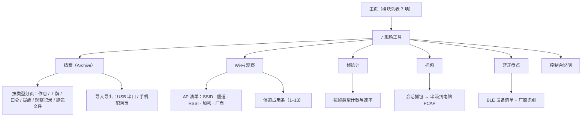
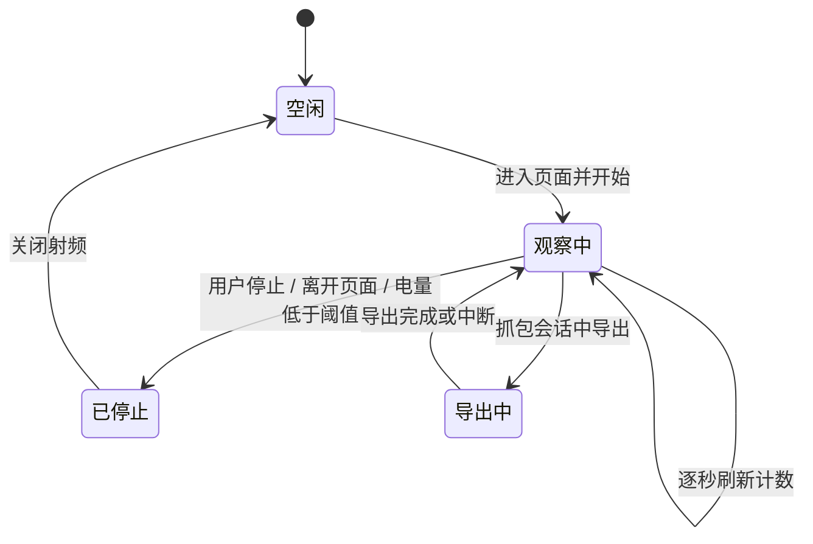
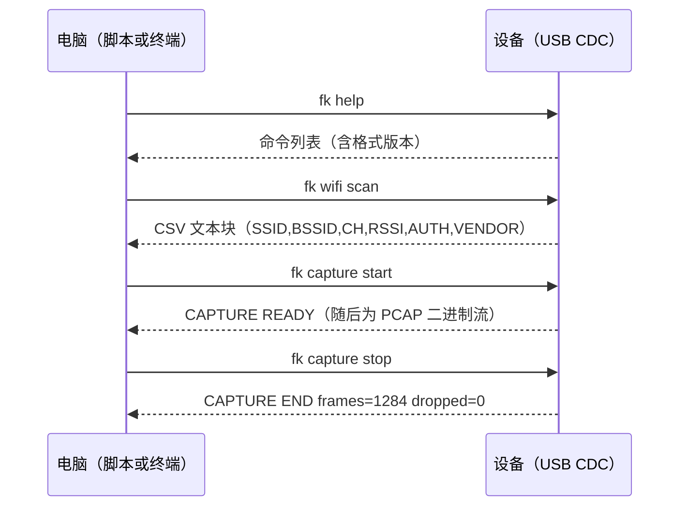

<p align="right">
  <a href="passport-field-kit-prd.md">English</a> · <strong>简体中文</strong>
</p>

# AI Passport 随身工具箱 · 现场工具 产品需求文档

玩法名称：现场工具（Field Kit，`passport-toolbox` 的第 7 个模块组）
运行平台：FoloToy AI Passport（ESP32-C3，8 MB Flash，无 PSRAM，240×320 竖屏，三键）
文档日期：2026-09-28
文档状态：第一版规划，仅定义需求与边界，尚未实现
关联文档：[随身工具箱产品需求文档](passport-toolbox-prd.zh_CN.md)（本模块组是它的增量）

本文档只回答三件事：这套硬件上还能加什么、加的东西来自哪些成熟项目、以及为什么有些能力明确不做。

---

## 1. 需求背景与来源

工具箱现有六个模块解决"个人日常"问题：时间、专注、作息、身份、赛事、系统。它们有一个共同点——只与用户自己有关，不观察外部世界。而设备本身带着 2.4 GHz Wi-Fi 与蓝牙，硬件自检页也能读到按键电压、电池与总线状态，也就是说这个设备已经有"感知"能力，只是还没有把它做成产品。

把它做成产品的参照对象很明确：Flipper Zero 证明了"口袋里的多工具"这种产品形态能被普通用户接受，ESP32Marauder 证明了在 ESP32 上做无线观察与抓包是工程上成立的。两者的功能清单不能照搬，因为它们的硬件与这台设备差得很远，但它们的产品结构、交互组织方式和数据组织方式值得提炼。[调研支撑]

触发来源：社区和用户对这两类玩法的持续性关注，以及本设备已经具备但未产品化的无线与总线能力。[专家判断]

---

## 2. 产品目标与范围

目标不是"做一个 Flipper"，而是在不破坏离线优先定位的前提下，给同一个设备补上一组面向"看清楚周围的无线环境"的工具，并让观察结果能被带走（导出到电脑）。

| 编号 | 目标 | 达成判据 |
|------|------|----------|
| O1 | 设备脱离电脑也能回答"周围有什么网络、信道挤不挤" | 观察页在无任何外部设备时可用；单次扫描可列出周边 AP 清单与信道占用 |
| O2 | 观察结果可带走 | 一次观察能导出成电脑可读文件（CSV / PCAP），导出失败有明确原因提示 |
| O3 | 记录不再被固定数量上限卡住 | 用户可保存的记录条数不再由编译期常量决定；档案库容量 [待实测确认] |
| O4 | 不损害既有体验 | 新模块全部离线可用；主页、作息倒计时、番茄钟的按键反馈仍 ≤200 毫秒 |
| O5 | 只做被动观察 | 不提供任何主动干扰、注入、伪造、破解或凭据获取能力 |

范围：新增第 7 个模块组"现场工具"，包含档案库、串口控制台、无线观察三类能力（功能 26–35）。不含任何硬件改动；不含手机端原生应用；不含云端。

---

## 3. 硬件能力核查

这一节是本文档的核心。先写清楚硬件不支持的边界，后续功能清单才有意义。[调研支撑]

### 3.1 引脚已经用满

ESP32-C3 可用 GPIO 共 15 个（GPIO0–10、GPIO18–21），本板全部占用：

| 引脚 | 用途 | 引脚 | 用途 |
|------|------|------|------|
| GPIO0 | 三键 ADC 分压 | GPIO8 | LCD SCLK |
| GPIO1 | LCD CS | GPIO9 | LCD MOSI（兼启动 strapping） |
| GPIO2 | I2S DOUT | GPIO10 | I2C SDA |
| GPIO3 | I2S WS | GPIO18 | USB D− |
| GPIO4 | I2S DIN | GPIO19 | USB D+ |
| GPIO5 | I2S BCLK | GPIO20 | LCD DC |
| GPIO6 | I2S MCLK | GPIO21 | LCD 背光 |
| GPIO7 | I2C SCL | | |

结论：这台设备无法外挂红外收发、Sub-GHz（CC1101 一类）、13.56 MHz / 125 kHz 射频前端或 1-Wire 读头。Flipper Zero 的六大硬件玩法在这块板子上不是"做不做"的问题，而是没有电气通路。要做只能等硬件改版，届时也应先在 `components/bsp/include/bsp_pins.h` 里定义引脚与验收口径。

### 3.2 USB 是固定功能的串口

C3 的 USB 控制器是 USB-Serial-JTAG，Espressif 明确说明它是"固定功能设备、完全由硬件实现"，不能改描述符、不能重配置成别的功能；官方 FAQ 同样写明 C3 只能作为 USB 设备提供串口与 JTAG，没有 USB-OTG。[调研支撑]

由此直接排除：BadUSB（USB HID 键盘）、U2F 安全密钥、USB 大容量存储（模拟 U 盘）。USB 这条线上唯一能做的是 CDC 串口数据通道，而这恰好是串口控制台的基础。

另有一处必须写进需求的既有事实：本仓库的控制台已经占用这条 CDC（`CONFIG_ESP_CONSOLE_USB_SERIAL_JTAG=y`），串口控制台只能与日志共用同一个通道，不存在"另开一个 USB 口"的选项。

### 3.3 能做的部分

| 能力 | 硬件依据 | 产品可用性 |
|------|----------|-----------|
| 被动接收 802.11 帧 | C3 支持混杂模式（promiscuous），可拿到管理帧、数据帧、控制帧与 CRC 错误帧，并可按帧类型过滤 | 可做帧统计与抓包 |
| AP 扫描 | Wi-Fi 驱动原生支持主动/被动扫描，返回 SSID/BSSID/信道/RSSI/加密方式 | 可做环境观察 |
| BLE 扫描 | NimBLE 中央设备发现，可拿地址、名称、RSSI、地址类型 | 可做设备盘点 |
| 板载文件存储 | 8 MB Flash 中应用只占约 3.5 MB，剩余空间可划出数据分区 | 可做档案库 |
| USB CDC 数据通道 | 固定功能串口，可双向传输 | 可做控制台与 PCAP 串流 |
| 手机交互 | 已有 SoftAP 配网页与 BLE 配网 | 可扩展到文件传输 |

同时必须接受三条硬约束：

- 单射频。抓包与联网、Wi-Fi 与蓝牙扫描都抢同一个射频，只能分时串行，不能并行做两件事。
- 混杂模式对吞吐影响很大（官方文档原话是"great impact"），只在观察页面开启，离开即关闭。
- 无 PSRAM，可用 SRAM 约 400 KB，且要与 Wi-Fi、蓝牙、LVGL 共享。抓包只能用小的固定缓冲，不做大缓存。

### 3.4 与参考项目的硬件差距

| 能力 | Flipper Zero | 本设备 |
|------|--------------|--------|
| Sub-GHz 收发 | CC1101，300–928 MHz | 无 |
| 125 kHz / 13.56 MHz | 有 | 无 |
| 红外收发 | 有 | 无 |
| 1-Wire / iButton | 有 | 无 |
| USB HID（BadUSB / U2F） | 有 | 无（固定功能串口） |
| 存储 | microSD | 板载 Flash 分区 |
| 屏幕 | 128×64 单色（5 键） | 240×320 彩色（3 键） |
| 无线观察 | 无（靠外部硬件） | 2.4 GHz Wi-Fi 混杂模式 + BLE 扫描 |
| GPS | 无 | 无 |

差距是双向的：Flipper 有射频前端但没有无线观察能力，本设备相反。这也决定了产品定位——**不做 Flipper 的翻版，做它的软件组织方式在本硬件上能成立的那部分。**

---

## 4. 参考项目研究

### 4.1 Flipper Zero：值得拿走的是数据与生态，不是硬件

| 借鉴点 | Flipper 的做法 | 在本设备上的落地 |
|--------|----------------|------------------|
| 档案库（Archive） | 按类型分页浏览已保存的遥控、卡片、密钥、载荷 | 档案库页按类型分页管理作息、工牌、口令条目、提醒、观察记录、抓包文件 |
| 串口 CLI | 插上 USB 即可用文本命令驱动设备，qFlipper 与第三方脚本都建立在它之上 | 串口控制台：设备侧文本命令，PC 侧可脚本化 |
| 稳定文件格式 | 保存的信号、载荷都是可被外部工具读写的文件，生态因此能长出来 | 导出格式固定为 CSV / JSON / PCAP，并带格式版本号 |
| 活动状态必须常显 | 广播、仿真等状态在状态栏有图标，用户不会忘记设备在做什么 | 观察模式在状态栏常显标记，任意页面长按可一键停止 |
| 手机伴侣 | 官方 App 通过 BLE 做数据管理与分享 | 扩展已有配网页为文件传输与结果查看入口 |
| 不做 | Sub-GHz / RFID / NFC / 红外 / iButton / BadUSB / U2F | 无硬件通路或不满足 USB 形态，见第 3 章 |

### 4.2 ESP32Marauder：值得拿走的是被动分析，不是攻击面

Marauder 的能力清单里，扫描、实时帧统计、PCAP 记录、BLE 设备识别都是"观察"，去认证洪泛、beacon 洪泛、probe 洪泛、PMKID 与握手捕获、钓鱼门户、BLE 广告洪泛都是"干扰或攻击"。[调研支撑]

本产品只取前者：

| 借鉴点 | Marauder 的做法 | 在本设备上的落地 |
|--------|------------------|------------------|
| AP / 客户端清单 | 扫描并列出 AP 与关联客户端，带 OUI 厂商识别 | Wi-Fi 环境观察页：AP 清单 + 信道占用 + 厂商识别 |
| 实时帧统计 | 屏幕上的 packet monitor，按帧类型分类计数 | 帧统计页：按管理/数据/控制/错误分类的实时计数与速率条 |
| PCAP 记录 | 抓到 SD 卡，事后用 Wireshark 打开 | 改为经 USB CDC 实时串流到电脑，不占板载空间、不落地他人载荷 |
| BLE 设备识别 | 设备清单，并对特定设备类型做识别 | 蓝牙盘点页：清单 + 少量厂商识别 |
| CLI / 菜单 / Web 三入口 | 三者并存 | 只做"按键 + 串口"两入口。不做 Web 命令行：配网页是给普通用户配置设备的入口，混入命令行会同时破坏易用性与安全性 |
| 不做 | 去认证、各种洪泛、握手与 PMKID 捕获、钓鱼门户、BLE 广告洪泛、GPS 打点 | 干扰与攻击能力不做，理由见第 7 章 |

Marauder 的 GPS 打点是依赖 GPS 模块与 SD 卡的；本设备两者都没有。一个看似可行的替代是"用手机位置打点"，但浏览器的定位 API 要求安全上下文（HTTPS 或 localhost），而配网页是 `http://192.168.4.1`，拿不到定位权限。因此本期不做地图定位，导出文件里保留时间戳，位置与地图由用户在电脑侧补。

### 4.3 研究结论

两个项目的可迁移部分高度一致：**数据如何组织、状态如何可见、结果如何带走**。这部分与硬件无关，所以能拿过来。

它们的招牌能力都建立在硬件上（Flipper 的射频前端、Marauder 的 ESP32 双核与大内存），这部分拿不过来，硬搬只会得到半成品。

被动观察与主动攻击在实现上只差几十行代码，在产品上是两条路。本产品选被动观察，理由不在技术可行性，而在合法性与这个设备的使用场景（随身、面向学生、常放在桌面）。

---

## 5. 目标用户与使用场景

| 用户 | 特征 | 使用频率 | 关键诉求 |
|------|------|----------|----------|
| 硬件折腾者（主） | 会自己烧录、看日志、关心 BSP 与功耗；已在用自检页与低功耗页 [调研支撑] | 每周数次 | 想弄清楚周围无线环境；想要能导出的原始数据；愿意接串口 |
| 学生用户（次） | 用工具盒的离线功能，不接电脑 | 很少进入本模块组 | 只想知道"我这个位置的 Wi-Fi 挤不挤、宿舍哪个信道更好" |
| 教师 / 社团（弱） | 带学生做网络基础实验 | 演示时 | 需要一个安全、只能被动观察的演示设备 |

核心场景按优先级排：

1. 到新环境先看一眼：宿舍、教室、机房，开 Wi-Fi 观察页看 AP 数量、信道拥挤程度、信号强度分布，判断该连哪个、要不要换信道。
2. 排查自己的网络：路由器放哪儿信号好、自己家 AP 是不是被邻居挤在同一信道。
3. 带走数据：把一次观察导出成 CSV，在电脑上看趋势；或者抓一段 PCAP，用 Wireshark 看自己的设备在做什么。
4. 演示与教学：向别人解释广播帧、探针请求、去认证帧分别是什么，为什么有人用它们做坏事而本设备不做。

前置条件：观察功能需要开启射频，会明显增加耗电；设备没有 GPS、没有 SD 卡，带走的路径是 USB 或手机热点网页。

---

## 6. 功能需求

### 6.1 信息架构

主页模块列表由 6 项变为 7 项，新增"现场工具"。既有模块的内部结构与数据不动。



一次观察会话的状态流转：



### 6.2 入口与按键约定

沿用全局三键约定（短按响应即发、长按 500 毫秒触发、不使用双击，见 [工具箱 PRD 第 6.2 节](passport-toolbox-prd.zh_CN.md)）：

| 页面 | 短按 UP / DOWN | 短按 OK | 长按 UP | 长按 DOWN | 长按 OK |
|------|----------------|---------|---------|-----------|---------|
| 现场工具菜单 | 选择条目 | 进入 | 档案库快捷入口 | 切到下一模块组 | 返回主页 |
| 档案库 | 移动选中项 | 打开 / 导出 | 切换类型页 | 切换排序（名称/时间） | 返回 |
| Wi-Fi 观察 | 滚动清单 | 开始 / 停止扫描 | 只显示强信号 | 切换信道占用 / 清单视图 | 返回 |
| 帧统计 | 调显示项 | 开始 / 停止 | 切换信道 | 锁定当前信道 | 返回 |
| 抓包 | 滚动说明 | 开始 / 结束会话 | 导出到电脑 | 丢弃本次记录 | 返回 |
| 蓝牙盘点 | 滚动清单 | 开始 / 停止扫描 | 只显示有名称设备 | 清空清单 | 返回 |

一致规则：任何观察页面离开时立即停止射频；熄屏期间不保持抓包（熄屏即停止，恢复时提示"上次观察已因熄屏停止"）。

### 6.3 功能总览

| # | 模块 | 功能说明 |
|---|------|----------|
| 26 | 档案库 | 统一的本地文件入口，按类型分页浏览与管理用户数据。取代目前"记录写死在 NVS 定长结构里"的做法，使记录条数不再由编译期常量决定（现为工牌 ≤5 张、提醒 ≤16 条）。每条记录是独立文件，带类型、创建时间、大小与来源标记；支持重命名、删除、按时间或名称排序。删除需二次确认，且提示"该操作不可恢复"。容量与条数上限由数据分区大小决定 [待实测确认]。 |
| 27 | 档案导入导出 | 两条路径。USB 串口：设备侧输出文本块（CSV / JSON），电脑侧自取；手机配网页：在现有页面增加文件列表与上传下载。导出文件头带格式版本号与生成时间，便于电脑侧脚本兼容。导入时先校验格式版本与字段完整性，逐条报告成功与失败数量，不整体回滚，也不静默丢弃。 |
| 28 | 串口控制台 | 在既有 USB CDC 通道上提供文本命令：查询状态、列出档案、读取文件、开始与停止观察、导出抓包、设置时间与配置项。命令与日志共用同一通道，必须用显式前缀区分，避免人读日志时把命令输出混进来。命令集保持小而稳定，面向脚本而非交互式全屏界面。设备进入深睡后 USB 设备会从系统消失，控制台需在文档中写明这一限制。 |
| 29 | Wi-Fi 环境观察 | 被动扫描并列出周边 AP：SSID、BSSID、信道、RSSI、加密方式、厂商（按 OUI 前缀识别，仅使用板载的小型对照表，不联网查询）。同一 BSSID 多次扫描只保留最新一条并记录出现次数。信道占用视图把 1–13 信道画成竖条，条高表示该信道上的 AP 数量与最强信号，用来判断"拥挤程度"。扫描结果默认保留在内存中，离开页面即清空；需要留存时由用户显式保存为一条观察记录。 |
| 30 | 帧统计 | 开启混杂模式后按帧类型实时计数：管理帧（细分为 beacon、probe request/response、deauth）、数据帧、控制帧、CRC 错误帧。显示每秒速率与累计数，并提供一段短时的速率条。可锁定单个信道，也可按固定顺序轮换。仅计数，不保存帧内容。轮换与统计参数只在页面内生效，离开即恢复默认。 |
| 31 | 抓包与导出 | 会话式抓包：用户开始一次会话，设备把收到的帧封装成 PCAP 经 USB CDC 实时送到电脑，由电脑侧保存文件。板载不缓存完整载荷，避免占用无 PSRAM 设备的内存。开始前必须经过一次明确的确认页，写清"将记录周围设备的数据帧，可能包含他人设备的地址信息，请仅在自己的网络或已获授权的环境中使用"。会话默认限制时长与文件大小上限，达到上限自动停止并提示。 |
| 32 | 蓝牙盘点 | 被动发现 BLE 设备并列出地址、地址类型、名称（若有）、RSSI 与出现次数；对有名称或已知厂商的设备做轻量识别。同一地址去重。清单可清空。与 Wi-Fi 观察互斥，切换时提示"蓝牙与 Wi-Fi 共用射频，已停止上一项"。 |
| 33 | 观察会话记录 | 每次观察（Wi-Fi 扫描、帧统计、抓包、蓝牙盘点）结束后生成一条会话记录，包含类型、起止时间、时长、信道、采样数与导出状态。记录进入档案库，可导出为文本。这条记录也是用户回看"上次观察到什么"的唯一入口。 |
| 34 | 观察模式状态 | 观察进行中时，任意页面状态栏持续显示观察标记，提示条显示停止方式；从任意页面长按可停止观察。避免用户忘记设备仍在收帧而继续耗电。 |
| 35 | 帧类型学习页 | 用设备自己统计到的计数解释 beacon、probe request、deauth 等帧的作用，并说明本设备为什么只做被动观察。面向学生用户与演示场景。 |

### 6.4 模块详情与原型

#### 6.4.1 现场工具菜单（功能 26–35 的统一入口）

```
┌──────────────────────────────┐
│ 现场工具                       │  ← 状态栏照常显示时间与电量
├──────────────────────────────┤
│  ▸ 档案库            12 项     │
│    Wi-Fi 观察                 │
│    帧统计                     │
│    抓包                       │
│    蓝牙盘点                   │
│    控制台说明                 │
├──────────────────────────────┤
│ 观察中：Wi-Fi 扫描  长按OK 停止 │  ← 仅观察进行时出现
└──────────────────────────────┘
│ ↑↓ 选择  OK 进入  长按↑ 档案  长按OK 返回 │
```

- 业务逻辑：菜单只做入口与状态汇总，不承载具体操作。第二行"观察中"只在射频开启时出现，显示当前观察类型。
- 交互逻辑：UP/DOWN 移动焦点；OK 进入；长按 UP 直接跳到档案库（使用频率最高的条目）；长按 OK 返回主页。若当前有观察在进行，长按 OK 先停止观察并提示，再返回。
- 规则约束：任何时刻只允许一个观察任务在跑。启动第二项时先停掉第一项并在提示条说明原因。
- 边界与异常：射频初始化失败时进入本菜单仍可用，观察条目变灰并提示"射频不可用，请重启设备"；电量低于 15% 时开始观察前给出耗电提示。

#### 6.4.2 档案库（功能 26、27、33）

```
┌──────────────────────────────┐
│ 档案           作息 · 共 3 项  │  ← 类型页签 + 计数
├──────────────────────────────┤
│  ▸ 走读作息表     09-28 12:10 │
│    住校作息表     09-27 20:41 │
│    考试周作息     09-25 08:02 │
├──────────────────────────────┤
│ 导出：USB 串口 或 手机配网页   │
└──────────────────────────────┘
│ ↑↓ 选择  OK 打开  长按↓ 排序  │
```

- 业务逻辑：档案库管理六类内容——作息、工牌、口令条目（只存名称与配置，不导出密钥）、提醒、观察记录、抓包文件。每类一个分页，页签上显示当前条数。条目按创建时间倒序，可切换为名称排序。
- 交互逻辑：UP/DOWN 移动选中；OK 打开详情并给出导出选项；长按 UP 切换类型页；长按 DOWN 切换排序方式；长按 OK 返回。
- 规则约束：文件名与显示名长度上限统一，超长截断并以省略号显示；口令类条目禁止通过任何导出路径输出密钥，只允许输出名称与配置项；删除需二次确认。
- 边界与异常：容量写满时拒绝新建并提示"档案库已满，请先导出或删除"；文件系统挂载失败时档案库显示不可用并建议在设置页修复（格式化），不静默丢弃既有数据。

#### 6.4.3 Wi-Fi 环境观察（功能 29）

```
┌──────────────────────────────┐
│ Wi-Fi 观察     CH 6 · 23 个 AP │
├──────────────────────────────┤
│  ▸ HomeNet-5G   6  -42  WPA2  │  ← 选中项
│    office-2.4   1  -58  WPA2  │
│    <隐藏>      11  -70  WPA3  │
│    TP-LINK_A2   6  -74  WPA2  │
├──────────────────────────────┤
│ 信道占用（AP 数 / 最强 RSSI）  │
│ 1▁2▂3▁4▁5▁6█7▁8▁9▁10▂11▄12▁13▁ │
└──────────────────────────────┘
│ ↑↓ 滚动  OK 重扫  长按↓ 切视图 │
```

- 业务逻辑：OK 触发一次扫描（首次进入自动扫描一次）。清单显示 SSID、信道、RSSI、加密方式与厂商；隐藏 SSID 显示为占位文本。信道占用视图按信道统计 AP 数量与其中最强信号，条高同时反映两者：数量决定高度，最强信号决定颜色深浅。
- 交互逻辑：UP/DOWN 滚动清单，滚动到顶部/底部时停在边界不环绕；长按 UP 只显示 RSSI 强于 −70 dBm 的项；长按 DOWN 在"信道占用"与"清单"两个视图间切换；OK 重新扫描。选中项为 AP 时可展开显示 BSSID 与厂商全名。
- 规则约束：只做被动接收与驱动扫描，不发送任何非扫描帧；同一 BSSID 只保留一条并累加出现次数；厂商识别仅用板载 OUI 表，覆盖不到时显示未知，不编造。
- 边界与异常：未找到任何 AP 时显示"未发现网络"并给出"信号弱或射频未就绪"的可能原因；扫描期间再次按 OK 不排队第二次扫描，提示"扫描中"；设备已联网时提示"当前已连接，扫描会短暂影响连接"。

#### 6.4.4 帧统计（功能 30）

```
┌──────────────────────────────┐
│ 帧统计          CH 锁定 6  1:12│  ← 已运行时长
├──────────────────────────────┤
│ 总计 1,284 帧    21 帧/秒      │
│ 管理帧   1,102  ██████████    │
│  ·beacon  890   ████████      │
│  ·probe   180   ██            │
│  ·deauth    0                 │
│ 数据帧      96  █             │
│ 控制帧      62  ▁             │
│ CRC 错误    24  ▁             │
├──────────────────────────────┤
│ OK 停止  ↑↓ 滚动  长按↓ 锁信道 │
└──────────────────────────────┘
```

- 业务逻辑：开启混杂模式并按帧类型累加计数，每秒刷新一次速率与条形图。计数在驱动回调里完成，界面只读快照，保证不在射频回调里做重活。
- 交互逻辑：OK 开始/停止；UP/DOWN 滚动细分项；长按 UP 切换工作信道；长按 DOWN 在"锁定当前信道"与"按固定顺序轮换"之间切换。
- 规则约束：只计数，不保存任何帧内容、不做解码到应用层协议；轮换只使用 1、6、11 三个常用信道，避免长时间停留在他人的私有信道上。
- 边界与异常：混杂模式开启失败时给出明确错误与建议；射频冲突（正在联网或做蓝牙盘点）时先停掉对方并说明；停止后计数保留在屏幕上供查看，离开页面清空。

#### 6.4.5 抓包与导出（功能 31）

```
┌──────────────────────────────┐
│ 抓包                准备就绪   │
├──────────────────────────────┤
│ 将记录周围设备的数据帧，可能   │
│ 含他人设备地址。请仅在自己的   │
│ 网络或已获授权环境使用。       │
│                              │
│ 上限：5 分钟 / 2 MB           │
├──────────────────────────────┤
│ OK 开始  长按OK 返回          │
└──────────────────────────────┘
```

- 业务逻辑：用户确认后开始会话，设备把帧封装为 PCAP 经 USB CDC 发出，电脑侧落盘。达到时长或大小上限自动停止并提示"已达上限，会话已结束"。会话结束后生成一条观察记录。
- 交互逻辑：OK 在确认页开始抓包；抓包中 OK 结束会话；长按 UP 提示导出方式（在电脑侧用串口工具接收）；长按 DOWN 丢弃本次记录，需二次确认；长按 OK 返回。
- 规则约束：确认页每次会话都必须出现一次，不做"不再提示"的选项；不缓存完整载荷到 Flash；不提供把抓包结果留在设备上的选项。
- 边界与异常：电脑侧未连接（USB 未枚举）时拒绝开始并提示"请先连接电脑"；传输中断时报告已发送帧数，不伪装成成功；电量低于 20% 时给出提示并在低于 10% 时强制停止。

#### 6.4.6 蓝牙盘点与学习页（功能 32、35）

```
┌──────────────────────────────┐
│ 蓝牙盘点          18 个设备    │
├──────────────────────────────┤
│  ▸ A4:C1:38:xx:xx  耳机 -46   │
│    无名称            -58      │
│    F0:9F:xx:xx     Beacon-62  │
├──────────────────────────────┤
│ ↑↓ 滚动  OK 停止  长按↓ 清空  │
└──────────────────────────────┘
```

- 业务逻辑：被动发现 BLE 设备，按地址去重，记录地址类型、名称、RSSI 与出现次数；对已知厂商前缀做轻量识别。
- 交互逻辑：UP/DOWN 滚动；OK 开始/停止扫描；长按 UP 只显示有名称的设备；长按 DOWN 清空清单（需确认）；长按 OK 返回。
- 规则约束：只做发现，不发起连接、不读写任何 GATT 特征、不发送任何广播；不保存他人设备的持久标识，离开页面即丢弃。
- 边界与异常：Wi-Fi 观察进行中时提示射频冲突并先停止对方；未发现设备时显示可能原因；蓝牙栈初始化失败时本页不可用但其余功能不受影响。

学习页（功能 35）用一屏文字加两栏对照解释常见帧类型与它们被滥用的方式，并写明本设备只保留被动能力的原因。它不联网、不引用外部文档，内容随固件一起发布。

#### 6.4.7 串口控制台（功能 28）



- 业务逻辑：命令以固定前缀开头，便于与日志区分。命令集覆盖状态查询、档案列举与读取、扫描、帧统计、抓包开始与结束、时间与配置设置。所有输出使用可解析的稳定格式，格式版本号随固件版本走。
- 交互逻辑：设备侧不需要切换到特殊模式；收到合法命令即执行，屏幕回到主页并显示"串口控制中"标记，避免用户不知道设备被外部驱动。
- 规则约束：命令集不做破坏性默认操作（清空、格式化必须显式带确认参数）；不提供读取口令密钥的命令；不提供任何主动发送无线帧的命令。
- 边界与异常：非法命令返回用法提示而不中断会话；进入深睡后 USB 设备消失，文档需说明；日志与命令共用通道，输出中不含控制字符以外的二进制（PCAP 流除外，且只在明确开始后出现）。

### 6.5 数据与存储策略

档案库需要一块可写的板载分区。当前分区表只有一个覆盖剩余空间的 `factory` 应用分区与 24 KB NVS，没有用户文件区。给数据分区腾空间意味着缩小应用分区，这是需要显式决策且必须通过校验的改动：

- 应用分区在缩小后仍需留有不小于 20% 的余量，避免后续功能无处安放。
- 改动后的分区表必须通过 `tools/verify_firmware.py` 的布局校验，且合并镜像仍可从 `0x0` 整片刷写。
- 分区表变化会清空设备上的用户数据。升级说明里必须写明这一点，并提供"先导出再刷写"的路径。
- 档案库数据与 NVS 解耦：NVS 继续只放配置与运行态，用户记录走文件分区，避免一次结构变更连带清掉全部数据。

导出格式约定：

| 类型 | 格式 | 说明 |
|------|------|------|
| 作息 / 提醒 / 工牌 | JSON 或 CSV | 带格式版本号、生成时间与条目数 |
| Wi-Fi 观察 / 蓝牙盘点 | CSV | 一行一个条目，字段固定顺序 |
| 帧统计会话 | CSV | 每行是一个采样点的时间与各类计数 |
| 抓包 | PCAP | 标准格式，可直接用 Wireshark 打开 |
| 口令条目 | 仅名称与配置 | 密钥不出设备 |

### 6.6 观察模式的统一规则

观察会改变设备行为，因此需要一套跨页面的统一规则：

- 状态常显：射频开启期间状态栏始终带标记，提示条始终显示停止方式。
- 一键停止：任意页面长按 OK 先停止观察，再执行原动作。
- 熄屏即停：息屏、深睡、离开页面、电量低于阈值都停止观察，恢复时不自动续跑，只提示上次因何停止。
- 不静默：每次开始观察都有明确的开始反馈（提示条文案 + 可听提示音），不使用"无提示的隐藏状态"。

---

## 7. 风险、合规与实施顺序

### 7.1 合规边界

被动接收无线电信号与观察周边网络，与干扰、伪造、破解在合法性上完全不同：

- 本产品不发送任何非扫描帧，不伪造 AP，不断开他人连接，不洪泛，不搭建钓鱼门户，不尝试破解加密，不采集他人凭据。
- 抓包会把周围设备的数据帧写到用户电脑上。抓包确认页必须写明用途限制，默认参数保守（有明确上限、不落板载），不做"不再提示"。
- 观察清单与抓包文件可能包含他人设备地址。产品不自动上传、不联网回传、不做云同步；档案库提供整类删除，删除后不留残余副本。
- 面向学生的场景尤其需要边界清晰：不做不等于做不到，学习页要把这个选择讲清楚，避免用户以为设备"能力不足"而转去找攻击工具。[工程判断]

### 7.2 风险

| 风险 | 影响 | 应对 |
|------|------|------|
| 单射频互斥 | 抓包时不能联网，Wi-Fi 与蓝牙扫描不能同时进行 | 统一由一个观察调度者串行管理；冲突时明确提示先停了什么 |
| 内存不足 | 无 PSRAM，Wi-Fi + 蓝牙 + LVGL + 文件系统并存可能触发分配失败 | 抓包不缓存载荷；观察页只在需要时申请与释放；实现阶段以运行时最小堆为验收项之一 |
| 混杂模式影响吞吐 | 开启期间既有联网功能变慢甚至不可用 | 只在观察页开启；离开立即关闭；界面上说明影响 |
| 分区表变更清数据 | 用户刷入新固件后丢失既有记录 | 升级说明前置提示；提供先导出后刷写的路径；档案库与 NVS 解耦 |
| USB 通道共用 | 命令输出与日志混杂，深睡后 USB 消失 | 固定前缀区分；文档写明深睡限制；控制台不做交互式全屏界面 |
| 导出数据含他人信息 | 隐私与合规风险 | 默认只做计数；抓包逐次确认；不做云同步；提供整类删除 |
| 观察耗电 | 随身设备电量消耗明显加快 | 低电量提示与强制停止阈值；熄屏即停；界面显示已运行时长 |
| 功能膨胀 | 本模块组与工具箱主线的离线体验争夺资源与注意力 | 本模块组保持"默认不被进入"：不进主页信息卡、不参与主页焦点默认值、不产生后台观察 |

### 7.3 实施顺序

按依赖关系分四步，前一步是后一步的前提，不并行开工：

1. 数据底座：数据分区落地 + 档案库 + 导入导出 + 串口协议骨架。没有这一步，后面的观察结果无处安放。
2. 被动观察：Wi-Fi 环境观察与帧统计。这一步就能独立产生用户价值，也是风险最高的部分（内存与射频行为）。
3. 抓包与导出：PCAP 串流、确认页、上限与中断处理。
4. 蓝牙盘点、观察会话记录、学习页与打磨。

---

## 8. 验收标准与本期不做

### 8.1 验收标准

必须在真机上成立，且与既有工具箱功能互不干扰：

1. 断网状态下，现场工具菜单全部条目可用（除需要 USB 的导出环节）。
2. 进入 Wi-Fi 观察页 3 秒内出现首屏结果；20 秒内可列出周边 AP；信道占用视图与清单视图一致。
3. 帧统计页计数连续刷新不掉行；停止后再开始，计数从零重新累加。
4. 抓包会话在电脑侧能生成可被 Wireshark 打开的 PCAP 文件；中断时给出已发送帧数而不是成功提示。
5. 任意页面长按 OK 都能停止观察，状态栏标记同步消失。
6. 熄屏、深睡、离开页面、电量低于阈值四种情形都能停止观察，且恢复时不自动续跑。
7. 档案库导出文件能被电脑侧脚本按格式版本解析；口令条目导出中不含密钥。
8. 全部观察功能关闭后，主页、作息倒计时与番茄钟的按键反馈仍 ≤200 毫秒，息屏行为与现在一致。
9. 合并镜像仍可从 `0x0` 整片刷写，分区布局通过校验。
10. 观察功能全程未发送任何非扫描帧（通过抓包自检或代码走查确认）。

### 8.2 本期不做

| 不做的事 | 原因 |
|----------|------|
| Sub-GHz、125 kHz / 13.56 MHz 射频、红外、1-Wire / iButton | 无射频前端，且 15 个 GPIO 已全部占用，无法外挂；需硬件改版 |
| BadUSB（USB HID）、U2F、USB 大容量存储 | C3 的 USB 是固定功能串口，描述符不可改 |
| BLE 键盘 / 文本注入 | 属输入注入面，同样需要明确授权才能使用；长文本输入用串口或配网页复制即可 |
| 去认证、beacon / probe 洪泛、握手与 PMKID 捕获、钓鱼门户 | 干扰与攻击能力，法律与产品定位均不允许 |
| BLE 广告洪泛（配对弹窗类） | 同上，且已有开源项目因此被上游移除的先例 |
| GPS 打点与地图 | 无 GPS；手机浏览器定位需安全上下文，配网页的 `http://192.168.4.1` 不满足 |
| 云端同步、账号、遥测 | 与离线优先定位冲突；不采集用户数据 |
| 手机原生 App | 现有配网页可覆盖本期需求，不引入第二个客户端 |
| 攻防演练剧本、载荷库 | 与本期定位无关 |

需要硬件改版才能讨论的项（Sub-GHz 接收、红外收发、外部模块扩展口）单独记录：若未来改版，应先在 `components/bsp/include/bsp_pins.h` 定义引脚与验收口径，再回到本文档拆分需求。
