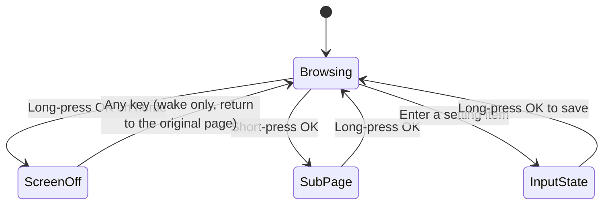
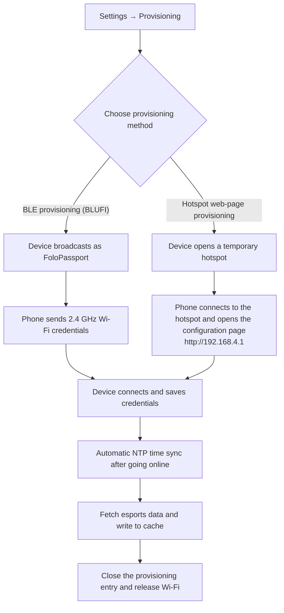

<p align="right">
  <a href="passport-toolbox-prd.zh_CN.md">简体中文</a> · <strong>English</strong>
</p>

# AI Passport Portable Toolbox Product Requirements Document

Play name: Passport Portable Toolbox (Play code: `passport-toolbox`)
Platform: FoloToy AI Passport (ESP32-C3 wearable AI hardware)
Document date: 2026-09-24
Document status: Third revision, including UI design specification and anti-human risk review, pending review

**Implementation scope for this release.** This release implements the full offline core plus the esports online module. The offline core covers the time and calendar, focus and productivity, routine and countdown, and identity and tools modules, while the online module covers the League of Legends esports center. The divination feature (feature 14, "I Ching divination / daily draw") is explicitly out of scope for this release, per section 12. All other features described in this document are in scope.

---

## 1. Requirement Background and Sources

FoloToy AI Passport is an open wearable AI hardware device, and the official repository positions it as a development baseline rather than a finished product: the repository provides the hardware capability contract, a stable BSP interface, resource boundaries, reference implementations, and acceptance methods, while the community distributes its own firmware applications to other players as "plays," and installation is done by connecting the device over Type-C and flashing directly from a web page. The device can only hold one play at a time, and installing a new one overwrites the application currently on the device.

The hardware facts given by the repository form the physical boundaries of this product: an ESP32-C3 main controller, a 240×320 portrait ST7789P3 display, UP/DOWN/OK three buttons (sharing a GPIO0 ADC resistor divider), an ES8311 audio codec, a CW2017 fuel gauge, 2.4 GHz Wi-Fi STA, NimBLE Bluetooth (Bluetooth Classic is not supported), 8 MB Flash, no PSRAM, and two low-power modes, two-second light sleep and five-second deep sleep. [Research support]

The plays currently available in the community cover a fairly wide range of scenarios, but they exhibit two clear characteristics. [Research support]

The first characteristic is that offline capability is generally weak. The most valuable plays all depend heavily on connectivity: Cyber Badge's XiaoZhi voice conversation and city radio, BigDay's real-time weather, voice input, PPT and short-video Bluetooth remote control, and timetable and grade import/sync all fail at their core once the network is gone. The only plays that are truly usable offline are a handful such as Life Progress, Pomodoro Timer, the 2FA authenticator, and health check-in, and their feature sets are all narrow.

The second characteristic is feature fragmentation. If a player wants a calendar, 2FA, a badge, and a countdown at the same time, they have to repeatedly flash between multiple plays, and each flash overwrites the previous data. Attempts such as the all-in-one platform and Banwei, which pack multiple features into a single firmware, have already appeared in the community, showing that players genuinely want integration, but that integration is mostly a side-by-side listing of features without unified architectural constraints built around offline-first.

These two points point to the same opportunity: build a box-style play that defaults to offline, converging the community's validated, highly upvoted ideas into a self-consistent, mutually linked daily toolbox, with networking used only as an enhancement, and add a category of online content that the device's user group genuinely cares about — League of Legends esports data. [Assumption]

The rationale for including League of Legends esports data comes from the user profile and community signals. The device's core users are young students and office workers, who overlap heavily with the League of Legends viewing audience. A social play such as Passport Radar, which requires multiple devices to interact, has already appeared in the community, showing that the hardware is treated as a lightweight, always-on personal information carrier. Using an always-on 240×320 small screen at the desk to see whether a team I follow is playing today and what the current score is, is a real scenario that the device form factor can support. [Assumption]

What happens if we don't solve this: the device will remain in a state where you install a play, use it for two days, and then it gathers dust; it is nearly useless offline, online plays are fragmented from one another, and players must keep re-flashing to switch purposes. [Assumption]

---

## 2. Product Goals

The product should become the one play that, once installed on the device, never needs to be replaced. Around this, the goals fall into four groups.

Offline goal. The core pages must be 100% reachable and operable with no network at all, and all features except the esports center and time sync must not depend on any network request. On first boot, with the device having never been connected, the user can set the time manually and then immediately use all offline capabilities including the calendar, Pomodoro timer, routine countdown, badge, and dynamic passcode. Offline usability is a hard acceptance item measured as a page reachability rate of 100% while disconnected, excluding the esports center; "mostly usable" is not acceptable.

Coverage goal. A single installation covers four categories of daily scenarios — time and calendar, focus and productivity, routine and countdown, and identity and tools — with more than 25 feature points in total, giving the device a reason to be opened even on days without commuting or match watching.

Online enhancement goal. When online, it provides League of Legends esports data, with information shown in three tiers; the default page presents only the schedule and scores, and a single-match detail view is a second-level drill-down. Esports data degrades to a local cache when offline and is clearly labeled with its freshness — no silent failure. The home page persistently shows the next match, so users learn the match status without having to enter the esports center.

Performance goal. Cold start to the main screen in no more than 1.5 seconds; UI feedback for any key press in no more than 200 milliseconds; the esports list scrolls without dropped frames; when entering the esports center, the local cache is shown first (within 500 milliseconds), and the network refresh completes within 5 seconds. These are the acceptance criteria for the first release, with no items left pending confirmation. Offline-first means the "first screen" of the esports center must be determined by the cache rather than waiting for the network to return; otherwise, on a weak network the user stares at a blank screen for a long time.

Engineering goal. All implementations must obey the repository's hardware capability contract: all pins and addresses are read only from BSP definitions, and the application layer does not duplicate hardware constants; the display uses partial refresh to accommodate a single DMA buffer; key callbacks do not block; and no new feature may create a second ADC1 unit or a second I2C bus on the same port.

---

## 3. Design Principles

The three-button small-screen device is the easiest kind of product to make user-hostile: as features multiply, it piles up long-press, double-click, and multi-level menus, and the user has to re-guess the meaning of each button every time. The following principles constrain all interaction decisions in this product, and the feature and UI designs below obey them.

Information before menus. The home page directly presents the three things a user most wants to know on boot: what time it is now, how long until the next routine node, and whether the team I follow is playing. The module list comes after the information cards, so the user gets the main value without drilling into any level.

One thing at a time. Each screen has only one primary action, and that primary action is unique and unambiguous on the screen. Multiple equally important buttons are not placed side by side on one screen.

Discoverable gestures. Every page has a persistent hint bar at the bottom listing the available keys and their meanings for the current page. It does not rely on the user remembering operations learned on a previous page, and there are no hidden gestures that only take effect on specific pages.

No input with latency. No double-click gestures that require a decision window. A double-click forces every single click to wait about 300 milliseconds to be confirmed, making the feel sluggish and causing mis-taps. All operations are composed of short presses and long presses, and a single key press responds immediately.

Do not create daily debt. Do not design features that require daily persistence or else produce frustration. Routine, esports, and calendar information are presented mostly passively; the user takes one look, and no reciprocal check-in behavior is required.

Offline is not crippled. Being offline affects only the esports center and time sync. All other features remain fully usable; the UI shows no blocking page that requires connectivity, and entries are not hidden because of being offline.

Dangerous operations are reversible. Confirm twice before clearing data, and provide a path to export a backup to the phone; warn about data impact before installing and overwriting.

Failures are understandable. Every failure gives a reason and a next step; no blank pages and no silent failures. Empty states explain why they are empty and how content can appear.

Don't deceive when time is inaccurate. For features that depend on time, such as dynamic passcodes and reminders, clearly state that they may be invalid when the time is not synced, rather than giving a seemingly correct result that makes the user fail repeatedly at a login page.

Eye comfort and power saving by default, but without lying. The default is a dark theme, and its purpose is night-time eye comfort; this device is a transmissive ST7789 LCD with an always-on backlight, so a dark theme does not save power. The only power-saving means are shortening the screen-off time and turning off the backlight, and neither the documentation nor the UI copy may imply that dark saves power. Automatic switching follows fixed local-time periods (for example, dark theme from 19:00 to 07:00 the next day), without relying on latitude/longitude and sunset calculations. Always-on mode clearly warns about power consumption; at low battery it gives advice, and only shortens the screen-off time automatically when the user has already enabled the power-saving option, without silently changing user settings.

### 3.1 Trade-offs relative to the first revision

| Discarded or narrowed design | Reason | Alternative |
|--------------------|------|----------|
| Habit check-in and streak days | Creates daily debt, frustration on interruption, and the value of check-in has been rejected by users | Passive routine-node countdown |
| Double-click OK to turn off the screen | Double-click detection adds about 300 milliseconds of latency to every single click and causes mis-taps | Long-press OK on the home page to turn off the screen; a single key press responds immediately |
| Missing-glyph warning for the Chinese font | Makes the UI look incomplete; a missing-glyph warning on user-defined text is unacceptable | Full coverage of the common Chinese character set |
| Scheduling by subject | High per-entry cost, misaligned with the countdown need users actually want | Routine-node timeline with countdown |
| Six peer menu entries occupying the home page | The user has to search the menu every time, and the first thing seen on boot has no value | Information cards first, module list after |
| Forbidding dynamic passcode use when the time is not synced | Being blocked during an urgent login is maddening | Warn but still allow use, and provide a calibration path |
| Reminder limit of 8 | A hard limit is easy to hit, and there is no way forward once hit | Raise the limit and provide a clear management UI |
| Returning to the home page after a deep-sleep wake | Pomodoro, timer, and current-page state are lost | Persist runtime state and the last page |

### 3.2 Second-revision critical review: anti-human risk list

The second revision was reviewed line by line with a single standard: "will the user get burned?" The only criterion was: without reading the manual, will the user make a wrong operation, get stuck, or be confused by the device's response? The table below lists the issues found and how they are handled; the resolutions are reflected in the corresponding sections below.

| # | Risk | Why it is anti-human | Handling in this revision |
|---|------|--------------|----------|
| 1 | Long-press DOWN on the home page directly starts the Pomodoro timer | A hidden gesture that also accidentally starts a 25-minute timer, which users often notice only seconds later | Remove this shortcut; the Pomodoro timer is entered from the module list and the quick panel |
| 2 | The home-page hint bar does not list the long-press UP quick panel | Directly violates the discoverable-gestures principle; the user never knows the panel exists | Complete the hint bar with long-press UP; every item in the panel has a visible fallback entry |
| 3 | Using a dark theme to imply power saving | This device is a transmissive LCD with an always-on backlight; dark does not save power, which amounts to guiding the user with a false reason | Dark declares only night-time eye comfort; power saving is handled solely by screen-off |
| 4 | Silently shortening screen-off at low battery | The screen-off duration set by the user is quietly changed, making behavior unpredictable | Change to an advisory prompt, effective only when the user has enabled the power-saving option |
| 5 | The recovery code can only be exported from the phone configuration page | Purely offline users get stuck, and this contradicts the positioning of being fully usable offline | On the device, long-press UP and confirm twice to view it directly; phone export is optional |
| 6 | After provisioning succeeds, the entry closes with no way to reopen it | Later attempts to change the badge, import a routine, or export a backup have no way in | Make clear that the hotspot configuration page is a device-local service that can be reopened from settings at any time |
| 7 | Manually setting the time requires pressing cell by cell | Setting a full date and time with three buttons takes dozens of presses | Make one-tap phone calibration the primary path; prefill defaults on the device with long-press for large steps, plus first-time guidance |
| 8 | Overlong routine node names are silently truncated | User-entered data is quietly altered | Shrink the font to display the full text instead; do not silently truncate |
| 9 | Entering the esports center must wait for the network before there is content | Long blank screens on weak networks make users think the device is broken | Cache first: show the last data with freshness labeled, then refresh in the background |
| 10 | Theme switches automatically by sunset | Impossible without latitude/longitude, which amounts to an empty promise | Switch by fixed local-time periods instead |
| 11 | Three buttons share an ADC divider without a declared constraint | Misjudged combos and boot-time keys are treated as bugs | Explicitly do not support key combos, debounce no less than 30 milliseconds, and keys during boot must not affect startup |
| 12 | Long press has no progress feedback | Users are unsure whether the press is held and press repeatedly | Specify a 500-millisecond threshold and show press progress |
| 13 | The reminder limit is said only to be raised, with no number | There is still no way forward once the limit is hit | Specify 16 and provide a bulk-cleanup entry |
| 14 | The followed-team limit has long been pending confirmation | Neither development nor acceptance is possible | Set at 5 teams; prompt the user to unfollow one when the limit is reached |
| 15 | The stopwatch, divination, and time setting have no prototypes | Development has no reference and the UI easily drifts | Fill in prototypes and include them in the UI list |

---

## 4. Target Users and Core Scenarios

### 4.1 User roles

Device user. The direct operator of this product, interacting through three buttons and the screen. They may be an esports viewer, a student, or an office worker; all three groups use the same offline toolbox on the device, and the differences show mainly in the followed-team configuration of the esports center and the node definitions of the routine table.

Phone configuration client. The phone or computer browser used when provisioning, uploading badge avatars, importing routine tables, and writing dynamic-passcode secrets. It is not a standalone account system; it is only a configuration entry that the device temporarily opens during provisioning, and the device no longer depends on it once configuration is complete.

Play developer. A developer who continues to extend this play based on this repository's BSP and demo branch. The product needs to separate pure logic from the UI and confine hardware access to the BSP, so that later extensions do not have to rewrite the interaction.

Community platform. Responsible for play distribution, version updates, and review; this product's installation, updates, and version rollback all depend on its existing pipelines.

### 4.2 User personas

Esports viewer (primary group). An 18–30-year-old student or young office worker who watches the LPL regularly every week and watches MSI and Worlds during the season; follows 2–3 teams; and is used to placing a small screen on the desk or beside the computer as a second screen. For them, the device is an always-on information corner, and what they care about most is when the team they follow plays today and where the match currently stands.

Student. An undergraduate or graduate student whose day is cut into small pieces by their routine and who wants to know how long until class ends, lunch break, or school dismissal; classroom and library networks are unstable, so offline usability is a hard requirement.

Office worker. Has a fixed routine and needs practical tools such as schedule countdowns, badge display, and dynamic passcodes; the device sits at their workstation, connectivity is rare, and offline capability directly determines whether they use it long-term.

Hardware tinkerer. Flashes the device themselves, cares about the BSP and low-power behavior, and proactively tries engineering-oriented features such as deep sleep and the self-test page.

### 4.3 Core scenarios and priorities

| Priority | Scenario | Precondition | Expected result |
|--------|------|----------|----------|
| P0 | On boot with no network, see the time and the countdown to the next node at a glance | Device is powered on and the time is set | Home-page information cards present it directly, with no need to enter any menu |
| P0 | When online, view today's League of Legends schedule and live scores | Wi-Fi provisioning is complete | The esports center lists the schedule, in-progress matches show live scores, and the home-page card shows the same |
| P0 | Focus with the Pomodoro timer and keep the record after power loss | None | The Pomodoro timer can pause and resume, and configuration and progress survive a restart |
| P0 | View a dynamic passcode offline and use it within its validity window | Device time is calibrated and the secret is imported | Shows the current passcode, the remaining seconds, and the next passcode, fully offline |
| P1 | View today's routine timeline and the countdown to each node | The routine table is defined or imported | The current node is highlighted and the countdown to the next node is accurate |
| P1 | Display an electronic badge and exchange QR codes with others | None | Multiple badges can be switched, and QR codes can be shown offline |
| P1 | Still view the most recent schedule after going offline | Data has been fetched while online before | Shows the cached schedule and notes that the data may be out of date |
| P2 | Provisioning and time sync | A usable 2.4 GHz Wi-Fi network | Provisioning is completed via the phone, and time sync happens automatically once online |
| P2 | Hardware self-test | None | Checks display, buttons, audio, battery, and storage item by item |

---

## 5. Research on Comparable Plays

The table below distills 12 plays already in the community. These plays are both a source of requirements and the direct in-community reference for this product. [Research support]

| Play | Author | Core idea | Offline capability | Connectivity dependency | What this product can learn |
|------|------|----------|----------|----------|------------------|
| Life Progress | AoiA | Turns today/this week/this month/this year/life into lit cells, teal for elapsed and coral for the present moment | Fully offline | None | Interaction model for time visualization: OK switches scale, UP/DOWN adjusts granularity |
| Cat Focus Calendar | Sherone | Perpetual calendar + lunar solar terms and dos/don'ts + Pomodoro timer + cat companionship + always-on wallpaper clock | Mostly offline | Only for time sync | Information architecture combining the perpetual calendar and the Pomodoro timer; companionship design |
| BigDay | Bigphilosophy | Weather forecast + almanac + daily hexagram + today in history + daily answer | Partially offline (hexagram and today in history are offline) | Weather needs network | Content structure for almanac and daily-content plays; the approach to partitioning offline and online content |
| UEG Digital Life Health Card | zach | Recreates the digital identity card from "The Wandering Earth" + health check-in | Fully offline | None | An IP-themed shell can significantly raise willingness to use; the limitations of the check-in model (this product has dropped check-in) |
| Two-Step Authenticator | GuoqiDeMengxin | Hardware TOTP (RFC 6238) + BLE writing + WLAN client fetch | Core is offline | Only for importing configuration | Feasibility of an offline security tool; recovery-code backup is a risk that must be flagged |
| Timetable and Grade Assistant | JQ | Four views (today/week/exam/grades) + on-device GPA calculation + hardware self-test page | Data usable offline | Only for time sync | Four-view switching model; on-device local computation rather than cloud; checklist-style self-test page |
| Banwei | OpenTele | Office-worker weekday companion: today's income, off-work/weekend/payday countdowns, work-smell index, status card, mini-game, local 2FA, Pomodoro timer | Fully offline | None (Bluetooth is an optional enhancement) | Its offline-first, networking-as-enhancement product structure is closest to this product; countdown-driven information design |
| Cyber Badge · Portable AI Assistant | Hexi2077 | 5 identity badges + XiaoZhi voice conversation + 8 reminders + wooden fish/radio/divination mini-apps | Badges and reminders offline | Voice and radio need network | Multiple badge switching; the fixed-time and weekday-repeat reminder model; the complete hotspot web provisioning interaction |
| AI Passport All-in-One Platform | Zhou Xuan | Electronic badge + voice input + PPT remote, multiple features running in parallel without interfering | Badge offline | Voice input and PPT need pairing | Navigation design for coexisting modules; the long-press-to-return key convention |
| Passport Radar | FOLOTOY | Multiple devices search for each other and show relative bearing | Offline (between devices) | None | A signal that the hardware can be treated as a social and information carrier |
| TikTok Remote | Yeats_Liao | After Bluetooth pairing, remotely scroll videos and like | No | Bluetooth pairing | The limitations of a single-function play in an offline scenario |
| PPT Presentation Remote | Yeats_Liao | Bluetooth HID presentation remote + presentation timer | No | Bluetooth pairing | The way a timer is combined with the primary function |

### Research conclusions

Offline and online are unevenly distributed. Of the 12 plays, 4 are fully offline, 3 are offline-centric, and 5 depend heavily on connectivity. The ones that genuinely keep players on the device long-term are exactly in the offline camp (Life Progress, Banwei, 2FA, Health Card), while reviews of the online plays frequently contain requests related to offline use and localization, such as "it needs a network to work" and "it would be even better if it supported Chinese." This supports this product's offline-first positioning.

Existing integration attempts have no unified constraints. Both the all-in-one platform and Banwei aggregate features, but they aggregate by listing features side by side without answering the question of which capabilities must still hold when the network is down. This product requires offline usability to hold under all circumstances, and derives module trade-offs and data storage from that, which is the main difference from them.

Countdown is a repeatedly validated information form. Banwei drives its information design with off-work, weekend, and payday countdowns; the timetable assistant prompts with the next class; Life Progress uses time cells. The device's screen is small, always on, and placed at the desk, so what it is best suited to present is a number that decreases over time. This product elevates the countdown to a main thread, used in two places: routine nodes and match start times.

Chinese fonts are a common engineering difficulty. Comments on Life Progress say "it would be even better if it supported Chinese," which actually points to the trade-offs of a bitmap Chinese font under the conditions of 8 MB Flash and no PSRAM. This product addresses this head-on; the approach is in section 6.6.

Differentiated positioning. Aimed at the League of Legends viewing audience, it turns esports information into an always-present card that is visible at a glance on the device and reviewable after going offline, while an offline toolbox keeps the device useful on days without matches. Esports data has not yet appeared in existing community plays, making it a clear content gap.

---

## 6. Feature Requirements

### 6.1 Product information architecture

The home page has two segments: the upper half is the information-card area and the lower half is the module list. The information cards are the content seen first on boot, and the module list is the entry point for deeper use.

```mermaid
graph TD
    HOME["Home<br/>Information cards + module list<br/>Status bar: time · battery · network · esports badge"]

    HOME --> C1["Info card: time and date"]
    HOME --> C2["Info card: countdown to next routine node"]
    HOME --> C3["Info card: match in progress or next match"]

    HOME --> T["1 Time and calendar"]
    HOME --> F["2 Focus and productivity"]
    HOME --> R["3 Routine and countdown"]
    HOME --> I["4 Identity and tools"]
    HOME --> E["5 League of Legends esports center"]
    HOME --> S["6 System settings"]

    T --> T1["Perpetual calendar (Gregorian / lunar / solar terms / dos and don'ts)"]
    T --> T2["Time progress (today / this week / this month / this year / life)"]
    T --> T3["Stopwatch · timer"]

    F --> F1["Pomodoro timer"]
    F --> F2["Local reminders"]

    R --> R1["Today's routine timeline"]
    R --> R2["Countdown to next node"]
    R --> R3["Routine configuration and import"]

    I --> I1["Electronic badge (multi-card switching)"]
    I --> I2["Dynamic passcode TOTP (offline)"]
    I --> I3["Divination / daily draw"]
    I --> I4["Hardware self-test"]

    E --> E1["Today's and this week's schedule"]
    E --> E2["Live scores"]
    E --> E3["Regional standings"]
    E --> E4["Teams and players"]
    E --> E5["Single-match detail (second level)"]

    S --> S1["Provisioning (BLE + hotspot web page)"]
    S --> S2["Time and time sync"]
    S --> S3["Screen-off and power saving"]
    S --> S4["Theme and display"]
    S --> S5["Sound and mute"]
    S --> S6["Followed teams"]
    S --> S7["Data backup and clearing"]
```



### 6.2 Global key conventions

The three physical buttons are the only input method for this product and must remain consistent across all pages. All operations have only two forms, short press and long press, and a single key press responds immediately.

| Operation | Home page | List and content pages | Input and settings pages |
|------|------|--------------|--------------|
| Short press UP / DOWN | Move focus | Move up/down, or switch sub-views | Increment/decrement values / switch options |
| Short press OK | Enter the selected item | Enter the next level or confirm | Confirm and jump to the next item |
| Long press OK | Turn off the screen | Go back one level | Save and go back |
| Long press UP | Open the quick panel (mute / theme / brightness) | Defined by the page (e.g. refresh, switch view, show code) | Large-step increase |
| Long press DOWN | Quickly start the Pomodoro timer | Defined by the page | Large-step decrease |
| Any key (while the screen is off) | Wake and return to the page before screen-off | Same as left | Same as left |

Every page has a persistent hint bar at the bottom showing the available keys for the current page. The hint bar content changes with the page, so the user does not need to memorize the global table.



While the screen is off, timers, the Pomodoro timer, reminder scheduling, routine-node switching, and the clock continue to run; the first key press after screen-off only wakes the device and does not trigger that key's normal action, and after waking it returns to the page that was showing before screen-off.

The long-press threshold is 500 milliseconds. During the press, progress feedback must be shown at the focus (an indicator bar on the left of the focus fills as the key is held), and the action triggers immediately when the threshold is reached, avoiding the illusion of "I pressed but nothing happened"; a short press responds the moment the key is released and does not wait for the long-press decision window.

Key hardware constraints. The three buttons share a GPIO0 ADC resistor divider, therefore: key combinations pressed simultaneously are not supported, and the UI design must not rely on key combos; key sampling requires debouncing with a debounce window of no less than 30 milliseconds; the OK key is related to the boot strapping pin, so the key state at the instant of boot must not affect normal startup and must not trigger business actions during the boot phase. The above constraints are written into the firmware implementation, and the UI design takes them as a premise.

### 6.3 Feature overview

| # | Module | Feature description |
|---|------|----------|
| 1 | Home-page information cards | Three cards arranged vertically. The time card shows the current time and date; the routine card shows the name of and countdown to the next routine node, or today's date when there is no routine table; the esports card shows the live score of an in-progress match, or the start time and countdown of the next followed-team match when there is no in-progress match. When there is no esports data at all, this card shows copy guiding the user to provision. |
| 2 | Home-page module list | Vertically lists six module entries; UP/DOWN moves and OK enters. The default focus stays on the last-used module. |
| 3 | Home-page status bar | Persistently shows the time, battery percentage (turns red below 20%), network status, and esports badge. The esports badge appears only when there is a followed match in progress or a followed match starting within 30 minutes. |
| 4 | Perpetual calendar | Shows the Gregorian date and weekday; long-press UP switches to the Chinese calendar view, overlaying the lunar date, solar terms, and dos and don'ts; UP/DOWN flips months or days. All data is computed locally. |
| 5 | Time progress | Shows the passage of time at five scales — today, this week, this month, this year, and life — as lit cells; OK cycles through the scales, and UP/DOWN adjusts cell granularity, with three levels per scale: overview, balanced, and fine. Birthday and life expectancy are set on first entry and can be skipped. |
| 6 | Stopwatch and timer | The stopwatch supports start/pause/reset and lap recording; the timer supports a custom duration and an end-of-timer alert tone. Both share the timing infrastructure with the Pomodoro timer and use a monotonic clock to avoid timing drift after screen-off. |
| 7 | Pomodoro timer | Focus duration and break duration are configurable; after starting, it enters the focus screen; pause and resume are supported; after completion it enters the break countdown with an alert tone. Focus records are written to power-loss-safe storage. |
| 8 | Local reminders | Supports adding reminders, each specifying a time of day, a date, or weekday repeats, up to 16. Reminders depend on the device's local time, and a prompt is shown when creating a reminder before time sync. They do not fire while powered off; on boot, missed reminders are summarized and shown at once. |
| 9 | Today's routine timeline | Shows all of today's routine nodes (arrival at school, classes, breaks, lunch break, evening study, dismissal, etc.), each with a name, start/end times, and type. The current node is highlighted, past nodes are dimmed, and future nodes are shown normally. |
| 10 | Countdown to next node | Shows in large text the remaining time until the next routine node starts, along with the current node's name and start/end times. Node switching can optionally play a tone and show a screen prompt. |
| 11 | Routine configuration and import | Supports configuring nodes separately by weekday, and supports odd/even weeks; provides two templates, day-student and boarding-student; supports importing structured text on the phone configuration page. Data is stored only locally on the device. |
| 12 | Electronic badge | Supports switching among 5 identity cards, each configurable with an avatar, nickname, multi-line text, QR code, and theme; blank lines are not shown. QR codes are generated offline and can be shown full-screen for others to scan. |
| 13 | Dynamic passcode TOTP | Generates one-time passcodes locally on the device based on RFC 6238, fully usable offline. The page shows the current passcode, the remaining validity time of the current passcode, and the next passcode at the same time. The secret can be imported from the phone configuration page or entered manually on the device, and the recovery code can be exported to the phone configuration page. When the time is not synced, a clear warning is given but use is still allowed. |
| 14 | Divination and daily draw (not in this release) | Originally planned to generate hexagrams and daily content offline. This release's implementation scope does not include this feature; the rationale and handling are in section 12. |
| 15 | Hardware self-test | Checks display, buttons, audio, battery, and storage item by item, giving a pass or fail conclusion for each, used to quickly confirm device status after installation. |
| 16 | Esports schedule | Lists today's and this week's League of Legends schedule, including region, event name, teams, start time, and match status. Sorted by default according to the priorities in section 7, with followed teams shown first. |
| 17 | Live scores | In-progress matches show the live score and current game number; scores update according to the refresh policy, and refreshing stops after leaving the esports center. |
| 18 | Regional standings | Shows team rankings, win/loss records, and points by region; supports switching between regions with UP/DOWN. |
| 19 | Teams and players | Shows basic team information and player rosters; supports following a team, with the follow state stored locally and driving schedule sorting, the home-page esports card, and the status-bar badge. |
| 20 | Single-match detail | Enters the detail of a single match from the schedule or score list, showing second-level information such as lineups and bans, the gold curve, and player data. This page is a drill-down page and is not a default entry. |
| 21 | Following and esports prompts | The user can follow several teams; matches of followed teams are shown first on the home-page esports card, the status-bar badge, and within the esports center. Follow relationships are stored offline. |
| 22 | Provisioning | Provides two provisioning paths: BLE provisioning (BLUFI) and device-hotspot web-page provisioning. In hotspot web-page provisioning, the device opens a temporary hotspot; after the phone connects, it opens the configuration page to enter 2.4 GHz Wi-Fi information and personal configuration; after provisioning succeeds the entry closes, but hotspot mode can be reopened at any time (a local service, no internet needed) for configuration and backup. |
| 23 | Time and time sync | The time is set in the three-step first-boot guide (one-tap phone calibration preferred, manual setting as fallback); when online, time is synced automatically via NTP and the sync source and time are recorded; when offline, the time can be set manually or calibrated using the phone's time via the phone configuration page. Sync status is visible on the settings page and on time-dependent pages. |
| 24 | Screen-off and power saving | The automatic screen-off duration can be always-on, 15 seconds, 30 seconds, 1 minute, 2 minutes, or 5 minutes; a key press wakes the device and restarts the timer. It enters light sleep when idle and can enter deep sleep during long standby. Always-on mode warns about power consumption; at low battery it gives advice, and only shortens the screen-off time automatically when the user has already enabled the power-saving option, without silently changing settings. |
| 25 | Theme and display | Provides light and dark themes and an option to switch automatically by local time period (for example, dark from 19:00 to 07:00 the next day), saved after the user selects it; dark is only for night-time eye comfort and does not imply power saving. |
| 26 | Sound and mute | Provides a mute switch and volume levels, covering alert tones, node-switching tones, and Pomodoro alert tones. Mute status is visible in the status bar. |
| 27 | Data backup and clearing | Supports exporting badges, routines, dynamic-passcode secrets, and recovery codes to the phone configuration page as a backup; supports clearing data by category, with a second confirmation before clearing. |

### 6.4 Module details and prototypes

#### 6.4.1 Home page (features 1, 2, 3)

```
┌──────────────────────────────────────────────────────┐
│ 14:32   ▓▓ 76%  ▲ LIVE                               │  ← A Status bar
├──────────────────────────────────────────────────────┤
│  09:42   Wed 9/24                                    │  ← B Time card
│  Until class ends  12:36  3rd period                 │  ← C Routine card (countdown to next node)
│  EDG 1:0 BLG  Game 2                                 │  ← D Esports card (in-progress takes priority)
├──────────────────────────────────────────────────────┤
│  ▸ Time and calendar                                 │  ← E Module list
│    Focus and productivity                            │
│    Routine and countdown                             │
│    Identity and tools                                │
│    League of Legends esports center                  │
│    System settings                                   │
├──────────────────────────────────────────────────────┤
│  ↑↓ Select  OK Enter  Long↑ Panel  LongOK Screen-off │  ← F Hint bar
└──────────────────────────────────────────────────────┘
```

- Business logic: after boot, it enters the home page and restores the last focused module. The status bar refreshes the time and battery every 30 seconds. The routine card computes the next node from the local routine table, and falls back to showing today's date when there is no routine table. The esports card selects content by the priorities in section 7: when there is a followed match in progress it shows the live score, otherwise it shows the countdown to the nearest followed match, and when there is neither it shows guiding copy.
- Interaction logic: UP/DOWN moves the module focus and updates the highlight immediately; OK enters the selected module; long-press OK turns off the screen; long-press UP opens the quick panel (mute, theme, brightness, and a "Start Pomodoro" entry). The three information cards do not take part in focus movement, and pressing OK only acts on the module list. This revision removes the home-page shortcut of long-pressing DOWN to directly start the Pomodoro timer: it is a hidden gesture and also accidentally starts a 25-minute timer that users often notice only seconds later; the Pomodoro timer can still be entered from the module list and the quick panel.
- Rule constraints: the module list is fixed at six entries and cannot be added to or removed by the user. The focus position is saved locally and restored after a restart. The information-card height is fixed to keep the module list position from jumping with the content.
- Boundaries and exceptions: when not provisioned, the network status shows "not provisioned" and the esports badge and card show guiding copy; when the battery reading fails it shows --% without blocking other features; when the routine table is empty the routine card does not occupy blank space and directly shows the date.

#### 6.4.2 Time and calendar (features 4, 5, 6)

```
┌───────────────────────────────────────────────┐
│ Perpetual calendar   2026 Sep                 │
│   Mon  Tue  Wed  Thu  Fri  Sat  Sun           │
│   1   2   3   4   5   6   7                   │
│   8  [9] 10  11  12  13  14                   │
│   ...                                         │
│  9/9 lunar · Cold Dew · Good: travel, friends │
├───────────────────────────────────────────────┤
│ ↑↓ Month   OK Time progress  HoldOK Back      │
└───────────────────────────────────────────────┘
```

- Business logic: the perpetual calendar computes the Gregorian date, lunar date, solar terms, and dos and don'ts from the local date, all on the device. Time progress computes the number of elapsed cells for the selected scale and granularity and highlights the current cell.
- Interaction logic: in the perpetual calendar, UP/DOWN flips months, long-press UP switches to the Chinese calendar view (overlaying the lunar date and dos and don'ts), and OK enters time progress; in time progress, OK cycles through today/this week/this month/this year/life, and UP/DOWN switches granularity among the overview/balanced/fine levels. In the stopwatch, OK starts/pauses, UP records a lap, and long-press UP resets; in the timer, OK starts/pauses and UP resets, with an alert tone when it ends.
- Rule constraints: the life scale runs from midnight of the birthday to midnight of the birthday at the life expectancy, defaulting to age 80; the current age is computed dynamically based on whether the birthday has passed today. The three granularity levels for each scale match community-validated values: today is 24 hours / 96 fifteen-minute cells / 288 five-minute cells; this week is 7 days / 56 three-hour cells / 168 hours; this month is the number of days in the month / 4 cells per day / 8 cells per day; this year is 12 months / 53 weeks / 365 or 366 days; life is 80 years / 320 quarters / 960 months.
- Boundaries and exceptions: when the time is not set, time progress is not shown and the user is guided to set the time first; the birthday can be skipped, and after skipping, time progress can still be viewed for the four scales from today to this year; progress is recomputed automatically across midnight or a month boundary.

#### 6.4.3 Focus and productivity (features 7, 8)

```
┌────────────────────────────────────┐
│ Pomodoro timer            Focusing │
│         25:00                      │
│    [■■■■■■□□□□□□]  Round 2         │
├────────────────────────────────────┤
│ OK Pause / Resume    HoldOK Exit   │
└────────────────────────────────────┘
```

- Business logic: the Pomodoro timer reads the user-configured focus and break durations and counts down after starting; when a focus segment ends it automatically enters the break segment and alerts; completed focus segments are written to a local record. Reminders are scheduled by local time and restored after a restart based on the time-sync result.
- Interaction logic: OK toggles between start/pause/resume; long-press OK exits while keeping the current progress; when the timer ends it plays an alert tone and automatically enters the next segment.
- Rule constraints: the focus and break durations are configurable, defaulting to 25 minutes and 5 minutes; when a reminder repeats by weekday it uses the device's local time zone; the reminder count limit is 16, and when the limit is reached a prompt is shown at the top of the list with a bulk-cleanup entry, so there is no dead end once the limit is hit; reminders do not fire while powered off, and after boot and time sync the next trigger point is recomputed from the latest time and missed reminders are summarized and shown at once.
- Boundaries and exceptions: when creating a reminder before time sync, the user is prompted to calibrate the time first; the Pomodoro timer is not interrupted by screen-off while running; after a device restart the Pomodoro timer is restored to the remaining time before the interruption.

#### 6.4.4 Routine and countdown (features 9, 10, 11)

```
┌─────────────────────────────────────────┐
│ Routine              Wed 09:42          │
│       Until class ends                  │
│         12:36                           │
│    3rd period 09:40 - 10:25             │
├─────────────────────────────────────────┤
│  ✓ 07:50  Arrive at school              │
│  ✓ 08:00  1st period                    │
│  ✓ 08:45  Break 10 min                  │
│  ✓ 08:55  2nd period                    │
│  ● 09:40  3rd period  In progress       │
│    10:25  Break 15 min                  │
│    11:10  4th period                    │
│    11:55  Lunch break until 14:00       │
│    14:00  5th period ...                │
│    17:30  School dismissal              │
│    19:00  Evening study ...             │
├─────────────────────────────────────────┤
│ ↑↓ Scroll   OK Switch view  HoldOK Back │
└─────────────────────────────────────────┘
```

- Business logic: the routine table defines nodes by weekday and odd/even week, each node containing a name, start/end times, and a type (class, break, lunch break, evening study, dismissal, custom). The page locates the current node in real time and computes the remaining time to the next node; node switching can optionally play a tone and show a screen prompt. All computation is done locally on the device.
- Interaction logic: UP/DOWN scrolls the timeline, OK switches between the today timeline and the week view, and long-press OK goes back. The current node scrolls automatically into view and is highlighted.
- Rule constraints: nodes are ordered by ascending time and cannot overlap; node names are recommended to stay within 8 Chinese characters, and when they exceed that the font is automatically shrunk to display the full text, without silently truncating user input; two templates, day-student and boarding-student, are provided, and users can add or remove nodes on top of a template; importing structured text on the phone configuration page is supported, validating the time format and overlaps on import.
- Boundaries and exceptions: when no routine table is defined, the page shows guidance and offers one-tap template application; crossing midnight (for example, evening study until 22:30) is treated as the same day and is not split into two days; when the device time is changed substantially, the countdown follows the current device time and warns that it may be distorted.

#### 6.4.5 Identity and tools (features 12, 13, 14, 15)

Electronic badge:

```
┌───────────────────────────────────────────────┐
│ Electronic badge          1 / 5               │
│   ┌────────┐  Name: Lin Yi                    │
│   │ Avatar │  Role: Student                   │
│   └────────┘  College: Computer Science       │
│   [ QR code ]                                 │
├───────────────────────────────────────────────┤
│ ↑↓ Switch badge  Hold↑ Full code  HoldOK Back │
└───────────────────────────────────────────────┘
```

Dynamic passcode TOTP:

```
┌─────────────────────────────────────────────────────┐
│ Dynamic passcode          1 / 3                     │
│  GitHub                                             │
│   482 915                                           │
│   ◔ 18 s left                                       │
│   Next  731 204                                     │
├─────────────────────────────────────────────────────┤
│ Time synced · 14:32                                 │
│ ↑↓ Switch account  Hold↑ Recovery code  HoldOK Back │
└─────────────────────────────────────────────────────┘
```

- Business logic: badge data (avatar, text, QR code) is stored locally, up to 5 badges. Dynamic passcodes are generated locally on the device per RFC 6238 and are fully usable offline; the page presents the current passcode, the remaining validity time of the current passcode, and the next passcode at the same time, so that when a passcode is about to expire the user can directly read the next one instead of discovering the expiry only when the digits change. The secret is stored locally and the recovery code can be exported. Divination and the daily draw are generated by a local algorithm, with a stable result on the same day. The self-test runs hardware checks item by item and gives a conclusion.
- Interaction logic: on the badge page, UP/DOWN switches identity cards, long-press UP shows the QR code full-screen, and long-press OK goes back. On the passcode page, UP/DOWN switches accounts, long-press UP views the recovery code (a second confirmation is required to prevent mis-taps and shoulder surfing), and long-press OK goes back; the passcode refreshes automatically every 30 seconds, and the remaining time is presented both as a ring progress and as seconds.
- Rule constraints: the dynamic passcode uses a 30-second step and 6 digits by default, following RFC 6238; the passcode is shown in groups of three to make it easy to copy segment by segment; when adding a passcode for the first time the user must be prompted to back up the recovery code. The recovery code can be viewed directly on the device after long-pressing UP and confirming twice, or exported as a file from the phone configuration page, and neither path depends on the internet — the hotspot configuration page is a device-local service. Secret import supports pasting an otpauth link or manually entering Base32 on the phone configuration page, and also supports manual entry on the device as a fallback. Badge text lines can have a font size and bold setting, and blank lines are not shown.
- Boundaries and exceptions: the dynamic passcode depends on the device time, and when the time is not synced a prominent warning is shown at the top of the page (for example, "time not synced, passcode may be invalid"), but use is still allowed, with an entry to go to time sync; the warning disappears automatically after the time is synced. When storage is insufficient, adding badges or passcodes is forbidden with a prompt.

Divination and daily draw, hardware self-test:

```
┌────────────────────────────────────────┐
│ Hardware self-test                     │
│  Display   ✓ Pass                      │
│  Buttons   ✓ Pass                      │
│  Audio     ○ Pending                   │
│  Battery   ○ Pending                   │
│  Storage   ✓ Pass                      │
├────────────────────────────────────────┤
│ ↑↓ Select   OK Single  Hold↑ Check all │
└────────────────────────────────────────┘
```

- Business logic: the self-test runs item by item and gives pass or fail conclusions; the audio check briefly occupies the audio channel and restores it afterward; the results are not written to persistent storage and are cleared on exit.
- Interaction logic: UP/DOWN selects a check item, OK runs a single item, and long-press UP runs all.
- Boundaries and exceptions: when a single item fails, possible causes and suggestions are given (for example, when audio fails, prompt to check mute and volume); the self-test does not modify any user data.

#### 6.4.6 League of Legends esports center (features 16–21)

```
┌─────────────────────────────────────────────┐
│ Esports center  [Schedule] Standings  Teams │
│ ● Live  EDG 1 : 0 BLG  Game 2               │
│ ○ 19:00   JDG  vs  TES   Not started        │
│ ○ 21:00   WBG  vs  LNG   Not started        │
│ ✓ 17:00   RNG 0 : 2 FPX  Finished           │
│ Tomorrow 17:00  WE vs OMG                   │
├─────────────────────────────────────────────┤
│ Updated 14:30  Hold↑ Refresh  HoldOK Back   │
└─────────────────────────────────────────────┘
```

- Business logic: on entering the module it requests schedule data, sorts it by the priorities in section 7, and renders it; in-progress matches update their scores on a timer according to the refresh policy; the standings and teams views request on demand when switching to the corresponding sub-view. All esports data is written to the local cache after a successful fetch. If the user follows teams, the matches of followed teams are shown first by default.
- Interaction logic: UP/DOWN moves within the schedule list and OK enters the single-match detail; long-press UP/DOWN switches the top sub-view; long-press UP on the list page is used for a manual refresh; long-press OK returns to the home page. In the teams view, pressing OK toggles the follow state and updates the schedule sorting immediately.
- Rule constraints: esports data is grouped by region, and by default the region of the user's followed teams and the major regions are shown; the single-match detail page can only be entered by drilling down from the schedule or score list, with no independent entry; the followed-team limit is 5, which fits the 2–3 teams in the personas while leaving margin, and when the limit is reached the user is prompted to unfollow one rather than failing silently.
- Boundaries and exceptions: when there is no network or the request fails, the most recent cached data is shown with the offline state and update time labeled at the top, along with a retry entry; when data has never been fetched successfully, an empty state is shown and the user is guided to provision; request timeouts are handled by the degradation strategy in section 7 and do not block offline features.

Single-match detail (second-level drill-down):

```
┌────────────────────────────────────────┐
│ EDG  vs  BLG      Game 2               │
│ [Lineup]  Gold curve  Player stats     │
│  EDG Blue side                         │
│  Top Fiora  Jungle Vi  Mid Akali       │
│  BLG Red side                          │
│  Top Jayce  Jungle Lee Sin  Mid Syndra │
├────────────────────────────────────────┤
│ Hold↑↓ Switch page   HoldOK Back       │
└────────────────────────────────────────┘
```

- Business logic: the detail page shows three kinds of second-level information — lineups and bans, the gold curve, and player data; the data is requested separately when entering the detail page, and on request failure it falls back to the basic score information already present in the schedule list.
- Interaction logic: long-press UP/DOWN switches among the three kinds of second-level information; long-press OK returns to the schedule list.
- Boundaries and exceptions: when the detail data is unavailable, only the cached score and teams are shown, with a note that the detail is temporarily unavailable.

#### 6.4.7 System settings and provisioning (features 22–27)

Provisioning provides two paths, and the user may choose either. BLE provisioning suits the scenario where the device is already on and the phone is nearby but the user does not want to switch Wi-Fi networks; hotspot web-page provisioning suits the scenario where personal configuration (badge, routine table, dynamic-passcode secret) needs to be filled in at the same time.



- Business logic: after provisioning succeeds, the device saves the credentials and syncs the time automatically, then fetches esports data on demand; the provisioning entry closes after success to avoid long-term exposure. The hotspot configuration page is a device-local service that does not need the internet, and the user can reopen hotspot mode from settings at any time to change the badge, import a routine table, write a passcode secret, or export a backup, so purely offline users are never stuck because "the entry is closed." The Wi-Fi and BLE protocol stacks are initialized only while the corresponding page is open and are released on exit, in line with the repository's constraint that Wi-Fi and BLE are on-demand services.
- Interaction logic: on the settings page, UP/DOWN selects an entry and OK enters it; during provisioning the screen shows the hotspot name, password, or a waiting state; long-press OK goes back one level on any settings sub-page.
- Rule constraints: only 2.4 GHz Wi-Fi is supported; the device time can be synced online, set manually, or calibrated with the phone's time; the automatic screen-off duration is a single choice among the given options; the theme is a single choice among light, dark, and automatic, with automatic switching by fixed local-time periods (for example, dark from 19:00 to 07:00 the next day) and no sunset calculation that requires latitude/longitude; mute and volume levels are set independently; data backup and clearing provide categorized operations with a second confirmation before clearing.
- Boundaries and exceptions: on provisioning failure, the entered information is retained and retry is allowed, without entering an infinite loop; wrong credentials give a clear prompt; clearing operations refresh the relevant pages after completion; backup export is done on the phone configuration page, and the device is only responsible for handing the data to the configuration page.

#### 6.4.8 First-time guidance and time setting (feature 23)

```
┌───────────────────────────────────────────────────────────────────┐
│ First-time setup         1 / 3                                    │
│  Device time is not set yet                                       │
│  Recommended: one-tap phone calibration (fastest, most accurate). │
│  ▸ Phone calibration   Recommended                                │
│    Manual setting   2026-01-01 00:00                              │
├───────────────────────────────────────────────────────────────────┤
│ ↑↓ Select   OK Enter   HoldOK Skip                                │
└───────────────────────────────────────────────────────────────────┘
```

- Business logic: on first boot it enters a three-step guide — set the time, choose a routine template (day-student / boarding-student / skip), and optionally import a passcode secret. Each step can be skipped, and after skipping, the home page and all offline features remain fully usable, and the guide does not appear again.
- Interaction logic: for time calibration, "phone calibration" is preferred: the device opens a hotspot, and after the phone connects, the configuration page shows the phone's current time; tapping confirm writes the phone's time to the device in one step. Manual setting is the fallback: the fields are year, month, day, hour, and minute in order, prefilled with sensible defaults on entry (the stored time or 2026-01-01 00:00), with a short press adding/subtracting 1, a long press adding/subtracting 10, OK jumping to the next item, and long-press OK saving. A failed phone calibration does not affect the manual path.
- Rule constraints: time setting is not allowed to start from zero cell by cell; a default value must be given first; any time-dependent feature (passcode, reminders, routine countdown) shows a warning but remains usable when the time is not calibrated, without blocking use.
- Boundaries and exceptions: if the clock is lost after the device is fully powered off, on boot it re-enters time setting while retaining the rest of the data; the time zone is not detected automatically, and a manual time-zone selection is provided; after skipping the guide, it can be re-entered from system settings.

### 6.5 Storage, offline, and data strategy

This product treats offline usability as an architectural premise. All user data and the esports cache are stored in the device's non-volatile storage, and the device is a fully functional tool with no network and no phone.

| Data category | Content | Usable offline | Online behavior |
|----------|------|----------|----------|
| Time base | Last time-sync time, time zone, manually set time | Yes (depends on the device clock, which may drift) | Overwritten by the base after NTP time sync |
| Personal configuration | Badge data, routine table, reminders, Pomodoro configuration and records, followed teams | Yes | Does not take part in sync; read and written only on the phone configuration page |
| Security data | Dynamic-passcode secret and recovery code | Yes (generated fully offline) | No network |
| Esports cache | The most recent successfully fetched schedule, scores, standings, and team information | Yes (read-only, freshness labeled) | Overwritten and the sync time recorded after a successful fetch |

Runtime persistence. The Pomodoro remaining time, timer state, and last page are written to non-volatile storage, so after a light-sleep resume or a deep-sleep restart the device returns to the state before the interruption and does not throw away the operation the user was performing.

Retention policy for the esports cache: the schedule and standings retain the most recent successful result; the score cache retains only the most recent result for offline review. The cache does not take part in cross-device sync.

Backup and restore. Badges, routine tables, dynamic-passcode secrets, and recovery codes can be exported at any time as a local file through the device hotspot configuration page (that page is a device-local service and needs no internet), as a backup measure before an overwrite installation; the recovery code can also be viewed directly on the device. Recovery-code backup is forcibly reminded when a passcode is first added.

### 6.6 Chinese font and display constraints

The device has 8 MB Flash and no PSRAM, and a bitmap Chinese font occupies considerable space, which is the real constraint behind the community feedback "it would be even better if it supported Chinese." The first revision once proposed a compromise of showing a warning when user-defined text had a missing glyph, but this makes the UI look incomplete and has been discarded.

By calculation, fully covering the common Chinese characters is affordable within the Flash budget: at 16×16 dot matrix, the GB2312 common-character set is about 6763 characters and the font is about 216 KB; at 24×24 dot matrix it is about 487 KB. Relative to the 8 MB Flash and the application partition, this usage is entirely acceptable. Therefore this product requires that UI copy and user-defined text (badge, routine node names, reminders, team names) all use the same complete font, with no missing-glyph warnings. For rare characters beyond the font's range, a placeholder plus pinyin is used, and such characters are very few.

On memory, having no PSRAM means render buffers and image assets must be restrained: esports data is loaded in pages to avoid reading the entire schedule and standings into memory at once; UI changes redraw only the affected regions, accommodating a single DMA buffer.

---

## 7. Display Priority and Degradation for Esports Data

The display rules for esports data are the core of this product's online experience and must answer both "what to look at first" and "what to do when there is no network."

### 7.1 Three-tier information layering

| Tier | Content | Entry | Visible by default |
|------|------|------|----------|
| First | Schedule list (with status, score, time, teams), regional standings, teams and players list | The top sub-views of the esports center and the home-page esports card | Yes |
| Second | Single-match game detail: lineups and bans, gold curve, player data | Drill down from the schedule or score list | No |
| Third | Extended information such as team and player historical data and event rules | Not in scope for this release | No |

The default page presents only first-tier information, ensuring a fast first-screen load and at-a-glance readability; second-tier information is a drill-down on demand, avoiding stacking too much content on a 240×320 screen.

### 7.2 Schedule list display priority

When multiple matches appear on the same screen, they are sorted in the order of the table below, with higher priority on top.

| Order | Category | Decision condition | Display emphasis |
|------|------|----------|----------|
| 1 | In-progress matches | Status is in progress | Status marker and live score, highest emphasis |
| 2 | Followed team about to start | A followed team is involved and the start is within 30 minutes | Highlight the start time and countdown |
| 3 | Other not-started matches today | Today, status not started | Normal display |
| 4 | Finished matches today | Today, status finished | Normal display, dimmed |
| 5 | Tomorrow's and this week's schedule | After today, within this week | Grouped display, collapsible |

The home-page esports card and the status-bar badge follow the same priority: the home-page esports card shows category-1 matches first, then the countdown to a category-2 match when there is none, and guiding copy when there is neither; the status-bar badge appears only when a category-1 or category-2 match exists, and uses different copy to distinguish in-progress from about-to-start.

### 7.3 Refresh and power saving

When entering the esports center, the local cache (if present) is rendered first with freshness labeled, then Wi-Fi is turned on to fetch data once and overwrite the cache with the new result; when in-progress matches exist, scores are refreshed at a fixed interval; after leaving the esports center, refreshing stops and Wi-Fi is released. Cache-first ensures no long blank screen on a weak network: the user sees the last data first, and it is updated in place once the network result returns. The home-page esports card's score is not continuously refreshed in the background, to avoid constant connectivity power drain, and updates when the user enters the esports center or manually refreshes. The refresh interval and timeout are determined in the technical design phase; this document constrains that Wi-Fi must not continue to be occupied after leaving the page.

### 7.4 Degradation rules

| Scenario | Behavior |
|------|------|
| Data has never been fetched successfully | Empty state, explaining the reason and guiding the user to complete provisioning |
| There is a cache but this request fails | Show the cached data, label the offline state and update time at the top, and provide retry |
| The cache is too old (beyond the agreed validity) | Show the cache and additionally note that the data may be out of date |
| Detail data is unavailable | Show only the existing score and teams, noting that the detail is temporarily unavailable |
| Request timeout | Treated as a failure, fall back to the cache, and do not block other operations on the page |

In any degraded state, the offline feature modules are unaffected.

---

## 8. UI Design

This chapter is a design-layer specification; the prototypes in section 6.4 stay at the wireframe level, and this chapter supplements layout, typography, color, components, states, and motion for direct reference by UI implementation.

### 8.1 Screen and layout

Logical canvas 240×320, portrait. The UI is divided into three fixed regions, and the content area scrolls independently.

| Region | Height | Content |
|------|------|------|
| Status bar | 26 | Time on the left; battery, network, and esports badge on the right |
| Content area | 270 | Cards, lists, details, scrollable |
| Hint bar | 24 | Available keys and their meanings for the current page |

The content area has left and right margins of 8, list item height 40, and card spacing 8. All clickable regions have a focus state with a 2-pixel indicator bar on the left and a background highlight, not relying on color alone to distinguish.

### 8.2 Information hierarchy and typography

Font sizes and uses are fixed, avoiding a fresh decision on every page. Numbers use a monospaced typeface to keep the clock and countdown from jittering horizontally when the digits change.

| Tier | Font size | Use |
|------|------|------|
| Display tier | 32 / 40 | Current time, countdown, passcode, score |
| Title tier | 20 | Page title, primary data |
| Body tier | 16 | List items, body text |
| Auxiliary tier | 12 | Hint bar, time-sync status, updated-at |

Only one display-tier element is allowed per screen, ensuring a unique visual focus.

### 8.3 Color and theme

Default is dark, with light and automatic-by-local-period options also provided (dark from 19:00 to 07:00 the next day). Semantic colors are fixed and consistent across pages.

| Semantics | Dark | Light | Use |
|------|------|------|------|
| Background | #0B0E13 | #F5F7FA | Page base color |
| Card | #151A22 | #FFFFFF | Card and list background |
| Primary text | #E8EDF4 | #10141A | Primary information |
| Secondary text | #93A0B4 | #5B6577 | Auxiliary information |
| Accent | #22D3EE | #0891B2 | Brand and interactive focus |
| In progress | #FF4757 | #E11D48 | Live and in-progress states |
| About to start | #FFB020 | #B45309 | Imminent reminders and countdowns |
| Finished | #6B7280 | #9AA3B2 | Dimmed state |
| Pass | #34D399 | #059669 | Self-test passed |
| Warning | #F59E0B | #B45309 | Prompts such as time not synced |

States are not expressed by color alone but are paired with icons or text, accommodating color-vision differences. The dark theme is for night-time eye comfort and does not imply power saving: this device is a transmissive LCD with an always-on backlight, and power consumption is determined mainly by the backlight and the screen-off duration, so UI copy must not claim that dark saves power.

### 8.4 Components

Status bar. Fixed height; elements on the right appear in order of availability, and missing items do not take up space. The esports badge uses a dot plus text.

Information card. The three home-page cards share a uniform style, with an optional semantic-color vertical bar on the left. Within a card, primary information uses the display or title tier, and secondary information uses the body tier.

List item. Left-aligned single or double line, with an optional status label on the right. The selected state has a left indicator bar and a background highlight.

Tab. Horizontal at the top, with an underline on the current tab. Used for the esports center's schedule, standings, and teams sub-views, and for the time-progress scale switching.

Ring progress. Used for the dynamic-passcode remaining time and the Pomodoro progress, with a number optionally overlaid in the center.

Countdown. Monospaced digits, optionally with unit separators. It changes by semantic color as it nears the end.

Dialog. Used for second confirmations and dangerous operations, containing a title, an explanation, and two options, with the default focus on the safe option.

Hint bar. At the bottom of the page, showing key meanings; it can also temporarily switch to a one-off prompt, such as "saved" or "refreshed."

Empty state. Explains why it is empty and the next action, never a purely blank page.

### 8.5 States and feedback

| State | Behavior |
|------|------|
| Loading | The content area shows skeleton placeholders, with a 2-pixel progress bar at the top |
| Success | The hint bar briefly shows "saved" or "refreshed," restoring the key hints after 1.5 seconds |
| Failure | The top bar shows the reason and a retry prompt, without clearing existing content |
| Empty | Empty-state explanation and guidance |
| Offline | The top labels the offline state and update time; offline features are unaffected |
| Time not synced | Time-dependent pages show a warning bar, and features remain usable |
| Low battery | The status-bar battery turns red and the hint bar gives power-saving advice; the screen-off time is shortened automatically only when the user has enabled the power-saving option, without silently changing settings |

### 8.6 Motion

Page transitions fade in over 150 milliseconds; list scrolling has no extra animation; the ring progress refreshes every 100 milliseconds; a top progress bar appears during refresh; screen-off fades out over 200 milliseconds; node switching and reminders are presented with a 300-millisecond hint bar plus an optional alert tone. Motion is restrained, with no decorative animation, to avoid dropped frames on a device without PSRAM.

### 8.7 Key screen list

Screens that need mockups: home page, perpetual calendar, time progress, stopwatch and timer, Pomodoro timer, reminder list, routine timeline, routine configuration, electronic badge, dynamic passcode, hardware self-test, esports schedule, standings, team detail, match detail, first-time guidance and time setting, provisioning guidance, system settings, quick panel, empty state, and offline state. The corresponding interactive prototype is in the companion file [`passport-toolbox-ui-prototype.html`](passport-toolbox-ui-prototype.html), which already covers all of the screens above.

---

## 9. Data and Instrumentation

The metrics answer three questions: whether the device is used continuously, whether the offline capabilities are actually used, and whether the esports data is worth the investment. Baseline values for process metrics are collected during the gray release; quality metrics have hard thresholds as acceptance criteria: abnormal reset rate below 1% per week, storage write failure rate below 0.1%, and the proportion of key responses exceeding 200 milliseconds below 1%.

| Type | Metric | Observation purpose |
|------|------|----------|
| North star | Weekly active devices (at least one valid interaction per week) | Judge whether the play stays on the device long-term |
| Process | Play install count, first-time provisioning completion rate | Judge whether the installation and provisioning pipeline is smooth |
| Process | Entry count and per-user usage count of each offline module | Judge which offline features are actually used |
| Process | Routine table definition or import rate, countdown page view count | Judge the adoption of the routine feature |
| Process | Pomodoro completion count, dynamic-passcode view count | Judge the stickiness of the focus and security features |
| Process | Followed-team setup rate, esports center open count, home-page esports card tap rate | Judge the appeal of the esports module |
| Process | Esports cache hit rate, offline esports view count | Judge whether offline review is needed |
| Quality | Cold-start duration, key response duration, abnormal reset rate | Judge whether the basic experience meets the bar |
| Quality | Esports data request success rate, first-screen load duration | Judge whether the data source and refresh strategy are reliable |
| Quality | Storage write failure rate, count of dynamic-passcode uses when the time is not synced | Judge data reliability and whether the risk prompt is effective |

| Event | Trigger timing | Key attributes | Decision it serves |
|------|----------|----------|------------|
| `app_boot` | Boot into the home page | Cold-start duration, whether provisioned, whether time-synced | Judge startup performance and the first-use journey |
| `module_open` | Enter any module | Module name, source page | Judge module usage distribution and decide future investment |
| `home_card_tap` | The home-page information card is viewed or navigated | Card type | Judge whether the home-page information priority matches expectations |
| `routine_set` | Define or import a routine table | Method (template/manual/import), node count | Judge the adoption and entry cost of the routine feature |
| `pomodoro_complete` | A Pomodoro focus segment completes | Duration, cumulative count for the day | Judge the stickiness of the focus feature |
| `totp_view` | Open the dynamic-passcode page | Account count, whether the time is synced | Judge security-feature use and the time-sync dependency |
| `esports_open` | Enter the esports center | Network state, whether the cache was hit | Judge the esports module's opening scenarios |
| `esports_fetch` | An esports data request finishes | Success or not, duration, data freshness | Judge data-source stability and the refresh strategy |
| `esports_detail_open` | Enter the single-match game detail | Match status | Judge whether second-tier information is worth keeping |
| `esports_follow_set` | Set or cancel a followed team | Operation type | Judge the real use of the follow feature |
| `provision_result` | Provisioning finishes | Method, success or not, failure reason | Judge the bottleneck in the provisioning pipeline |
| `storage_clear` | Perform a clear or backup operation | Operation type and category | Judge the use and risk of data management |

Given the device's limited connectivity opportunities, instrumentation uses local accumulation with batch reporting when online, and a reporting failure does not block user operations.

---

## 10. Dependencies, Risks, and Milestones

### 10.1 Dependencies

Technical dependencies. The preferred source of League of Legends esports data is Riot's official Esports API (clear authorization, stable SLA), with a data access layer abstracted in the application so that, if authorization or quota is limited, it can be replaced with a compliant third-party aggregation API without changing the UI layer. Other dependencies include the NTP time-sync service, BLE provisioning (BLUFI) capability, the Wi-Fi, NVS, FreeRTOS, and low-power capabilities provided by ESP-IDF, and the display, key, audio, battery, and shared-I2C interfaces provided by the repository BSP.

Team dependencies. Firmware development, UI and interaction implementation, testing, and community operations each take on different parts; Chinese font subsetting and packaging require the UI and firmware teams to determine together.

External dependencies. The stability and usage authorization of the esports data API, the community platform's installation and update pipeline, and the device's 2.4 GHz Wi-Fi environment.

### 10.2 Risks

| Risk | Likelihood | Impact | Response |
|------|--------|------|------|
| The esports data API is unstable or lacks compliant authorization | Medium | High (the core online value is harmed) | Prefer a data source with clear authorization and a stable SLA; build degradation and caching into the API layer; if necessary, launch first with a minimal set of schedule and scores |
| The Chinese font exceeds the Flash budget | Low | Medium | Subset by the common-character set and account for the usage; fully cover the common Chinese characters and reserve room for extension |
| Memory pressure without PSRAM | Medium | Medium (page stutter or reset) | Partial refresh, paged loading of esports data, avoid large-area redraws; do real-device memory and stability testing |
| Networking in the esports center reduces battery life | Medium | Medium (affects long-term use) | Go online only on the esports center page and release on exit; no background polling for the home-page esports card |
| Inaccurate device time causes dynamic-passcode failures | Medium | High (account security) | Prominent warning when the time is not synced plus a calibration path; prompt the user to back up the recovery code; support calibration with the phone's time |
| High routine-table entry cost leaves the feature idle | Medium | Medium | Provide day-student and boarding-student templates for one-tap application, and support structured import from the phone |
| Large-area refresh flicker under a single DMA buffer | Medium | Low | Use partial refresh so UI changes redraw only the affected regions |
| Players mistakenly think a passing compile means passing hardware validation | Medium | Medium (acceptance misjudgment) | Report build results and real-device validation results separately on delivery, and explicitly list items not validated on the real device |
| Three buttons sharing a GPIO0 ADC divider cause key misjudgment or startup anomalies | Medium | Medium | Debounce window no less than 30 milliseconds, no key combos, keys during boot must not affect startup; do real-device rapid-press and long-press stress tests |

### 10.3 Milestones

The following is the suggested phase order; specific dates are determined by project scheduling and are not preset in this document: requirements review and prototype confirmation, UI and pure-logic implementation (runnable and testable on the host), hardware capability integration and real-device bring-up, esports data integration and degradation validation, real-device acceptance and gray release, official release.

Acceptance and release follow the repository's conventions: build results and real-device results are recorded separately, and items not executed on the real device are listed one by one.

---

## 11. Acceptance Criteria

Offline acceptance. After disconnecting the network and unplugging the data cable, all pages except the esports center and time sync can be entered normally and a complete operation can be performed; on first boot with the device having never been connected, the user can skip the guide or set the time manually or via phone calibration and then use the calendar, Pomodoro timer, routine countdown, badge, and dynamic passcode; the dynamic passcode can be generated fully offline and shows the current passcode, the remaining validity time, and the next passcode at the same time; the recovery code can be viewed on the device after a second confirmation; after a device restart, the badge, routine table, Pomodoro configuration and progress, followed teams, and esports cache are not lost.

Online acceptance. After provisioning is complete, the time syncs automatically and the sync status is shown on the relevant pages; when a local cache exists, entering the esports center presents the cache first and then refreshes online, with a cache first screen within 500 milliseconds and an online refresh within 5 seconds; the home-page esports card shows the live score of an in-progress match or the countdown to the next match; the esports center shows the schedule in the priority order of section 7, with followed-team matches ahead of other not-started matches; the single-match game detail can be entered by drilling down from the schedule list; after leaving the esports center the device releases Wi-Fi and stops refreshing.

Degradation acceptance. When entering the esports center with the network disconnected, the cached data is shown with the update time labeled; when data has never been fetched, an empty state is shown with provisioning guidance; when the detail data is unavailable, only the existing score is shown with a note; when the time is not synced, the dynamic-passcode page shows a warning and remains usable.

Interaction acceptance. The hint bar at the bottom of any page shows the correct key meanings, and the home-page hint bar includes the long-press ↑ quick panel; all operations are done with short and long presses, with no gesture requiring a double-click and no reliance on key combos; a long press shows visible progress feedback while held and triggers when the 500-millisecond threshold is reached; UI feedback for any key press is within 200 milliseconds; the first key press after screen-off only wakes the device and returns to the page before screen-off; at low battery the user's screen-off setting is not silently changed.

Hardware acceptance. The display, key, audio, battery, and storage self-test items pass one by one on the real device; the three buttons behave according to the conventions in section 6.2 on all pages; the Pomodoro timer is not interrupted by screen-off while running.

Data acceptance. The instrumentation events listed in section 9 can be collected correctly and reported successfully when online; the abnormal reset rate is below 1% per week, the storage write failure rate is below 0.1%, and the proportion of key responses exceeding 200 milliseconds is below 1%.

Engineering acceptance. The application layer does not duplicate hardware pin and address constants, reading them all from BSP definitions; no second ADC1 unit or second I2C bus on the same port is created; key callbacks do not block; UI copy and user-defined text have no missing glyphs.

---

## 12. Out of Scope for This Release

AI voice conversation and radio and other capabilities that require continuous connectivity and high compute; Bluetooth HID remote-control capabilities (PPT, short video, etc.); social plays with multi-device interaction; third-party content aggregation such as weather; cross-device data sync and account systems; the third-tier extended esports information; habit check-in features that require daily maintenance; and offline random divination content such as I Ching divination and the daily draw — it does not fit this product's positioning of "not creating daily debt and not deceiving users," nor is it consistent with the practical orientation of the rest of the toolbox, so it is removed in this release and the corresponding item is removed from the screen list as well.
