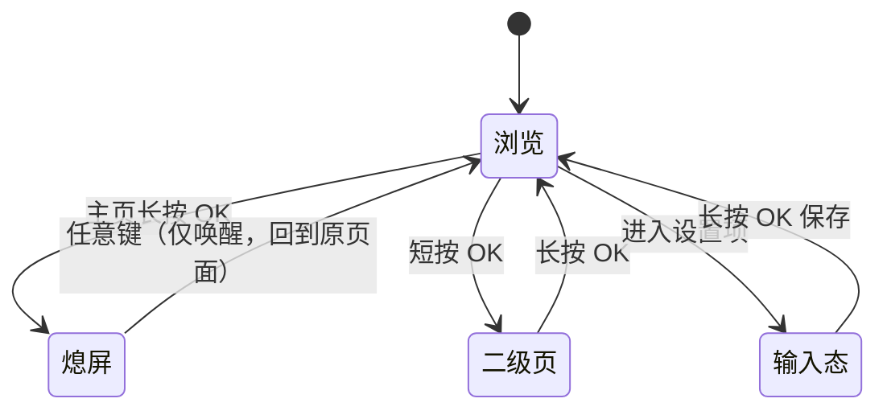
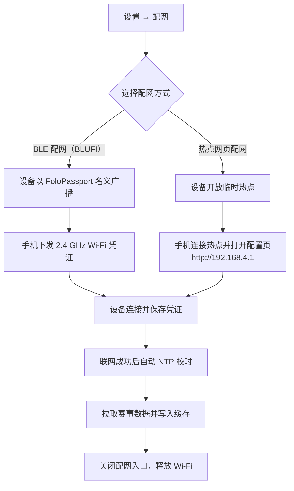

<p align="right">
  <a href="passport-toolbox-prd.md">English</a> · <strong>简体中文</strong>
</p>

# AI Passport 随身工具箱 产品需求文档

玩法名称：通行证随身工具箱（Play code：`passport-toolbox`）
运行平台：FoloToy AI Passport（ESP32-C3 可穿戴 AI 硬件）
文档日期：2026-09-24
文档状态：第三版，含界面设计规范与反人类风险审查，待评审

---

## 1. 需求背景与来源

FoloToy AI Passport 是一款开放的可穿戴 AI 硬件，官方仓库把它定位成开发基线而不是成品：仓库同时给出硬件能力契约、稳定的 BSP 接口、资源边界、参考实现和验收方法，社区则通过玩法把各自写好的固件应用分发给其他玩家，安装方式是用 Type-C 连接设备后从网页直接烧录。设备一次只能装一个玩法，安装会覆盖当前设备上的应用。

仓库给出的硬件事实构成了本产品的物理边界：ESP32-C3 主控、240×320 竖屏 ST7789P3、UP/DOWN/OK 三键（共用 GPIO0 的 ADC 电阻分压）、ES8311 音频编解码、CW2017 电量计、2.4 GHz Wi-Fi STA、NimBLE 蓝牙（不支持蓝牙经典）、8 MB Flash、无 PSRAM，以及两秒浅睡眠与五秒深睡眠两种低功耗模式。[调研支撑]

社区当前已有的玩法覆盖了相当广的场景，但呈现出两个明显特征。[调研支撑]

第一个特征是离线能力普遍偏弱。价值最集中的几类玩法都强依赖联网：赛博工牌的小智语音对话与城市电台、BigDay 的实时天气、语音输入、PPT 与短视频蓝牙遥控、课表与成绩的导入同步，断网后核心体验即失效。真正离线可用的玩法只有人生进度、番茄钟、2FA 验证器、健康打卡等少数几个，而它们的功能面都很窄。

第二个特征是功能碎片化。玩家想同时拥有日历、2FA、工牌、倒计时，就得在多个玩法之间反复烧录，每次烧录都覆盖上一份数据。社区里已经出现了多合一平台和班味这类把多个功能塞进同一固件的尝试，说明玩家对整合有真实需求，但它们的整合更多是功能并列，没有围绕离线优先做统一的架构约束。

这两点指向同一个机会：做一款以离线为默认状态的箱式玩法，把社区被验证过的高赞点子收敛成一套自洽、互相联动的日常工具箱，联网只作为增强，并补上设备用户群体真正关心的一类在线内容——英雄联盟赛事数据。[假设]

把英雄联盟赛事数据放进来的依据来自用户画像与社区信号。设备的核心使用人群是年轻学生与上班族，与英雄联盟观赛人群高度重叠；社区里已经出现通行证雷达这种需要多台设备联动的社交向玩法，说明硬件被当作一种轻量、常亮的随身信息载体。用一块常亮的 240×320 小屏在桌边看今天有没有我关注的队伍比赛、现在比分多少，是设备形态能承接的真实场景。[假设]

不解决会怎样：设备会继续停留在装一个玩法玩两天就吃灰的状态，离线时几乎无用，联网玩法又彼此割裂，玩家需要不断重新烧录来切换用途。[假设]

---

## 2. 产品目标

产品要成为设备上装上就不用再换的那一个玩法。围绕这一点，目标分成四组。

离线目标。核心页面在完全无网络时 100% 可进入、可操作，除赛事中心与校时外的所有功能不依赖任何网络请求；首次开机在从未联网的情况下，用户手动设定时间后即可正常使用日历、番茄钟、作息倒计时、工牌、动态口令等全部离线能力。离线可用性以断网状态下除赛事中心外页面可进入率等于 100% 作为硬性验收项，不接受"大部分可用"。

覆盖目标。一次安装覆盖时间与日历、专注与效率、作息与倒计时、身份与工具四类日常场景，共 25 项以上功能点，让设备在不通勤、不观赛的日子里也有打开的理由。

联网增强目标。联网时提供英雄联盟赛事数据，信息按三级分层展示，默认页只呈现赛程与比分，单场比赛详情作为二级下钻；赛事数据在断网时降级为本地缓存并明确标注新鲜度，不做静默失败；主页常驻显示下一场比赛，用户不必主动进入赛事中心也能获知赛况。

性能目标。冷启动到主界面不超过 1.5 秒；任意按键的界面反馈不超过 200 毫秒；赛事列表滚动不掉帧；进入赛事中心时先呈现本地缓存（不超过 500 毫秒），联网刷新在 5 秒内完成。以上为首版验收口径，不再保留待确认项。离线优先意味着赛事中心的"首屏"必须由缓存决定，而不是等网络返回，否则弱网下用户会长时间盯着空屏。

工程目标。全部实现遵守仓库的硬件能力契约：所有引脚与地址只从 BSP 定义读取，应用层不复制硬件常量；显示使用局部刷新以适应单 DMA 缓冲；按键回调不阻塞；不因新增功能创建第二个 ADC1 单元或第二条同端口 I2C 总线。

---

## 3. 设计原则

三键小屏设备最容易做成反人类的产品：功能一多就靠长按、双击、多层菜单来堆，用户每次都要重新猜按键含义。以下原则约束本产品的所有交互决策，后文的功能与界面设计都服从这些原则。

信息先于菜单。主页直接呈现三件用户开机最想知道的事：现在几点、距离下一个作息节点还有多久、我关注的队伍有没有在打。模块列表排在信息卡片之后，用户不点进任何一层就能获得主要价值。

一次只让用户做一件事。每屏只有一个主操作，且主操作在屏幕上唯一、明确。不在一屏内并列多个同等重要的按钮。

手势可发现。每个页面底部常驻提示条，列出当前页面可用的按键与含义。不依赖用户记住上一页学到的操作，不出现只在特定页面才生效的隐藏手势。

不做有延迟的输入。不使用需要等待判定窗口的双击手势。双击会让每一次单击都要等待约 300 毫秒才能确认，手感变钝，还会误触。全部操作由短按与长按构成，单次按键立即响应。

不制造每日负债。不设计需要每天坚持否则产生挫败感的功能。作息、赛事、日历等信息以被动呈现为主，用户看一眼即可，不要求回报式的打卡行为。

离线不降级为残废。断网只影响赛事与校时。其余功能完整可用，界面不出现需要联网的阻断页，也不因离线而隐藏入口。

危险操作可逆。清除数据前二次确认，并提供导出备份到手机的路径；安装与覆盖前提示数据影响。

失败可理解。任何失败都给出原因与下一步动作，不出现空白页或静默失败。空状态说明为什么空、怎么才能有内容。

时间不准时不欺骗。动态口令、提醒等依赖时间的功能，在时间未同步时明确告知可能无效，而不是给出看似正确的结果让用户在登录页反复失败。

护眼与省电默认，但不说谎。默认深色主题，用途是夜间护眼；本机是 ST7789 透射式 LCD，背光常亮，深色并不省电，因此省电手段只有缩短息屏与关闭背光，文档与界面文案都不得暗示深色更省电。自动切换按本地时间的固定时段执行（如 19:00 至次日 07:00 用深色），不依赖经纬度与日落计算。常亮模式明确提示耗电；低电量时给出建议，且仅在用户已开启省电选项时自动缩短息屏，不静默改动用户设置。

### 3.1 相对第一版的取舍

| 被舍弃或收敛的设计 | 原因 | 替代方案 |
|--------------------|------|----------|
| 习惯打卡与连续天数 | 制造每日负债，中断即挫败，且打卡价值已被用户否定 | 被动的作息节点倒计时 |
| 双击 OK 熄屏 | 双击判定给每一次单击带来约 300 毫秒延迟与误触 | 主页长按 OK 熄屏，单次按键立即响应 |
| 中文字库缺字提示 | 让界面显得残缺，用户自定义文本出现缺字提示不可接受 | 完整覆盖常用汉字集 |
| 按学科排课 | 逐条录入成本高，与用户真正想要的倒计时诉求错位 | 作息节点时间轴加倒计时 |
| 六个平级菜单入口独占主页 | 每次都要在菜单里找，开机第一眼没有价值 | 主页信息卡片在前，模块列表在后 |
| 动态口令未校时禁止使用 | 紧急登录时被拦下会让人抓狂 | 警示但仍可使用，同时给出校准路径 |
| 提醒上限 8 条 | 硬性上限容易触顶，触顶后无路可走 | 上限提升并给出清晰的管理界面 |
| 深睡眠唤醒后回到主界面 | 番茄钟、计时、当前页面状态丢失 | 持久化运行态与上次页面 |

### 3.2 第二版苛刻审查：反人类风险清单

对第二版做了一次以"用户会不会被坑"为唯一标准的逐条审查。判断依据只有一条：用户在不看说明书的前提下，会不会做出错误操作、被卡住，或对设备的反应感到困惑。下表是查出的问题与处理方式，处理结果已落到后文对应章节。

| # | 风险 | 为什么反人类 | 本版处理 |
|---|------|--------------|----------|
| 1 | 主页长按 DOWN 直接开始番茄钟 | 隐藏手势，且会误启动一段 25 分钟计时，用户常常数秒后才发现 | 移除该快捷键，番茄钟改由模块列表与快捷面板进入 |
| 2 | 主页提示条未列出长按 UP 快捷面板 | 直接违反手势可发现原则，用户永远不知道面板存在 | 提示条补全长按 UP，面板内每项都有可见入口兜底 |
| 3 | 用深色主题暗示省电 | 本机是透射式 LCD，背光常亮，深色并不省电，等于用错误理由引导用户 | 深色只声明夜间护眼，省电只由息屏负责 |
| 4 | 低电量时静默缩短息屏 | 用户设定的息屏时长被悄悄改掉，行为不可预期 | 改为提示建议，仅在用户已开启省电选项时生效 |
| 5 | 恢复码只能去手机配置页导出 | 纯离线用户被卡住，且与完全离线可用的定位自相矛盾 | 设备端长按 UP 二次确认后可直接查看，手机导出为可选 |
| 6 | 配网成功后入口关闭且无重开路径 | 之后想改工牌、导入作息、导出备份都无门 | 明确热点配置页是设备本地服务，可随时从设置重新开启 |
| 7 | 手动设定时间要逐格按 | 三键设完整日期时间动辄几十次按键 | 以手机一键校准为主路径，设备端预填默认值并用长按大步进，配首次引导 |
| 8 | 作息节点名超长被静默截断 | 用户输入的数据被悄悄改掉 | 改为缩小字号完整显示，不静默截断 |
| 9 | 进入赛事中心必须等网络才有内容 | 弱网下长时间空屏，用户以为设备坏了 | 缓存优先，先出上次数据并标注新鲜度，再后台刷新 |
| 10 | 主题按日落自动切换 | 没有经纬度就做不到，等于空承诺 | 改为按本地时间固定时段切换 |
| 11 | 三键共用 ADC 分压却未声明约束 | 组合键与开机按键的误判会被当成 bug | 明确不支持组合键、去抖不小于 30 毫秒、开机阶段按键不影响启动 |
| 12 | 长按没有过程反馈 | 用户不确定是否按住，会反复重按 | 规定 500 毫秒阈值并显示按住进度 |
| 13 | 提醒上限只说提升不给数 | 触顶后仍然无路可走 | 明确 16 条并给出批量清理入口 |
| 14 | 关注战队上限长期待确认 | 既无法开发也无法验收 | 定为 5 支，触顶时提示先取消 |
| 15 | 秒表、摇卦、时间设置没有原型 | 开发无参照，界面容易走样 | 补齐原型并纳入界面清单 |

---

## 4. 目标用户与核心场景

### 4.1 用户角色

设备使用者。本产品的直接操作者，通过三键与屏幕交互。可以是电竞观赛党、在校学生或上班族，三类人群在设备上使用的是同一套离线工具箱，差别主要体现在赛事中心的关注战队配置与作息表的节点定义上。

手机配置端。使用者在配网、上传工牌头像、导入作息表、写入动态口令密钥时用到的手机或电脑浏览器。它不是一个独立账号体系，只是设备在配网期间临时开放的配置入口，配置完成后设备不再依赖它。

玩法开发者。基于本仓库 BSP 与 demo 分支继续扩展本玩法的开发者。产品需要把纯逻辑与界面分离、把硬件访问收敛在 BSP，使后续扩展不必重写交互。

社区平台。负责玩法的分发、版本更新与审核，本产品的安装、更新、版本回退都依赖它的既有链路。

### 4.2 用户画像

电竞观赛党（主要人群）。18–30 岁的学生或年轻上班族，每周固定看 LPL，赛季期间会看 MSI 与世界赛；关注 2–3 支战队；习惯在电脑前或桌边放一块小屏作为第二屏。设备对他们来说是常亮的信息角，最在意的是我关注的队伍今天什么时候打、现在打到哪了。

在校学生。本科生或研究生，一天被作息切得很碎，想知道离下课、午休、放学还有多久；教室与图书馆网络不稳定，离线可用是硬需求。

打工人。作息固定，需要日程倒计时、工牌展示、动态口令这类实用工具；设备放在工位，联网机会少，离线能力直接决定是否长期使用。

硬件折腾者。会自己烧录、关心 BSP 与低功耗表现，会主动尝试深睡眠、自检页等偏工程的功能。

### 4.3 核心场景与优先级

| 优先级 | 场景 | 前置条件 | 期望结果 |
|--------|------|----------|----------|
| P0 | 无网开机后一眼看到时间、距离下一节点的倒计时 | 设备已开机，时间已设定 | 主页信息卡片直接呈现，无需进入任何菜单 |
| P0 | 有网时查看今日英雄联盟赛程与实时比分 | 已完成 Wi-Fi 配网 | 赛事中心列出赛程，进行中的比赛显示实时比分，主页卡片同步显示 |
| P0 | 用番茄钟专注并断电后保留记录 | 无 | 番茄钟可暂停恢复，重启后配置与进度不丢 |
| P0 | 离线查看动态口令并在有效期内使用 | 设备时间已校准，密钥已导入 | 显示当前口令、剩余秒数与下一个口令，完全离线 |
| P1 | 查看今日作息时间轴与各节点倒计时 | 作息表已定义或导入 | 当前节点高亮，下一节点倒计时准确 |
| P1 | 展示电子工牌与他人交换二维码 | 无 | 多张工牌可切换，二维码离线可显示 |
| P1 | 断网后仍能查看最近一次赛程 | 曾经联网拉取过数据 | 显示缓存赛程并标注数据可能已过期 |
| P2 | 配网与校时 | 有可用的 2.4 GHz Wi-Fi | 通过手机完成配网，联网后自动校时 |
| P2 | 硬件自检 | 无 | 逐项检查显示、按键、音频、电池、存储 |

---

## 5. 同类玩法研究

下表对社区已有的 12 个玩法做提炼。这些玩法既是需求来源，也构成了本产品在社区内的直接参照。[调研支撑]

| 玩法 | 作者 | 核心点子 | 离线能力 | 联网依赖 | 本产品可借鉴之处 |
|------|------|----------|----------|----------|------------------|
| 人生进度 | AoiA | 把今天/本周/本月/今年/一生化成点亮的格子，青绿色表示已走过、珊瑚色表示此刻 | 完全离线 | 无 | 时间可视化的交互模型：OK 切换尺度、UP/DOWN 调精度 |
| 猫猫专注日历 | Sherone | 万年历 + 农历节气宜忌 + 番茄钟 + 猫咪陪伴 + 常亮壁纸时钟 | 基本离线 | 仅用于校时 | 万年历与番茄钟合并的信息架构；陪伴感设计 |
| BigDay | Bigphilosophy | 天气预报 + 黄历 + 每日卦象 + 历史今日 + 每日答案 | 部分离线（卦象、历史今日可离线） | 天气需联网 | 黄历与每日内容类玩法的内容结构；离线与在线内容分区的做法 |
| UEG 数字生命健康卡 | zach | 复刻《流浪地球》数字身份卡 + 健康打卡 | 完全离线 | 无 | IP 主题化外壳能显著提升使用意愿；打卡模式的局限（本产品已弃用打卡） |
| 二步验证器 | 过期的萌新 | 硬件 TOTP（RFC 6238）+ BLE 写入 + WLAN 客户端获取 | 核心离线 | 仅用于导入配置 | 离线安全工具的可行性；恢复码备份是必须提醒的风险点 |
| 课表与成绩助手 | JQ | 今日/本周/考试/成绩四视图 + 设备端算 GPA + 硬件自检页 | 数据离线可用 | 仅用于校时 | 四视图切换模式；设备端本地计算而非云端；自检页的清单化设计 |
| 班味 | OpenTele | 打工人工作日伴侣：今日收入、下班/周末/发薪倒计时、班味指数、状态卡、迷你游戏、本地 2FA、番茄钟 | 完全离线 | 无（蓝牙为可选增强） | 离线为主、联网为增强的产品结构与本产品最接近；倒计时驱动的信息设计 |
| 赛博工牌 · 随身 AI 助手 | 何夕2077 | 5 张身份工牌 + 小智语音对话 + 8 条提醒 + 木鱼/电台/摇卦小程序 | 工牌与提醒离线 | 语音、电台需联网 | 多工牌切换；提醒的定点与按星期重复模型；热点网页配网的完整交互 |
| AI Passport 多合一平台 | 周旋 | 电子工牌 + 语音输入 + PPT 遥控，多功能并行互不干扰 | 工牌离线 | 语音输入与 PPT 需配对 | 多模块并存的导航设计；长按返回的按键约定 |
| 通行证雷达 | FOLOTOY | 多台设备互相搜索并显示相对方位 | 离线（设备间） | 无 | 硬件可被当作社交与信息载体的信号 |
| TikTok 遥控器 | Yeats_Liao | 蓝牙配对后遥控刷视频、点赞 | 否 | 蓝牙配对 | 单一功能玩法在断网场景下的局限 |
| PPT 演讲遥控器 | Yeats_Liao | 蓝牙 HID 演示遥控 + 演讲计时 | 否 | 蓝牙配对 | 计时器与主功能结合的呈现方式 |

### 研究结论

离线与在线的分布并不均衡。12 个玩法里有 4 个完全离线、3 个以离线为核心、5 个强依赖联网。真正让玩家长期留在设备上的，恰好集中在离线阵营（人生进度、班味、2FA、健康卡），而联网玩法的评价里频繁出现要联网才能用、支持中文就更好了这类与离线、本地化相关的诉求。这支持了本产品离线优先的定位。

已存在的整合尝试没有统一约束。多合一平台与班味都做了功能聚合，但聚合方式是把功能并列，没有回答断网时哪些能力必须仍然成立这个问题。本产品要求离线可用在任何情况下都成立，并以此反推模块取舍与数据存储，这是与它们的主要区别。

倒计时是被反复验证的信息形态。班味用下班、周末、发薪倒计时驱动信息设计，课表助手用下一节课提示，人生进度用时间格子。设备屏幕小、常亮、放在桌边，最适合呈现的就是一个随时间递减的数字。本产品把倒计时提升为主线，用在作息节点与赛事开赛两处。

中文字库是共性的工程难点。人生进度的评论里出现要是支持中文就更好了，指向的其实是 8 MB Flash、无 PSRAM 条件下点阵中文字库的取舍。本产品正面解决这个问题，方案见第 6.6 节。

差异化定位。面向英雄联盟观赛人群，把赛事信息做成设备上一眼可见、断网可回看的常驻卡片，同时用离线工具箱保证设备在没有比赛的日子里依然有用。赛事数据在社区现有玩法中尚未出现，是明确的内容空位。

---

## 6. 功能需求

### 6.1 产品信息架构

主页分两段：上半是信息卡片区，下半是模块列表。信息卡片是开机第一眼的内容，模块列表是深入使用的入口。

```mermaid
graph TD
    HOME["主页<br/>信息卡片区 + 模块列表<br/>状态栏：时间 · 电量 · 网络 · 赛事角标"]

    HOME --> C1["信息卡片：时间与日期"]
    HOME --> C2["信息卡片：下一作息节点倒计时"]
    HOME --> C3["信息卡片：进行中或下一场比赛"]

    HOME --> T["1 时间与日历"]
    HOME --> F["2 专注与效率"]
    HOME --> R["3 作息与倒计时"]
    HOME --> I["4 身份与工具"]
    HOME --> E["5 英雄联盟赛事中心"]
    HOME --> S["6 系统设置"]

    T --> T1["万年历（公历 / 农历 / 节气 / 宜忌）"]
    T --> T2["时间进度（今日 / 本周 / 本月 / 今年 / 人生）"]
    T --> T3["秒表 · 计时器"]

    F --> F1["番茄钟"]
    F --> F2["本地提醒"]

    R --> R1["今日作息时间轴"]
    R --> R2["下一节点倒计时"]
    R --> R3["作息配置与导入"]

    I --> I1["电子工牌（多卡切换）"]
    I --> I2["动态口令 TOTP（离线）"]
    I --> I3["摇卦 / 每日一签"]
    I --> I4["硬件自检"]

    E --> E1["今日与本周赛程"]
    E --> E2["实时比分"]
    E --> E3["赛区积分榜"]
    E --> E4["战队与选手"]
    E --> E5["单场对局详情（二级）"]

    S --> S1["配网（BLE + 热点网页）"]
    S --> S2["时间与校时"]
    S --> S3["息屏与省电"]
    S --> S4["主题与显示"]
    S --> S5["声音与静音"]
    S --> S6["关注战队"]
    S --> S7["数据备份与清除"]
```



### 6.2 全局按键约定

三个实体按键是本产品唯一的输入方式，必须在所有页面保持一致。全部操作只有短按与长按两种形态，单次按键立即响应。

| 操作 | 主页 | 列表与内容页 | 输入与设置页 |
|------|------|--------------|--------------|
| 短按 UP / DOWN | 移动焦点 | 上下移动，或切换子视图 | 数值加减 / 选项切换 |
| 短按 OK | 进入选中项 | 进入下一级或确认 | 确认并跳到下一项 |
| 长按 OK | 熄屏 | 返回上一级 | 保存并返回 |
| 长按 UP | 打开快捷面板（静音 / 主题 / 亮度） | 由页面定义（如刷新、切换视图、亮码） | 大步增加 |
| 长按 DOWN | 快速开始番茄钟 | 由页面定义 | 大步减少 |
| 任意键（熄屏时） | 唤醒并回到熄屏前的页面 | 同左 | 同左 |

每个页面底部常驻一条提示条，显示当前页面可用的按键。提示条内容随页面变化，用户不需要记住全局表。



熄屏期间计时、番茄钟、提醒调度、作息节点切换与时钟继续运行；熄屏后第一次按键只负责唤醒，不触发该键的常规动作，唤醒后回到熄屏前的页面。

长按阈值 500 毫秒。按住期间必须在焦点处显示进度反馈（焦点左侧指示条随按住填充），达到阈值立即触发动作，避免"按了没反应"的错觉；短按在松手瞬间响应，不等待长按判定窗口。

按键硬件约束。三个按键共用 GPIO0 的 ADC 电阻分压，因此：不支持同时按下的组合键，界面设计不得依赖组合键；按键采样需去抖，去抖窗口不小于 30 毫秒；OK 键与启动引导脚相关，开机瞬间的按键状态不得影响正常启动，也不得在启动阶段触发业务动作。以上约束写进固件实现，界面设计以此为前提。

### 6.3 功能总览

| # | 模块 | 功能说明 |
|---|------|----------|
| 1 | 主页信息卡片 | 三张卡片纵向排列。时间卡显示当前时间与日期；作息卡显示距离下一个作息节点的名称与倒计时，无作息表时显示今日日期；赛事卡显示进行中比赛的实时比分，没有进行中比赛时显示下一场关注战队的开赛时间与倒计时。无任何赛事数据时该卡片显示引导配网的文案。 |
| 2 | 主页模块列表 | 纵向列出六个模块入口，UP/DOWN 移动、OK 进入。默认焦点停留在上次使用的模块。 |
| 3 | 主页状态栏 | 常驻显示时间、电池百分比（低于 20% 变红）、网络状态、赛事角标。赛事角标仅在存在进行中的关注比赛或 30 分钟内开赛的关注比赛时出现。 |
| 4 | 万年历 | 显示公历日期与星期，长按 UP 切换到中国日历视图，叠加农历日期、节气与宜忌；UP/DOWN 翻月或翻日。数据全部本地计算。 |
| 5 | 时间进度 | 以点亮格子的方式展示今日、本周、本月、今年、人生五个尺度的时间流逝，OK 依次切换尺度，UP/DOWN 调整格子精度，每个尺度提供总览、均衡、精细三档。生日与预期寿命在首次进入时设置，可跳过。 |
| 6 | 秒表与计时器 | 秒表支持开始/暂停/清零与分段记录；计时器支持自定义时长与到时提示音。两者与番茄钟共用计时基础设施，使用单调时钟避免熄屏后计时漂移。 |
| 7 | 番茄钟 | 可设置专注时长与休息时长，开始后进入专注界面；支持暂停与恢复；完成后进入休息倒计时并给出提示音。专注记录写入掉电不丢失的存储。 |
| 8 | 本地提醒 | 支持新增提醒，每条可指定钟点、日期或按星期重复，上限 16 条。提醒依赖设备本地时间，未校时前创建提醒时给出提示。关机期间不响，开机会汇总错过的提醒并一次性提示。 |
| 9 | 今日作息时间轴 | 展示今日全部作息节点（到校、上课、课间、午休、晚自习、放学等），每个节点含名称、起止时间与类型。当前节点高亮，已过节点弱化，未来节点常规显示。 |
| 10 | 下一节点倒计时 | 大字显示距离下一个作息节点开始的剩余时间，并标注当前节点名称与起止时间。节点切换时可选提示音与屏幕提示。 |
| 11 | 作息配置与导入 | 支持按星期分别配置节点，支持单双周；提供走读、住校两套模板；支持在手机配置页按结构化文本导入。数据只保存在设备本地。 |
| 12 | 电子工牌 | 支持 5 张身份卡切换，每张可配置头像、昵称、多行文本、二维码与主题；留空的行不显示。二维码离线生成并可全屏展示供他人扫描。 |
| 13 | 动态口令 TOTP | 基于 RFC 6238 在设备本地生成一次性口令，完全离线可用。页面同时显示当前口令、当前口令的剩余有效时间与下一个口令。密钥可通过手机配置页导入或设备端手动输入，恢复码可导出到手机配置页。时间未同步时给出明确警示但仍可使用。 |
| 14 | 摇卦与每日一签（本期不做） | 原计划离线生成卦象与每日内容。本期实现范围不含该功能，理由与处理见第 12 章。 |
| 15 | 硬件自检 | 逐项检查显示、按键、音频、电池与存储，每项给出通过或失败结论，用于安装后快速确认设备状态。 |
| 16 | 赛事赛程 | 列出今日与本周英雄联盟赛程，包含赛区、赛事名称、战队、开赛时间与比赛状态。默认按第 7 章的优先级排序，并优先展示关注战队。 |
| 17 | 实时比分 | 进行中的比赛显示实时比分与当前局数；比分按刷新策略更新，退出赛事中心后停止刷新。 |
| 18 | 赛区积分榜 | 按赛区展示战队排名、胜负数与积分；支持 UP/DOWN 在赛区之间切换。 |
| 19 | 战队与选手 | 展示战队基本信息与选手名单；支持将战队设为关注，关注状态保存在本地并驱动赛程排序、主页赛事卡与状态栏角标。 |
| 20 | 单场对局详情 | 从赛程或比分列表进入单场比赛详情，展示阵容与禁用、经济曲线、选手数据等二级信息。该页为下钻页，不作为默认入口。 |
| 21 | 关注与赛事提示 | 用户可关注若干支战队；关注战队的比赛在主页赛事卡、状态栏角标与赛事中心内优先呈现。关注关系离线保存。 |
| 22 | 配网 | 提供两条配网路径：BLE 配网（BLUFI）与设备热点网页配网。热点网页配网时设备开放临时热点，手机连接后打开配置页填写 2.4 GHz Wi-Fi 信息与个人配置；配网成功后入口关闭，但可随时重新开启热点模式（本地服务，无需互联网）用于配置与备份。 |
| 23 | 时间与校时 | 首次开机的三步引导中设定时间（手机一键校准优先，手动设置兜底）；联网时通过 NTP 自动校时并记录校时来源与时间；未联网时允许手动设置时间，也可通过手机配置页用手机时间校准。校时状态在设置页与依赖时间的页面可见。 |
| 24 | 息屏与省电 | 自动息屏时长可选常亮、15 秒、30 秒、1 分钟、2 分钟、5 分钟；按键唤醒并重新计时。空闲时进入浅睡眠，长时间待机可进入深睡眠。常亮模式提示耗电；低电量时给出建议，仅在用户已开启省电选项时自动缩短息屏，不静默改动设置。 |
| 25 | 主题与显示 | 提供明暗两套主题与按本地时段自动切换选项（如 19:00 至次日 07:00 深色），用户选择后保存；深色仅用于夜间护眼，不代表省电。 |
| 26 | 声音与静音 | 提供静音开关与音量档位，覆盖提醒音、节点切换音与番茄钟提示音。静音状态在状态栏可见。 |
| 27 | 数据备份与清除 | 支持将工牌、作息、动态口令密钥与恢复码导出到手机配置页作为备份；支持分类清除数据，清除前二次确认。 |

### 6.4 模块详情与原型

#### 6.4.1 主页（功能 1、2、3）

```
┌──────────────────────────────┐
│ 14:32          ▓▓ 76%  ▲ LIVE │  ← A 状态栏
├──────────────────────────────┤
│  09:42   周三 9/24            │  ← B 时间卡
│  距离下课  12:36  第三节       │  ← C 作息卡（下一节点倒计时）
│  EDG 1:0 BLG  第2局           │  ← D 赛事卡（进行中优先）
├──────────────────────────────┤
│  ▸ 时间与日历                  │  ← E 模块列表
│    专注与效率                  │
│    作息与倒计时                │
│    身份与工具                  │
│    英雄联盟赛事中心            │
│    系统设置                    │
├──────────────────────────────┤
│ ↑↓ 选择  OK 进入  长按↑ 面板  长按OK 熄屏 │  ← F 提示条
└──────────────────────────────┘
```

- 业务逻辑：开机后进入主页并恢复上次焦点模块。状态栏每 30 秒刷新时间与电量。作息卡依据本地作息表计算下一节点，无作息表时退回显示今日日期。赛事卡按第 7 章优先级选择内容：有进行中的关注比赛时显示实时比分，否则显示最近一场关注比赛的倒计时，都没有时显示引导文案。
- 交互逻辑：UP/DOWN 移动模块焦点并即时更新高亮；OK 进入选中模块；长按 OK 熄屏；长按 UP 打开快捷面板（静音、主题、亮度，并含"开始番茄钟"入口）。三张信息卡片不参与焦点移动，用户按 OK 只作用于模块列表。本版移除了主页长按 DOWN 直接开始番茄钟的快捷键：它是隐藏手势，且会误启动一段 25 分钟计时，用户往往数秒后才发现；番茄钟仍可从模块列表与快捷面板进入。
- 规则约束：模块列表固定六项，不可由用户增删。焦点位置保存在本地，重启后恢复。信息卡片高度固定，避免模块列表位置随内容跳动。
- 边界与异常：未配网时网络状态显示未配网，赛事角标与赛事卡显示引导文案；电量读取失败时显示 --%，不阻断其他功能；作息表为空时作息卡不占用空白，直接显示日期。

#### 6.4.2 时间与日历（功能 4、5、6）

```
┌──────────────────────────────┐
│ 万年历          2026 年 9 月   │
│  一  二  三  四  五  六  日    │
│  1   2   3   4   5   6   7    │
│  8  [9] 10  11  12  13  14    │
│  ...                          │
│ 九月初九 · 寒露 · 宜 出行 会友  │
├──────────────────────────────┤
│ ↑↓ 翻月   OK 时间进度  长按OK 返回│
└──────────────────────────────┘
```

- 业务逻辑：万年历基于本地日期计算公历、农历、节气与宜忌，全部在设备端完成。时间进度按选定尺度与精度计算已过格子数并高亮当前格子。
- 交互逻辑：万年历中 UP/DOWN 翻月，长按 UP 切换到中国日历视图（叠加农历与宜忌），OK 进入时间进度；时间进度中 OK 依次切换今日/本周/本月/今年/人生，UP/DOWN 在总览/均衡/精细三档间切换精度。秒表中 OK 开始/暂停、UP 记圈、长按 UP 清零；计时器中 OK 开始/暂停、UP 重置，到时给出提示音。
- 规则约束：人生尺度从生日当天零点起到预期寿命生日零点止，默认 80 岁；当前年龄按今天是否已过生日动态计算。各尺度三档精度与社区已验证取值一致：今日为 24 小时 / 96 个 15 分钟 / 288 个 5 分钟；本周为 7 天 / 56 个 3 小时 / 168 小时；本月为当月天数 / 每天 4 格 / 每天 8 格；今年为 12 月 / 53 周 / 365 或 366 天；人生为 80 年 / 320 季度 / 960 月。
- 边界与异常：时间未设定时不展示时间进度，引导先设定时间；生日可跳过，跳过后时间进度仍可查看今日到今年四个尺度；跨零点或跨月时进度自动重算。

#### 6.4.3 专注与效率（功能 7、8）

```
┌──────────────────────────────┐
│ 番茄钟                 专注中  │
│        25:00                 │  ← 剩余时间，大号等宽
│   [■■■■■■□□□□□□]  第 2 轮    │
├──────────────────────────────┤
│ OK 暂停 / 继续    长按OK 退出  │
└──────────────────────────────┘
```

- 业务逻辑：番茄钟读取用户配置的专注与休息时长，开始后倒计时；一个专注段结束后自动进入休息段并提示；完成的专注段写入本地记录。提醒按本地时间调度，重启后依据校时结果恢复。
- 交互逻辑：OK 在开始/暂停/继续之间切换；长按 OK 退出并保留当前进度；计时结束时触发提示音并自动进入下一段。
- 规则约束：专注与休息时长可配置，默认 25 分钟与 5 分钟；提醒按星期重复时以设备本地时区为准；提醒数量上限 16 条，达到上限时在列表顶部提示并提供批量清理入口，不出现触顶后无路可走；提醒在关机期间不触发，开机校时后按最新时间重算下一次触发点，并汇总错过的提醒一次性提示。
- 边界与异常：未校时前创建提醒时提示用户先校准时间；番茄钟运行中熄屏不中断计时；设备重启后番茄钟恢复到中断前的剩余时间。

#### 6.4.4 作息与倒计时（功能 9、10、11）

```
┌──────────────────────────────┐
│ 作息              周三 09:42   │
│      距离下课                  │
│        12:36                 │  ← 大字倒计时
│   第三节 09:40 - 10:25         │
├──────────────────────────────┤
│ ✓ 07:50  到校                  │
│ ✓ 08:00  第一节                │
│ ✓ 08:45  课间 10 分钟          │
│ ✓ 08:55  第二节                │
│ ● 09:40  第三节  进行中        │  ← 当前节点
│   10:25  课间 15 分钟          │
│   11:10  第四节                │
│   11:55  午休 至 14:00         │
│   14:00  第五节 ...            │
│   17:30  放学                  │
│   19:00  晚自习 ...            │
├──────────────────────────────┤
│ ↑↓ 滚动   OK 切换视图  长按OK 返回│
└──────────────────────────────┘
```

- 业务逻辑：作息表按星期与单双周定义节点，每个节点含名称、起止时间与类型（上课、课间、午休、晚自习、放学、自定义）。页面实时定位当前节点并计算到下一节点的剩余时间；节点切换时可选提示音与屏幕提示。全部计算在设备本地完成。
- 交互逻辑：UP/DOWN 滚动时间轴，OK 在今日时间轴与周视图之间切换，长按 OK 返回。当前节点自动滚动到可视区域并高亮。
- 规则约束：节点按时间升序排列且不可重叠；节点名称建议控制在 8 个汉字以内，超出时自动缩小字号完整显示，不静默截断用户输入；提供走读与住校两套模板，用户可在模板基础上增删节点；支持在手机配置页按结构化文本导入，导入时校验时间格式与重叠。
- 边界与异常：未定义作息表时页面显示引导，提供一键套用模板；跨零点（如晚自习到 22:30）按当日处理，不拆分为两天；设备时间被大幅修改时倒计时以当前设备时间为准并提示可能失真。

#### 6.4.5 身份与工具（功能 12、13、14、15）

电子工牌：

```
┌──────────────────────────────┐
│ 电子工牌              1 / 5   │
│   ┌────────┐  姓名：林一      │
│   │ 头像   │  身份：学生      │
│   └────────┘  学院：计算机     │
│   [ 二维码 ]                  │
├──────────────────────────────┤
│ ↑↓ 切换工牌  长按↑ 全屏码  长按OK 返回│
└──────────────────────────────┘
```

动态口令 TOTP：

```
┌──────────────────────────────┐
│ 动态口令              1 / 3   │
│  GitHub                       │
│   482 915                     │  ← 当前口令，大号分组
│   ◔ 剩余 18 秒                 │  ← 环形进度 + 秒数
│   下一个  731 204              │  ← 下一个口令
├──────────────────────────────┤
│ 时间已同步 · 14:32            │  ← 时间同步状态
│ ↑↓ 切换账户  长按↑ 恢复码  长按OK 返回│
└──────────────────────────────┘
```

- 业务逻辑：工牌数据（头像、文本、二维码）保存在本地，最多 5 张。动态口令在设备本地按 RFC 6238 生成，完全离线可用；页面同时呈现当前口令、当前口令的剩余有效时间与下一个口令，让用户在口令即将过期时可以直接读下一个，避免等到数字跳变才发现过期。密钥保存在本地，恢复码可导出。摇卦与每日一签由本地算法生成，同一天结果稳定。自检逐项运行硬件检查并给出结论。
- 交互逻辑：工牌页 UP/DOWN 切换身份卡，长按 UP 全屏展示二维码，长按 OK 返回。口令页 UP/DOWN 切换账户，长按 UP 查看恢复码（需二次确认，防止误触与肩窥），长按 OK 返回；口令每 30 秒自动刷新，剩余时间以环形进度与秒数双重呈现。
- 规则约束：动态口令默认 30 秒步长、6 位数字，遵循 RFC 6238；口令按三位一组显示，便于逐段抄写；首次添加口令时必须提示用户备份恢复码。恢复码可在设备端长按 UP 二次确认后直接查看，也可在手机配置页导出为文件，两条路径都不依赖互联网——热点配置页是设备本地服务。密钥导入支持手机配置页粘贴 otpauth 链接或手动输入 Base32，也支持设备端手动输入作为兜底。工牌文本行可设字号与是否加粗，留空的行不显示。
- 边界与异常：动态口令依赖设备时间，时间未同步时页面顶部显示醒目警示（如时间未同步，口令可能无效），但仍允许使用，并给出前往校时的入口；时间同步后警示自动消失。存储空间不足时禁止新增工牌或口令并提示。

摇卦与每日一签、硬件自检：

```
┌──────────────────────────────┐
│ 硬件自检                      │
│  显示      ✓ 通过              │
│  按键      ✓ 通过              │
│  音频      ○ 待检查            │
│  电池      ○ 待检查            │
│  存储      ✓ 通过              │
├──────────────────────────────┤
│ ↑↓ 选择   OK 单项  长按↑ 全部检查│
└──────────────────────────────┘
```

- 业务逻辑：自检逐项运行并给出通过与失败结论；音频检查会短暂占用音频通道，结束后恢复；结果不写入持久存储，退出即清除。
- 交互逻辑：UP/DOWN 选择检查项，OK 运行单项，长按 UP 运行全部。
- 边界与异常：单项失败时给出可能原因与建议（如音频失败时提示检查静音与音量）；自检不修改任何用户数据。

#### 6.4.6 英雄联盟赛事中心（功能 16–21）

```
┌──────────────────────────────┐
│ 赛事中心  [赛程] 积分榜  战队  │
│ ● 进行中  EDG 1 : 0 BLG  第2局 │  ← 优先级 1：LIVE
│ ○ 19:00   JDG  vs  TES   未开始│  ← 优先级 2：关注战队即将开赛
│ ○ 21:00   WBG  vs  LNG   未开始│  ← 优先级 3：今日剩余赛程
│ ✓ 17:00   RNG 0 : 2 FPX  已结束│  ← 优先级 4：今日已结束
│ 明日 17:00  WE vs OMG          │  ← 优先级 5：明日与本周
├──────────────────────────────┤
│ 更新于 14:30  长按↑ 刷新  长按OK 返回│
└──────────────────────────────┘
```

- 业务逻辑：进入模块时请求赛程数据，按第 7 章优先级排序后渲染；进行中的比赛按刷新策略定时更新比分；积分榜与战队视图在切换到对应子视图时按需请求。所有赛事数据在拉取成功后写入本地缓存。若用户已关注战队，默认优先展示关注战队的比赛。
- 交互逻辑：UP/DOWN 在赛程列表内移动，OK 进入单场详情；长按 UP/DOWN 切换顶部子视图；长按 UP 在列表页用于手动刷新；长按 OK 返回主页。在战队视图按 OK 切换关注状态并即时更新赛程排序。
- 规则约束：赛事数据按赛区分组，默认展示用户关注战队所在赛区与主要赛区；单场详情页只能从赛程或比分列表下钻进入，不设独立入口；关注战队数量上限 5 支，与画像中关注 2–3 支战队的需求相符并留有余量，达到上限时提示先取消一支，不静默失败。
- 边界与异常：无网络或请求失败时，展示最近一次缓存数据并在顶部标注离线与更新时间，同时提供重试入口；从未成功拉取过数据时展示空状态并引导配网；请求超时按第 7 章降级策略处理，不阻塞离线功能。

单场对局详情（二级下钻）：

```
┌──────────────────────────────┐
│ EDG  vs  BLG      第 2 局      │
│ [阵容]  经济曲线  选手数据     │
│  EDG 蓝色方                   │
│  上单 剑姬  打野 蔚  中单 阿卡丽 │
│  BLG 红色方                   │
│  上单 杰斯  打野 盲僧  中单 辛德拉│
├──────────────────────────────┤
│ 长按↑↓ 切页   长按OK 返回       │
└──────────────────────────────┘
```

- 业务逻辑：详情页展示阵容与禁用、经济曲线、选手数据三类二级信息，数据在进入详情页时单独请求，请求失败时回退到赛程列表中已有的基础比分信息。
- 交互逻辑：长按 UP/DOWN 在三类二级信息之间切换；长按 OK 返回赛程列表。
- 边界与异常：详情数据不可用时，仅展示已缓存的比分与战队，并标注详情暂不可用。

#### 6.4.7 系统设置与配网（功能 22–27）

配网提供两条路径，用户可任选。BLE 配网适用于设备已开机、手机在身边但不想切换 Wi-Fi 的场景；热点网页配网适用于需要同时填写个人配置（工牌、作息表、动态口令密钥）的场景。



- 业务逻辑：配网成功后设备保存凭证并自动校时，随后按需拉取赛事数据；配网入口在成功后关闭，避免长期暴露。热点配置页是设备本地服务，不需要互联网，用户可随时在设置中重新开启热点模式，用于修改工牌、导入作息表、写入口令密钥或导出备份，纯离线用户不会因为"入口关了"而被卡住。Wi-Fi 与 BLE 协议栈仅在对应页面打开时初始化，退出时释放，符合仓库对 Wi-Fi 与 BLE 作为按需服务的约束。
- 交互逻辑：设置页 UP/DOWN 选择条目，OK 进入；配网过程中屏幕显示热点名称、密码或等待状态；长按 OK 在任意设置子页返回上一级。
- 规则约束：仅支持 2.4 GHz Wi-Fi；设备时间可通过联网校时或手动设置，也可用手机时间校准；自动息屏时长在给定选项中单选；主题在明暗与自动之间单选，自动模式按本地时间固定时段切换（如 19:00 至次日 07:00 深色），不做需要经纬度的日落计算；静音与音量档位独立设置；数据备份与清除提供分类操作且清除前二次确认。
- 边界与异常：配网失败时保留已输入信息并允许重试，不进入死循环；凭证错误时给出明确提示；清除类操作完成后刷新相关页面；备份导出在手机配置页完成，设备端只负责把数据交给配置页。

#### 6.4.8 首次引导与时间设置（功能 23）

```
┌──────────────────────────────┐
│ 首次设置                1 / 3 │
│  设备时间尚未设定              │
│  推荐用手机一键校准，最快也最准。│
│  ▸ 手机校准           推荐      │
│    手动设置   2026-01-01 00:00 │
├──────────────────────────────┤
│ ↑↓ 选择   OK 进入   长按OK 跳过│
└──────────────────────────────┘
```

- 业务逻辑：首次开机进入三步引导——设定时间、选择作息模板（走读 / 住校 / 跳过）、可选导入口令密钥。每步都可跳过，跳过后主页与全部离线功能仍完整可用，引导不再重复出现。
- 交互逻辑：时间校准首选"手机校准"：设备开启热点，手机连上后配置页显示手机当前时间，点确认即把手机时间写入设备，一步完成。手动设置为兜底：字段依次为年、月、日、时、分，进入时预填合理默认值（已存时间或 2026-01-01 00:00），短按加减 1，长按加减 10，OK 跳到下一项，长按 OK 保存。手机校准失败不影响手动路径。
- 规则约束：时间设置不允许逐格从零开始，必须先给默认值；任何依赖时间的功能（口令、提醒、作息倒计时）在时间未校准时都显示警示但仍可用，不阻断使用。
- 边界与异常：设备彻底断电后若时钟丢失，开机重新进入时间设置并保留其余数据；不自动识别时区，提供手动时区选择；跳过引导后，可从系统设置重新进入该引导。

### 6.5 存储、离线与数据策略

本产品把离线可用当作架构前提。全部用户数据与赛事缓存都保存在设备的非易失存储中，设备在无网络、无手机的情况下是一个功能完整的工具。

| 数据类别 | 内容 | 离线可用 | 联网行为 |
|----------|------|----------|----------|
| 时间基准 | 上次校时时间、时区、手动设置的时间 | 是（依赖设备时钟，可能漂移） | NTP 校时后覆盖基准 |
| 个人配置 | 工牌数据、作息表、提醒、番茄钟配置与记录、关注战队 | 是 | 不参与同步，仅在手机配置页读写 |
| 安全数据 | 动态口令密钥与恢复码 | 是（完全离线生成） | 不联网 |
| 赛事缓存 | 最近一次成功拉取的赛程、比分、积分榜、战队信息 | 是（只读，标注新鲜度） | 拉取成功后覆盖并记录同步时间 |

运行态持久化。番茄钟剩余时间、计时器状态与上次所在页面写入非易失存储，设备浅睡眠恢复或深睡眠重启后回到中断前的状态，不把用户正在进行的操作丢掉。

赛事缓存的保留策略：赛程与积分榜保留最近一次成功结果；比分缓存仅保留最近一次结果用于离线回看。缓存不参与跨设备同步。

备份与恢复。工牌、作息表、动态口令密钥与恢复码可在任意时间通过设备热点配置页导出为本地文件（该页面是设备本地服务，无需互联网），作为覆盖安装前的备份手段；恢复码也可在设备端直接查看。恢复码备份在首次添加口令时强制提醒。

### 6.6 中文字库与显示约束

设备为 8 MB Flash、无 PSRAM，点阵中文字库会占用可观空间，这是社区玩法里支持中文就更好了这一反馈背后的真实约束。第一版曾提出用户自定义文本缺字时给出提示的折中方案，这个方案会让界面显得残缺，已废弃。

经核算，完整覆盖常用汉字在 Flash 预算是可承受的：16×16 点阵下 GB2312 常用字集约 6763 字，字库约 216 KB；若采用 24×24 点阵约 487 KB。相对 8 MB Flash 与应用分区，这一占用完全可接受。因此本产品要求界面文案与用户自定义文本（工牌、作息节点名、提醒、战队名）均使用同一套完整字库，不出现缺字提示。若遇超出字库范围的生僻字，以占位符加拼音提示，这类字符极少。

内存方面，无 PSRAM 意味着渲染缓冲与图片资源要克制：赛事数据分页加载，避免一次性把整个赛程与积分榜读入内存；界面改动只重绘受影响区域，适应单 DMA 缓冲。

---

## 7. 赛事数据的显示优先级与降级

赛事数据的展示规则是本产品在线体验的核心，需要同时回答先看什么和没网怎么办。

### 7.1 三级信息分层

| 层级 | 内容 | 入口 | 默认可见 |
|------|------|------|----------|
| 一级 | 赛程列表（含状态、比分、时间、战队）、赛区积分榜、战队与选手列表 | 赛事中心顶部子视图与主页赛事卡 | 是 |
| 二级 | 单场比赛的对局详情：阵容与禁用、经济曲线、选手数据 | 从赛程或比分列表下钻 | 否 |
| 三级 | 战队与选手的历史数据、赛事规则等扩展信息 | 暂不在本期范围 | 否 |

默认页只呈现一级信息，保证首屏加载快、信息一眼可读；二级信息按需下钻，避免在 240×320 屏幕上堆叠过多内容。

### 7.2 赛程列表显示优先级

同屏出现多场比赛时，按下表顺序排序，优先级高的排在上方。

| 顺序 | 类别 | 判定条件 | 展示强调 |
|------|------|----------|----------|
| 1 | 进行中的比赛 | 状态为进行中 | 状态标记与实时比分，最高强调 |
| 2 | 关注战队即将开赛 | 关注战队参与且距开赛不超过 30 分钟 | 高亮开赛时间与倒计时 |
| 3 | 今日其他未开始比赛 | 今日内、状态为未开始 | 常规展示 |
| 4 | 今日已结束比赛 | 今日内、状态为已结束 | 常规展示，弱化 |
| 5 | 明日与本周赛程 | 今日之后、本周之内 | 分组展示，可折叠 |

主页赛事卡与状态栏角标遵循同一优先级：主页赛事卡优先显示第 1 类比赛，没有时显示第 2 类比赛的倒计时，都没有时显示引导；状态栏角标仅在存在第 1 类或第 2 类比赛时出现，并用不同文案区分进行中与即将开赛。

### 7.3 刷新与省电

进入赛事中心时先渲染本地缓存（若存在）并标注新鲜度，再开启 Wi-Fi 拉取一次数据，用新结果覆盖缓存；存在进行中的比赛时按固定间隔刷新比分；退出赛事中心后停止刷新并释放 Wi-Fi。缓存优先保证弱网下不会长时间空屏，用户先看到上次数据，联网结果返回后原地更新。主页赛事卡的比分不在后台持续刷新，避免常驻联网耗电，用户进入赛事中心或手动刷新时更新。刷新间隔与超时时间在技术设计阶段确定，本文档约束退出页面后不得继续占用 Wi-Fi。

### 7.4 降级规则

| 场景 | 表现 |
|------|------|
| 从未成功拉取过数据 | 空状态，说明原因并引导完成配网 |
| 有缓存但本次请求失败 | 展示缓存数据，顶部标注离线与更新时间，提供重试 |
| 缓存过旧（超过约定时效） | 展示缓存并额外提示数据可能已过期 |
| 详情数据不可用 | 仅展示已有比分与战队，标注详情暂不可用 |
| 请求超时 | 按失败处理，回退缓存，不阻塞页面其他操作 |

任何降级状态下，离线功能模块均不受影响。

---

## 8. 界面设计

本章是设计层规范，第 6.4 节的原型保持线框级别，本章补充布局、字体、色彩、组件、状态与动效，供界面实现直接参照。

### 8.1 屏幕与布局

逻辑画布 240×320，竖屏。界面分为三段固定区域，内容区独立滚动。

| 区域 | 高度 | 内容 |
|------|------|------|
| 状态栏 | 26 | 左侧时间，右侧电量、网络、赛事角标 |
| 内容区 | 270 | 卡片、列表、详情，可滚动 |
| 提示条 | 24 | 当前页面可用按键与含义 |

内容区左右边距 8，列表项高度 40，卡片间距 8。所有可点击区域的焦点态带左侧 2 像素指示条与背景高亮，不依赖颜色单独区分。

### 8.2 信息层级与字体

字号与用途固定，避免每页重新决定。数字使用等宽字形，保证时钟与倒计时跳变时不左右抖动。

| 层级 | 字号 | 用途 |
|------|------|------|
| 展示级 | 32 / 40 | 当前时间、倒计时、验证码、比分 |
| 标题级 | 20 | 页面标题、主数据 |
| 正文级 | 16 | 列表项、正文 |
| 辅助级 | 12 | 提示条、时间同步状态、更新于 |

每屏只允许出现一个展示级元素，保证视觉焦点唯一。

### 8.3 色彩与主题

默认深色，另提供浅色与按本地时段自动切换（19:00 至次日 07:00 深色）。语义色固定，跨页面一致。

| 语义 | 深色 | 浅色 | 用途 |
|------|------|------|------|
| 背景 | #0B0E13 | #F5F7FA | 页面底色 |
| 卡片 | #151A22 | #FFFFFF | 卡片与列表底 |
| 主文字 | #E8EDF4 | #10141A | 主要信息 |
| 次文字 | #93A0B4 | #5B6577 | 辅助信息 |
| 强调 | #22D3EE | #0891B2 | 品牌与可交互焦点 |
| 进行中 | #FF4757 | #E11D48 | 直播与进行中状态 |
| 即将开始 | #FFB020 | #B45309 | 临期提醒与倒计时 |
| 已结束 | #6B7280 | #9AA3B2 | 弱化状态 |
| 通过 | #34D399 | #059669 | 自检通过 |
| 警示 | #F59E0B | #B45309 | 时间未同步等提示 |

状态不只用颜色表达，配合图标或文字，照顾色觉差异。深色主题用于夜间护眼，不代表省电：本机为透射式 LCD，背光常亮，功耗主要由背光与息屏时长决定，界面文案不得宣称深色更省电。

### 8.4 组件

状态栏。固定高度，右侧元素按可用性依次出现，缺失项不占位。赛事角标用圆点加文字。

信息卡片。主页三张卡片样式统一，左侧可带语义色竖条。卡片内主信息用展示级或标题级字号，副信息用正文级。

列表项。左对齐单行或双行，右侧可带状态标签。选中态带左侧指示条与背景高亮。

标签页。顶部横向，当前页带下划线。用于赛事中心的赛程、积分榜、战队三个子视图，以及时间进度的尺度切换。

环形进度。用于动态口令剩余时间与番茄钟进度，中心可叠加数字。

倒计时。等宽数字，可带单位分隔。临近结束时按语义色变化。

对话框。用于二次确认与危险操作，含标题、说明与两个选项，默认焦点在安全选项上。

提示条。页面底部，展示按键含义；也可临时切换为一次性提示，如已保存、已刷新。

空状态。说明为什么为空与下一步动作，不出现纯空白页。

### 8.5 状态与反馈

| 状态 | 表现 |
|------|------|
| 加载 | 内容区显示骨架占位，顶部 2 像素进度条 |
| 成功 | 提示条短暂显示已保存或已刷新，1.5 秒后恢复按键提示 |
| 失败 | 顶部条显示原因与重试提示，不清空已有内容 |
| 空 | 空状态说明与引导 |
| 离线 | 顶部标注离线与更新时间，离线功能不受影响 |
| 时间未同步 | 依赖时间的页面显示警示条，功能仍可用 |
| 低电量 | 状态栏电量变红，提示条给出省电建议；仅在用户已开启省电选项时自动缩短息屏，不静默改动设置 |

### 8.6 动效

页面切换 150 毫秒淡入；列表滚动无额外动画；环形进度每 100 毫秒刷新；刷新时顶部进度条；熄屏 200 毫秒渐隐；节点切换与提醒以 300 毫秒的提示条加可选提示音呈现。动效克制，不做装饰性动画，避免在无 PSRAM 的设备上掉帧。

### 8.7 关键界面清单

需要出图的界面：主页、万年历、时间进度、秒表与计时器、番茄钟、提醒列表、作息时间轴、作息配置、电子工牌、动态口令、硬件自检、赛事赛程、积分榜、战队详情、对局详情、首次引导与时间设置、配网引导、系统设置、快捷面板、空状态与离线状态。对应的可交互原型见配套文件 [`passport-toolbox-ui-prototype.html`](passport-toolbox-ui-prototype.html)，原型已覆盖上述全部界面。

---

## 9. 数据与埋点

指标用于回答三个问题：设备是否被持续使用、离线能力是否被真正用到、赛事数据是否值得投入。过程类指标的基线值在灰度阶段采集；质量类指标设定硬阈值作为验收依据：异常复位率低于每周 1%，存储写入失败率低于 0.1%，按键响应超过 200 毫秒的比例低于 1%。

| 类型 | 指标 | 观察目的 |
|------|------|----------|
| 北极星 | 周活跃设备数（每周至少一次有效交互） | 判断玩法是否长期留在设备上 |
| 过程 | 玩法安装量、首次配网完成率 | 判断安装与配网链路是否顺畅 |
| 过程 | 各离线模块的进入次数与人均使用次数 | 判断哪些离线功能真正被用 |
| 过程 | 作息表定义或导入率、倒计时页面查看次数 | 判断作息功能的采用度 |
| 过程 | 番茄钟完成数、动态口令查看次数 | 判断专注与安全功能的黏性 |
| 过程 | 关注战队设置率、赛事中心打开次数、主页赛事卡点击率 | 判断赛事模块的吸引力 |
| 过程 | 赛事缓存命中率、离线查看赛事次数 | 判断离线回看是否被需要 |
| 质量 | 冷启动时长、按键响应时长、异常复位率 | 判断基础体验是否达标 |
| 质量 | 赛事数据请求成功率、首屏加载时长 | 判断数据源与刷新策略是否可靠 |
| 质量 | 存储写入失败率、时间未同步时使用动态口令的次数 | 判断数据可靠性与风险提示是否有效 |

| 事件 | 触发时机 | 关键属性 | 服务的决策 |
|------|----------|----------|------------|
| `app_boot` | 开机进入主页 | 冷启动耗时、是否已配网、是否已校时 | 判断启动性能与首次使用链路 |
| `module_open` | 进入任一模块 | 模块名、来源页面 | 判断模块使用分布，决定后续投入 |
| `home_card_tap` | 主页信息卡片被查看或跳转 | 卡片类型 | 判断主页信息优先级是否符合预期 |
| `routine_set` | 定义或导入作息表 | 方式（模板/手动/导入）、节点数 | 判断作息功能的采用与录入成本 |
| `pomodoro_complete` | 番茄钟专注段完成 | 时长、当日累计次数 | 判断专注功能黏性 |
| `totp_view` | 打开动态口令页 | 账户数、时间是否同步 | 判断安全功能使用与校时依赖 |
| `esports_open` | 进入赛事中心 | 网络状态、是否命中缓存 | 判断赛事模块打开场景 |
| `esports_fetch` | 赛事数据请求结束 | 成功与否、耗时、数据新鲜度 | 判断数据源稳定性与刷新策略 |
| `esports_detail_open` | 进入单场对局详情 | 比赛状态 | 判断二级信息是否值得保留 |
| `esports_follow_set` | 设置或取消关注战队 | 操作类型 | 判断关注功能的真实使用 |
| `provision_result` | 配网结束 | 方式、成功与否、失败原因 | 判断配网链路瓶颈 |
| `storage_clear` | 执行清除或备份操作 | 操作类型与类别 | 判断数据管理的使用与风险 |

考虑到设备联网机会有限，埋点采用本地累积、联网时批量上报的方式，上报失败不阻塞用户操作。

---

## 10. 依赖、风险与里程碑

### 10.1 依赖

技术依赖。英雄联盟赛事数据源首选 Riot 官方 Esports API（授权明确、有稳定 SLA），并在应用内抽象出数据访问层，若授权或配额受限，可替换为合规第三方聚合接口而不改动界面层。其余依赖包括 NTP 校时服务、BLE 配网（BLUFI）能力、ESP-IDF 提供的 Wi-Fi、NVS、FreeRTOS 与低功耗能力，以及仓库 BSP 提供的显示、按键、音频、电池、共享 I2C 接口。

团队依赖。固件开发、界面与交互实现、测试、社区运营分别承担不同环节；中文字库裁剪与打包需要界面与固件协同确定。

外部依赖。赛事数据接口的稳定性与使用授权、社区平台的安装与更新链路、设备的 2.4 GHz Wi-Fi 环境。

### 10.2 风险

| 风险 | 可能性 | 影响 | 应对 |
|------|--------|------|------|
| 赛事数据接口不稳定或无合规授权 | 中 | 高（在线核心价值受损） | 优先选择有明确授权与稳定 SLA 的数据源；接口层做降级与缓存；必要时先用赛程与比分的最小集合上线 |
| 中文字库超出 Flash 预算 | 低 | 中 | 按常用字集裁剪并核算占用，完整覆盖常用汉字，预留扩展空间 |
| 无 PSRAM 下的内存压力 | 中 | 中（页面卡顿或复位） | 局部刷新、分页加载赛事数据、避免大区域重绘；在真机上做内存与稳定性实测 |
| 赛事中心联网拉低续航 | 中 | 中（影响长期使用） | 仅在赛事中心页联网、退出即释放；主页赛事卡不做后台轮询 |
| 设备时间不准导致动态口令失败 | 中 | 高（账号安全） | 时间未同步时显著警示并给出校准路径；提示用户备份恢复码；支持用手机时间校准 |
| 作息表录入成本高导致功能闲置 | 中 | 中 | 提供走读与住校模板一键套用，支持手机端结构化导入 |
| 单 DMA 缓冲下大范围刷新闪烁 | 中 | 低 | 使用局部刷新，界面改动只重绘受影响区域 |
| 玩家误以为编译通过即硬件验证通过 | 中 | 中（验收误判） | 交付时分别报告构建结果与真机验证结果，未在真机验证的项目明确列出 |
| 三键共用 GPIO0 ADC 分压导致按键误判或启动异常 | 中 | 中 | 去抖窗口不小于 30 毫秒、不支持组合键、开机阶段按键不影响启动；真机做连击与长按压力测试 |

### 10.3 里程碑

以下为建议阶段顺序，具体日期由项目排期确定，本文不预设：需求评审与原型确认、界面与纯逻辑实现（可在主机上运行测试）、硬件能力接入与真机联调、赛事数据接入与降级验证、真机验收与灰度发布、正式发布。

验收与发布遵循仓库的约定：构建结果与真机结果分开记录，未在真机执行的项目逐项列出。

---

## 11. 验收标准

离线验收。断开网络、拔掉数据线后，除赛事中心与校时外的全部页面可正常进入并完成一次完整操作；首次开机在从未联网的情况下，可跳过引导或用手动/手机校准设定时间后使用日历、番茄钟、作息倒计时、工牌、动态口令；动态口令在完全离线时可生成，且同时显示当前口令、剩余有效时间与下一个口令；恢复码可在设备端二次确认后查看；重启设备后工牌、作息表、番茄钟配置与进度、关注战队与赛事缓存不丢失。

在线验收。完成配网后自动校时并在相关页面显示校时状态；有本地缓存时进入赛事中心先呈现缓存再联网刷新，缓存首屏不超过 500 毫秒、联网刷新不超过 5 秒；主页赛事卡显示进行中比赛的实时比分或下一场比赛的倒计时；赛事中心按第 7 章优先级顺序展示赛程，关注战队比赛排在其他未开始比赛之前；单场对局详情可从赛程列表下钻进入；退出赛事中心后设备释放 Wi-Fi，不再刷新。

降级验收。断开网络进入赛事中心时展示缓存数据并标注更新时间；从未拉取过数据时展示空状态并给出配网引导；详情数据不可用时仅展示已有比分并标注提示；时间未同步时动态口令页显示警示且仍可使用。

交互验收。任意页面底部提示条显示正确的按键含义，主页提示条包含长按 ↑ 快捷面板；所有操作由短按与长按完成，不存在需要双击的手势，也不依赖组合键；长按按住期间有可见的进度反馈，达到 500 毫秒阈值即触发；任意按键的界面反馈不超过 200 毫秒；熄屏后第一次按键仅唤醒并回到熄屏前页面；低电量时不会静默改动用户的息屏设置。

硬件验收。显示、按键、音频、电池、存储自检项在真机上逐项通过；三键在所有页面行为符合第 6.2 节约定；番茄钟运行中熄屏不中断计时。

数据验收。第 9 章列出的埋点事件可被正确采集并在联网时成功上报；异常复位率低于每周 1%，存储写入失败率低于 0.1%，按键响应超过 200 毫秒的比例低于 1%。

工程验收。应用层未复制硬件引脚与地址常量，全部从 BSP 定义读取；未创建第二个 ADC1 单元或第二条同端口 I2C 总线；按键回调未阻塞；界面文案与用户自定义文本无缺字。

---

## 12. 本期不做

AI 语音对话与电台等需要持续联网且算力要求高的能力；蓝牙 HID 遥控（PPT、短视频等）能力；多设备联动的社交玩法；天气等第三方内容聚合；跨设备数据同步与账号体系；赛事数据的三级扩展信息；需要每日维护的习惯打卡类功能；摇卦与每日一签等离线随机占卜类内容——它与本产品"不制造每日负债、不欺骗用户"的定位不符，也与工具箱其余部分的实用取向不一致，本期移除，界面清单同步删除该项。
